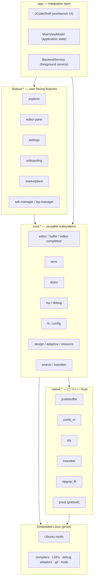
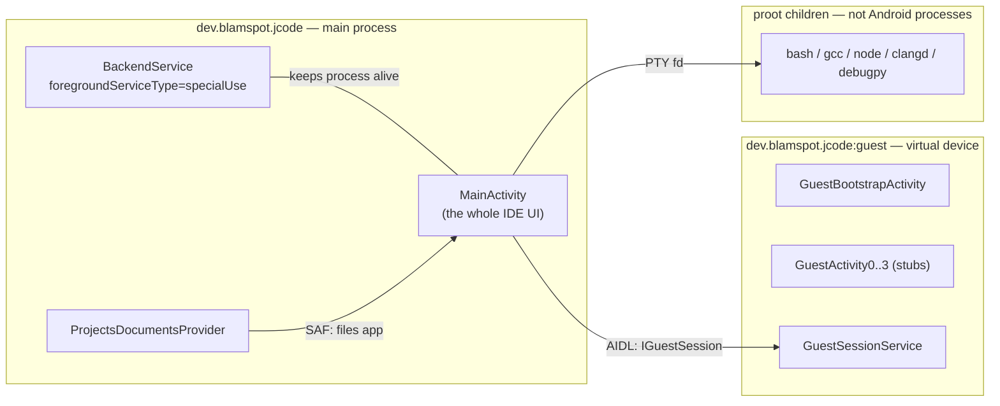

# System architecture

| | |
|---|---|
| **Status** | Implemented |
| **Modules** | `:app` and every `:core:*` / `:feature:*` / `:native:*` module |
| **Primary sources** | app/src/main/AndroidManifest.xml, app/build.gradle.kts, build.gradle.kts, settings.gradle.kts, app/src/main/java/dev/blamspot/jcode/MainActivity.kt, app/src/main/java/dev/blamspot/jcode/BackendService.kt |
| **Verified against** | commit `cea581c`, 2026-08-09 |

---

## 1. Purpose and scope

JCode is a single Android application that hosts a full IDE **and** a Linux userland on the same
device, with no root and no companion app. This document describes the top-level shape: what runs
where, which platform constraints forced which design decisions, and how the pieces connect.

Subsystem detail lives in the other specifications; this document only establishes the frame.

---

## 2. Architecture

### 2.1 Layers

**Module dependency rule** (enforced by convention, see [Module map](02-module-map.md)):
`:core:*` never depends on `:feature:*`; `:feature:*` depends only on `:core:*`; `:app` depends on
everything.

### 2.2 Process topology

The application runs in up to three processes.

| Process | Declared at | Contains | Why separate |
|---|---|---|---|
| `dev.blamspot.jcode` (main) | default | `MainActivity`, `BackendService`, `ProjectsDocumentsProvider`, `AppInstallReceiver` | — |
| `dev.blamspot.jcode:guest` | `android:process=":guest"` on `GuestBootstrapActivity`, `GuestActivity0`–`GuestActivity3`, `GuestSessionService` (AndroidManifest.xml:96–143) | The loaded guest APK and the framework hooks that host it | The guest gets its own ART heap and framework hooks and cannot corrupt the IDE |
| proot children | spawned at runtime | Every distro tool | They are ordinary Linux processes under a PTY, not Android components |

The `:guest` process is **not a security boundary** — it shares the app's uid. See
[App sandbox architecture](../08-virtual-device/01-app-sandbox-architecture.md).

`BackendService` is a `specialUse` foreground service with subtype
`interactive_terminal_and_build_runner` and `android:stopWithTask="false"`, so terminal sessions,
language servers, debug adapters, and build jobs survive backgrounding. It is driven by
`SessionRegistry` (`app/src/main/java/dev/blamspot/jcode/backend/SessionRegistry.kt`), whose
`BackendSessionKind` enum is `TERMINAL`, `LANGUAGE_SERVER`, `DEBUG_ADAPTER`, `JOB`.

### 2.3 The three execution domains

Work in JCode happens in one of three places, and most subsystem complexity is about the seams
between them:

| Domain | Runs as | Examples | Reaches the others via |
|---|---|---|---|
| **Host (JVM/ART)** | The app process | UI, editor buffer, config, workspace DB | JNI, PTY, Binder |
| **Host (native)** | In-process `.so` | Piece tree, VT parser, tokenizer, ripgrep | JNI |
| **Guest (Linux)** | proot children | Compilers, LSP servers, debug adapters, git, node | PTY + framed stdio, bind-mounted files |

Every host↔guest crossing must translate paths — see
[Storage and path model](05-storage-and-path-model.md).

---

## 3. Platform constraints that shaped the design

These are not preferences; each one forced a specific implementation.

| Constraint | Consequence |
|---|---|
| **W^X at `targetSdk` ≥ 29** — `execve()` from `filesDir` is SELinux-denied | proot and its ELF loaders ship as `jniLibs` (`libproot.so`, `libproot-loader.so`, `libproot-loader32.so`) and are exec'd from `nativeLibraryDir`. `useLegacyPackaging = true` and `keepDebugSymbols += "**/libproot*.so"` in `app/build.gradle.kts` keep them extracted and unstripped. |
| **No host root** — a hard project invariant | Isolation is proot userspace only; `-0` gives *fake* root inside the guest. Enforced by `scripts/check-no-host-root.sh` in CI, in the pre-commit hook, and as a release pre-flight. See [Security and privacy](../09-platform/04-security-and-privacy.md). |
| **Shared `/storage` is FUSE** — no symlinks, not exec-capable | Projects live on app-private ext4 under `filesDir/workspace/projects`; a one-time migration moves legacy shared-storage projects there. |
| **SELinux blocks `/proc/stat`** under proot | `CpuStatSampler` synthesizes `/proc/stat`, `/proc/loadavg`, `/proc/uptime`, `/proc/version` from per-core `cpuidle` sysfs deltas and proot bind-mounts them over the real ones. |
| **16 KB page size devices** | Every native target links with `-Wl,-z,max-page-size=16384` (`native/CMakeLists.txt`, `jcode_configure_target`). |
| **`targetSdk` held at 33** | Deliberate: the API-34 gates (foreground-service types, receiver export flags) are not yet handled, and JCode is distributed outside the Play Store. Lint's `ExpiredTargetSdkVersion` is disabled with that reasoning in `build.gradle.kts:72–78`. |
| **`hardwareAccelerated=false` in the manifest** | A window can only *enable* `FLAG_HARDWARE_ACCELERATED`, never disable it, so the manifest default must be off for the user-facing Settings toggle to be able to opt out. `MainActivity` enables it when the preference is on (default on). |
| **ART verifier register limits** | The workbench passes state through `CompositionLocal` bundles rather than composable parameters; `JCodeShell.kt` is near the per-method limit. |

### 3.1 Permissions and why each exists

Declared in `app/src/main/AndroidManifest.xml`:

| Permission | Used for |
|---|---|
| `FOREGROUND_SERVICE`, `FOREGROUND_SERVICE_SPECIAL_USE` | `BackendService` keeping terminals/builds alive |
| `INTERNET` | Rootfs download, `apt`, marketplace, update check |
| `POST_NOTIFICATIONS` | The foreground-service notification |
| `WAKE_LOCK` | Long-running builds and installs |
| `MANAGE_EXTERNAL_STORAGE` | Raw file-path access to the legacy `/storage/emulated/0/JCode` root; checked with `Environment.isExternalStorageManager()` |
| `REQUEST_INSTALL_PACKAGES` | The in-app updater; gated at runtime by `canRequestPackageInstalls()` |

A `<queries>` block for `ACTION_VIEW` + `BROWSABLE` on `http`/`https` exists solely so the
"Open web previews in" picker can enumerate installed browsers under targetSdk-30 package
visibility rules.

`ProjectsDocumentsProvider` exposes the app-private ext4 projects tree to the system Files app as a
browsable root. Its authority is `${applicationId}.documents`, so debug/beta/release variants
coexist, and it is guarded by `android.permission.MANAGE_DOCUMENTS`, which only DocumentsUI holds.

---

## 4. Toolchain and target matrix

| Item | Value | Source |
|---|---|---|
| AGP | 8.13.0 | `gradle/libs.versions.toml` |
| Gradle | 8.14.3 | `gradle/wrapper/gradle-wrapper.properties` |
| Kotlin | 2.2.20 (KSP 2.2.20-2.0.2) | `gradle/libs.versions.toml` |
| JVM toolchain | 21 (Hilt's javac forced to 17) | `build.gradle.kts` |
| `compileSdk` | 36 | `app/build.gradle.kts` |
| `minSdk` / `targetSdk` | 33 / 33 | `app/build.gradle.kts` |
| NDK | 27.2.12479018 | `app/build.gradle.kts`, root `build.gradle.kts` |
| CMake | 3.28.3 desired, auto-detected from `$ANDROID_HOME/cmake` | root `build.gradle.kts` |
| C / C++ standard | C11 / C++17, `-fvisibility=hidden` | `native/CMakeLists.txt` |
| Release ABI | `arm64-v8a`; debug adds `x86_64` | root `build.gradle.kts` |
| Compose BOM | 2025.01.00, Material3 1.3.1 | `gradle/libs.versions.toml` |

Full detail in [Build variants and release](../09-platform/02-build-variants-and-release.md).

---

## 5. Failure modes

| Failure | Effect | Handling |
|---|---|---|
| A native `.so` is missing or lacks an expected symbol | `UnsatisfiedLinkError` at class init | `Buffer`, `NativeHighlighter`, `NativeSearch` catch it and fall back to a Kotlin implementation. `VtParser` does not — a terminal cannot work without it. |
| proot cannot exec | No guest tooling at all | Surfaced through the onboarding wizard's `ProotReady` step |
| The `:guest` process dies | The app-sandbox tab reports the session ended | `IGuestSessionCallback.onGuestFinished(reason)`; the IDE process is unaffected |
| Android kills the app while a build runs | Session state is lost | `BackendService` exists specifically to make this rare; `SessionStore` restores tabs and unsaved buffers |

---

## 6. Known gaps

- Several `:feature:*` modules that the layer diagram implies own their UI are in fact empty
  markers, with the real implementation living in `:app`. See
  [Module map](02-module-map.md) and
  [Known gaps and unwired code](../09-platform/05-known-gaps-and-unwired-code.md).
- `:app` is very top-heavy: `JCodeShell.kt` (4,999 lines) and `MainViewModel.kt` (4,844 lines)
  hold work that the module layering would place in features.

---

## 7. References

- [Module map](02-module-map.md)
- [Storage and path model](05-storage-and-path-model.md)
- [Embedded Linux runtime](../03-runtime/03-embedded-linux-runtime.md)
- [App sandbox architecture](../08-virtual-device/01-app-sandbox-architecture.md)
- [`AGENTS.md`](../../../AGENTS.md) — repo working conventions and locked decisions
