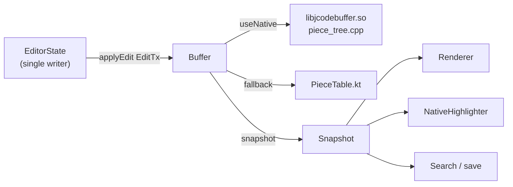

# Text buffer

| | |
|---|---|
| **Status** | Implemented |
| **Modules** | `:core:buffer`, `:native:buffer` |
| **Primary sources** | core/buffer/src/main/java/dev/jcode/core/buffer/Buffer.kt, core/buffer/src/main/java/dev/jcode/core/buffer/PieceTable.kt, native/buffer/src/piece_tree.cpp, native/buffer/src/jni_buffer.cpp, core/buffer/src/androidTest/java/dev/jcode/core/buffer/NativeBufferDifferentialTest.kt, core/buffer/src/test/java/dev/jcode/core/buffer/PieceTableTest.kt |
| **Verified against** | commit `cea581c`, 2026-08-09 |

---

## 1. Purpose and scope

The document store beneath every open file. It has two interchangeable implementations — a C++
piece tree and a pure-Kotlin piece table — behind one API, plus an immutable snapshot type that
readers (renderer, highlighter, search) use without blocking the writer.

**All content is UTF-8 bytes.** Offsets in this API are byte offsets, not UTF-16 character indices.
The conversion boundary is described in
[Input, IME and gestures](04-input-ime-and-gestures.md).

---

## 2. Architecture



`Buffer` picks its implementation once at construction:

```kotlin
class Buffer internal constructor(
    initialContent: ByteArray,
    useNative: Boolean = nativeAvailable,
) : AutoCloseable
```

`nativeAvailable` is set in a static initializer: `System.loadLibrary("jcodebuffer")` succeeding
**and** the compile-time constant `USE_NATIVE_BUFFER = true`. An `UnsatisfiedLinkError` silently
selects the Kotlin path. Flipping `USE_NATIVE_BUFFER` to `false` forces the Kotlin path for
debugging.

### 2.1 Why two implementations

The Kotlin path is not dead code; it is the correctness oracle. `NativeBufferDifferentialTest`
fuzzes the C++ piece tree against the Kotlin piece table *and* a naive reference through the real
JNI, on device. The code comment states the requirement plainly: the test "must stay green before
any change here ships".

The native path exists for speed — its snapshots answer line/offset queries by prefix-sum binary
search, which the comment measures at roughly 100× the Kotlin line walk.

---

## 3. Public contract

### 3.1 `Buffer`

| Member | Signature | Notes |
|---|---|---|
| `create` | `fun create(): Buffer` | Empty buffer |
| `fromText` | `fun fromText(text: String): Buffer` | Encodes UTF-8 |
| `isNativeAvailable` | `fun isNativeAvailable(): Boolean` | |
| `byteLength` | `val byteLength: Int` | |
| `lineCount` | `val lineCount: Int` | At least 1 for an empty buffer |
| `snapshot` | `fun snapshot(): Snapshot` | |
| `applyEdit` | `fun applyEdit(tx: EditTx): Snapshot` | Returns the post-edit snapshot |
| `readRange` | `fun readRange(start: Int, end: Int): ByteArray` | |
| `readRangeAsUtf16` | `fun readRangeAsUtf16(start: Int, end: Int): String` | Decodes UTF-8 |
| `offsetToLineColumn` | `fun offsetToLineColumn(offset: Int): Pair<Int, Int>` | Both 0-based |
| `lineColumnToOffset` | `fun lineColumnToOffset(line: Int, column: Int): Int` | |
| `lineAt` | `fun lineAt(line: Int): Pair<Int, Int>` | Byte range `[start, end)` |
| `close` | `override fun close()` | |

### 3.2 `Snapshot`

An immutable read view, also `AutoCloseable`. Beyond the read accessors mirroring `Buffer`:

| Member | Purpose |
|---|---|
| `lineText(line): String` | Line without its terminator |
| `readLines(firstLine, count): LineWindow` | **Batched** — one native crossing for a window of lines |
| `nativeHandleOrZero` | Internal; lets `NativeHighlighter` run directly over this snapshot's bytes |

`LineWindow` carries `texts: Array<String>` plus parallel `bufferStarts` / `byteLengths` arrays, and
exposes `text(line)`, `byteStart(line)`, `byteEnd(line)`, `contains(line)`. It replaced a renderer
loop that cost two JNI calls and a `ByteArray` allocation **per visible line per frame**.

Its native read grows its output buffer adaptively: `nativeReadLines` returns the required size when
the supplied array is too small, and the Kotlin side retries with exactly that size, starting from
`max(1024, count * 96)` bytes.

### 3.3 Edit transactions

```kotlin
sealed class EditOp {
    data class Insert(val offset: Int, val text: String) : EditOp()
    data class Delete(val start: Int, val end: Int) : EditOp()
}

data class EditTx(val ops: List<EditOp>)
```

Factories: `EditTx.insert`, `EditTx.delete`, `EditTx.replace(start, end, text)` (a `Delete` followed
by an `Insert` at the same offset), and `EditTx.builder()` → `EditTxBuilder`.

Operations within a transaction apply **in list order**, each seeing the effect of the previous one.

`NativeEditOp` is the JNI marshalling form: `type` 0 = insert, 1 = delete, plus `offset`, `length`
and `data`.

---

## 4. Data model — the piece table

Both implementations use the same model, and the C++ side "mirrors `PieceTable.kt`'s semantics
byte-for-byte" per the comment in `Buffer.kt`.

Content is a sequence of **pieces** over two byte arrays:

| Buffer | Mutability | Contents |
|---|---|---|
| `original` | Immutable | The bytes the file was opened with |
| `add` | Append-only | Every inserted byte, ever |

An edit only splits and trims the piece list — it never re-copies the document. Cost is
`O(pieces)`, not `O(fileSize)`.

```
Piece(fromAdd: Boolean, start: Int, length: Int, newlineFrom: Int, newlineCount: Int)
```

### 4.1 Newline indexing

Newline byte offsets are indexed once per backing buffer — `original` up front via `scanNewlines`,
`add` incrementally as text is appended. Line/offset conversion is therefore a piece walk plus a
binary search (`lowerBound`), never a byte scan of the document.

`PieceTable` maintains `length` and `newlineTotal` incrementally; `lineCount` is
`newlineTotal + 1`.

### 4.2 Snapshots

`PieceSnapshot` shares both byte arrays with the live table and copies **only the piece list**, so
taking a snapshot is `O(pieces)`, not `O(bytes)`. Because `original` is immutable and `add` is
append-only, a snapshot's view can never be invalidated by a later edit.

---

## 5. Behavior

### 5.1 Snapshot caching

`Buffer` caches the current snapshot (`cachedSnapshot` for the Kotlin path,
`cachedNativeSnapshot` for the native path) so repeated reads between edits do not re-copy.

`applyEdit` invalidates by **dropping the reference, not closing it** — a reader may already hold
that snapshot and be mid-call. The `Cleaner` frees the native handle after GC.

### 5.2 Close semantics

`close()` calls `cleanable.clean()`, which runs the capture-free cleanup action exactly once and
deregisters it, then zeroes the handle. The native handle is therefore freed deterministically at
`close()` and can never be double-freed, and a dropped-without-close buffer is still reclaimed.

Any operation after `close()` fails a `check(!closed) { "Buffer is closed" }`.

---

## 6. Threading and lifecycle

`Buffer` is **not** internally synchronized for writes. Its own doc comment states the contract:

> All mutable state lives behind a single writer thread concept (EditorDispatcher) at the editor
> layer.

`PieceTable` is explicitly "not thread-safe: callers (`Buffer`) serialize access". `Buffer` does
`synchronized(this)` around snapshot-cache access and Kotlin-path mutation, but the ordering
guarantee comes from `EditorState`'s single-writer dispatcher — see
[Concurrency and resource lifecycle](../01-architecture/03-concurrency-and-resource-lifecycle.md#21-the-single-writer-editor-invariant).

`Buffer` and `Snapshot` each own a private `Cleaner` registered with a lambda capturing only the
primitive handle.

---

## 7. Invariants and constraints

1. **`Snapshot.nativeHandle` must keep that exact field name.** `jni_buffer.cpp`'s
   `getSnapshot`/`setSnapshot` resolve it by literal name; a rename aborts the VM with
   `NoSuchFieldError` the moment any native `Snapshot` method runs — i.e. on opening a file.
2. Cleanup lambdas capture the primitive handle only.
3. All offsets are **UTF-8 byte** offsets.
4. The C++ piece tree must remain byte-for-byte equivalent to `PieceTable.kt`;
   `NativeBufferDifferentialTest` is the gate.
5. Snapshot invalidation drops, never closes.
6. Buffer writes are serialized by the caller.

---

## 8. Failure modes

| Failure | Effect | Handling |
|---|---|---|
| `libjcodebuffer.so` missing | Native path unavailable | `UnsatisfiedLinkError` caught in the static initializer; Kotlin path selected |
| Use after `close()` | `IllegalStateException("Buffer is closed")` | Fail-fast |
| Concurrent writes from two threads | Piece-list corruption, silent wrong text | Prevented only by the single-writer discipline |
| `readLines` output array too small | Handled: native returns the needed size and the call is retried |

---

## 9. Known gaps

- `Buffer` declares `nativeOpenFromFd(fd: Int)` and the JNI export exists, but no caller uses it —
  files are read into a `ByteArray` first. Large-file mmap-style opening is therefore not in use.
- `Buffer` rolls its own `Cleaner` rather than extending `:core:resource`'s `NativeHandle`, and does
  not register with `ResourceManager`, so it is invisible to memory-pressure trimming.

---

## 10. References

- [Editor state and undo](02-editor-state-and-undo.md)
- [Rendering and decorations](03-rendering-and-decorations.md)
- [Syntax highlighting and completion](05-syntax-highlighting-and-completion.md)
- [Native layer and JNI](../01-architecture/04-native-layer-and-jni.md)
