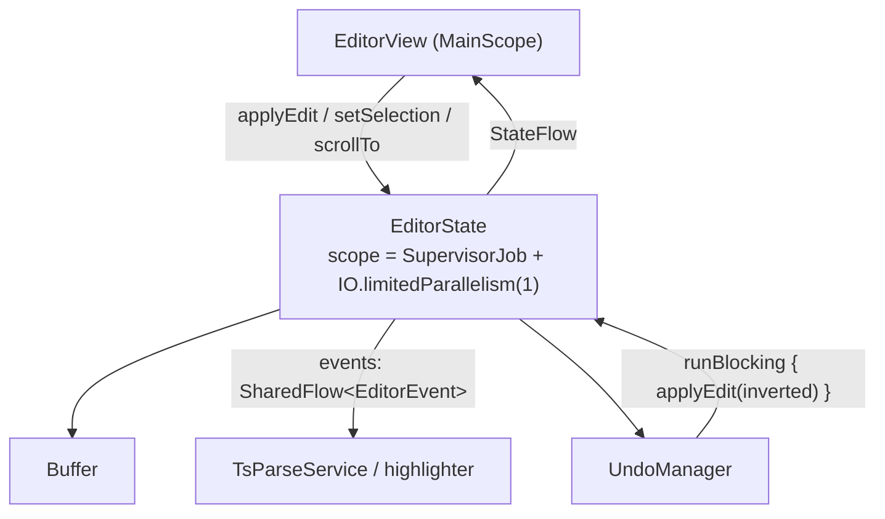

# Editor state and undo

| | |
|---|---|
| **Status** | Implemented |
| **Modules** | `:core:editor` |
| **Primary sources** | core/editor/src/main/java/dev/blamspot/jcode/core/editor/EditorState.kt, core/editor/src/main/java/dev/blamspot/jcode/core/editor/UndoManager.kt |
| **Verified against** | commit `cea581c`, 2026-08-09 |

---

## 1. Purpose and scope

`EditorState` is the per-document state holder: it owns the `Buffer`, serializes every mutation
onto a single writer, and publishes everything the view needs as flows. `UndoManager` sits directly
on top of it.

One `EditorState` exists per open file tab (`EditorTab.editorState`); host-rendered page tabs have
`editorState == null`.

---

## 2. Architecture



```kotlin
class EditorState(
    buffer: Buffer,
    dispatcher: CoroutineDispatcher = Dispatchers.IO,
) : AutoCloseable {
    private val scope = CoroutineScope(SupervisorJob() + dispatcher.limitedParallelism(1))
}
```

Every mutator runs `withContext(scope.coroutineContext)`. See
[Concurrency and resource lifecycle](../01-architecture/03-concurrency-and-resource-lifecycle.md).

---

## 3. Public contract

### 3.1 Published state

| Flow | Type | Initial value |
|---|---|---|
| `snapshot` | `StateFlow<Snapshot>` | `buffer.snapshot()` |
| `carets` | `StateFlow<List<Caret>>` | `listOf(Caret(0, 0))` |
| `viewport` | `StateFlow<Viewport>` | `Viewport()` |
| `folds` | `StateFlow<List<FoldRange>>` | empty |
| `decorations` | `StateFlow<DecorationSet>` | `DecorationSet.EMPTY` |
| `language` | `StateFlow<LanguageDescriptor?>` | `null` |
| `renderConfig` | `StateFlow<RenderConfig>` | `RenderConfig()` |
| `theme` | `StateFlow<EditorTheme>` | `EditorTheme()` (the dark values) |
| `dirty` | `StateFlow<Boolean>` | `false` |
| `revealRequest` | `StateFlow<RevealRequest?>` | `null` |
| `events` | `SharedFlow<EditorEvent>` | `extraBufferCapacity = 64` |

Plus `var readOnly: Boolean` and `val undoManager: UndoManager?` (created in `init`).

### 3.2 Mutators

All are `suspend` and all hop to the single-writer scope: `applyEdit(tx)`, `replaceAll(...)`,
`setSelection(...)`, `scrollTo(...)`, `addFold(...)`, `removeFold(...)`, `toggleFold(...)`.

`requestReveal(line, column)` and `clearReveal()` are plain (non-suspending) setters on a
`StateFlow`: the view consumes a reveal request once it has laid out with correct metrics, then
clears it.

---

## 4. Data model

### 4.1 `Caret`

```kotlin
data class Caret(val anchor: Int, val head: Int, val preferredColumn: Int = -1)
```

`offset == head`; `isSelection == (anchor != head)`; `start`/`end` are the ordered pair.
`preferredColumn` (`-1` = unset) preserves the intended column across vertical movement over short
lines. Offsets are **UTF-8 byte offsets** into the buffer.

`carets` is a list — the model is multi-caret-capable.

### 4.2 `Viewport`

```kotlin
data class Viewport(
    val scrollY: Int = 0, val scrollX: Int = 0,
    val widthPx: Int = 0, val heightPx: Int = 0,
    val lineHeightPx: Int = 20,
)
```

Derived: `visibleLineTop = scrollY / lineHeightPx`,
`visibleLineBottom = (scrollY + heightPx) / lineHeightPx + 1`.

### 4.3 `FoldRange`, `LanguageDescriptor`, `RevealRequest`

```kotlin
data class FoldRange(val startLine: Int, val endLine: Int, val summaryText: String? = null)  // inclusive
data class LanguageDescriptor(val id: String, val name: String, val extensions: List<String> = emptyList())
data class RevealRequest(val line: Int, val column: Int)  // both 0-based
```

### 4.4 `RenderConfig`

| Field | Default |
|---|---|
| `fontSizeSp` | `14f` |
| `lineHeightMultiplier` | `1.4f` |
| `tabWidth` | `4` |
| `showWhitespace` | `false` |
| `ligatures` | `true` |
| `wordWrap` | `false` |

These are the editor-layer defaults. The user-facing defaults that override them live in
`SettingsDefaults` — see [Settings reference](../06-workbench/04-settings-reference.md).

### 4.5 `EditorTheme`

Eight ARGB values as `Long`: `background`, `foreground`, `lineNumber`, `lineNumberActive`,
`selection`, `cursor`, `gutterBackground`, `gutterBorder`.

| | `DARK` (Catppuccin Mocha) | `LIGHT` |
|---|---|---|
| `background` | `0xFF1E1E2E` | `0xFFFAFAFA` |
| `foreground` | `0xFFCDD6F4` | `0xFF1C1B1F` |
| `lineNumber` | `0xFF6C7086` | `0xFF9E9E9E` |
| `lineNumberActive` | `0xFFCDD6F4` | `0xFF424242` |
| `selection` | `0x40585B76` | `0x40BDBDBD` |
| `cursor` | `0xFFF5E0DC` | `0xFF6750A4` |
| `gutterBackground` | `0xFF181825` | `0xFFF5F5F5` |
| `gutterBorder` | `0xFF313244` | `0xFFE0E0E0` |

The editor is a custom `View` and does **not** inherit `MaterialTheme`; the host must push the
current theme into `EditorState.theme` explicitly.

### 4.6 `EditorEvent`

```kotlin
sealed class EditorEvent {
    data class TextChanged(val rangeStart: Int, val rangeEnd: Int, val newLength: Int)
    data object SelectionChanged
    data class ViewportChanged(val viewport: Viewport)
    data object FoldsChanged
    data object DecorationsChanged
}
```

---

## 5. Behavior

### 5.1 `applyEdit`

1. Return immediately if `readOnly`.
2. Capture `oldSnapshot`.
3. `buffer.applyEdit(tx)` → publish the new snapshot.
4. Set `dirty = true`.
5. Fold the transaction's operations into one changed range (`min` of starts, `max` of ends,
   summed inserted length) and emit `TextChanged`.
6. `undoManager.recordEdit(tx, carets, oldSnapshot)`.

### 5.2 `replaceAll`

Replaces the whole buffer as a single transaction on the writer, so a concurrent keystroke cannot
interleave. With `onlyIfClean = true` it returns `false` and does nothing when there are unsaved
edits — this is how an external on-disk change is mirrored into an open tab without clobbering the
user. On success the buffer is left clean, undo history is cleared, and the caret is clamped to the
new length. The check and the edit are atomic (no suspension between them).

---

## 6. Undo and redo

`UndoManager(state, maxGroups = 500, maxInvertedBytes = 50 MiB)` — a linear history (no undo tree).

Each entry stores the **inverted** transaction plus the selection before and after and a timestamp:

```kotlin
private data class UndoEntry(
    val invertedTx: EditTx,
    val selectionBefore: List<Caret>,
    val selectionAfter: List<Caret>,
    val timestamp: Long,
)
```

Inversion (`invertEdit`) reads the pre-edit snapshot: an `Insert` inverts to a `Delete` of the same
span, and a `Delete` inverts to an `Insert` of the text read from `oldSnapshot`. This is why the
old snapshot must be captured before the buffer mutates.

### 6.1 Grouping

A **new group** starts when:

| Condition | |
|---|---|
| `isComposing` | never — an IME composing session always stays in one group |
| History is empty | yes |
| More than **500 ms** since the current group started | yes |
| The selection moved between the last edit and this one | yes |
| Otherwise | no |

`beginComposing()` / `endComposing()` bracket an IME session; `flushGroup()` forces a boundary.

### 6.2 Limits

Eviction (`evictOldestIfNeeded`) drops the oldest groups when either `maxGroups` (500) or
`maxInvertedBytes` (50 MiB of estimated inverted-transaction payload) is exceeded.

Any new recorded edit clears the redo stack.

### 6.3 Threading

`undo()` and `redo()` apply their inverted transaction through
`runBlocking { state.applyEdit(...) }`, so they **block the calling thread** until the write lands
on the single-writer dispatcher. Calling them from the UI thread is a deliberate bounded stall.

---

## 7. Invariants and constraints

1. Every mutation goes through the single-writer scope. Nothing writes `_snapshot` directly.
2. `recordEdit` must receive the snapshot from **before** the edit, or inversion produces wrong
   text.
3. `readOnly` is checked inside `applyEdit`, so it cannot be bypassed by a caller.
4. `close()` cancels the scope and closes the `Buffer`; the state is unusable afterwards.
5. The editor `View` does not inherit `MaterialTheme` — theme changes must be pushed into
   `EditorState.theme`.

---

## 8. Failure modes

| Failure | Effect |
|---|---|
| Event consumer slower than 64 buffered events | Oldest events are dropped (`extraBufferCapacity = 64` on a `MutableSharedFlow`) |
| `undo()` called on the main thread during a long write | Bounded UI stall |
| External file change while the tab is dirty | `replaceAll(onlyIfClean = true)` returns `false`; the user's edits are preserved and the reload is skipped |
| History exceeding limits | Oldest groups evicted; undo silently stops further back |

---

## 9. Known gaps

- `EditorState` publishes `folds` and supports `addFold`/`removeFold`/`toggleFold`, but nothing
  computes fold ranges automatically — folds only appear if a caller supplies them.
- `carets` is a list and the model is multi-caret-capable, but the input layer creates a single
  caret; there is no multi-cursor UI.
- `native/core`'s C++ `EditorState`/`UndoManager` were removed at 1.6.2 having never been bound —
  `core/editor` declared no `external fun` against them. This Kotlin implementation always was, and
  remains, the live one.

---

## 10. References

- [Text buffer](01-text-buffer.md)
- [Input, IME and gestures](04-input-ime-and-gestures.md)
- [Concurrency and resource lifecycle](../01-architecture/03-concurrency-and-resource-lifecycle.md)
