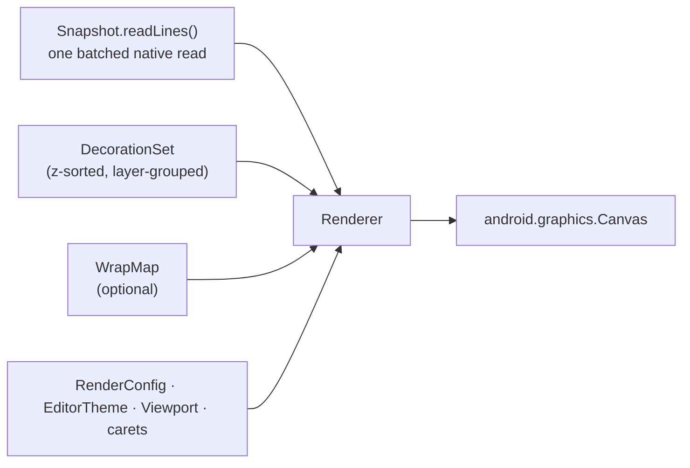

# Rendering and decorations

| | |
|---|---|
| **Status** | Implemented |
| **Modules** | `:core:editor` (package `dev.jcode.core.editor.decor`), `:core:editor-decor` (marker only) |
| **Primary sources** | core/editor/src/main/java/dev/jcode/core/editor/Renderer.kt, core/editor/src/main/java/dev/jcode/core/editor/WrapMap.kt, core/editor/src/main/java/dev/jcode/core/editor/decor/Decoration.kt, core/editor/src/main/java/dev/jcode/core/editor/decor/DecorationSet.kt, core/editor/src/main/java/dev/jcode/core/editor/decor/ColoredSpan.kt, core/editor/src/main/java/dev/jcode/core/editor/decor/SquiggleDecoration.kt, core/editor/src/main/java/dev/jcode/core/editor/decor/DebugDecorations.kt, core/editor/src/main/java/dev/jcode/core/editor/decor/InlineDecoration.kt, core/editor/src/main/java/dev/jcode/core/editor/decor/DirtyTracker.kt |
| **Verified against** | commit `cea581c`, 2026-08-09 |

---

## 1. Purpose and scope

How a document becomes pixels: the `Canvas` renderer, the soft-wrap layout map, and the decoration
system that everything else (syntax colors, diagnostics, breakpoints, ghost text) uses to draw into
the editor.

The editor is an in-house custom `View` by project decision — no third-party editor framework.

---

## 2. Architecture



`Renderer(typeface, density)` is stateless with respect to the document — everything is passed per
draw:

```kotlin
fun draw(
    canvas: Canvas, snapshot: Snapshot, viewport: Viewport, config: RenderConfig,
    carets: List<Caret>, decorations: DecorationSet = DecorationSet.EMPTY,
    theme: EditorTheme = EditorTheme.DARK, wrapMap: WrapMap? = null,
)
```

`density` (px per dp) is not optional in practice: `RenderConfig.fontSizeSp` is in sp and must be
multiplied by it before reaching `Paint.textSize`, or text renders roughly `density`× too small on a
high-DPI screen.

### 2.1 Two draw paths

| Path | When | Behavior |
|---|---|---|
| `draw` | `wrapMap == null` | One visual row per logical line; honours `viewport.scrollX` |
| `drawWrapped` | `wrapMap != null` | Iterates `WrapMap` visual rows; **no horizontal scrolling** |

Both draw, in order: gutter background and border, line-highlight decorations, selection rectangles,
text (syntax-coloured), squiggles, carets, line numbers, and gutter markers.

---

## 3. Performance design

The renderer's own doc comment states the goal: per-frame cost stays flat in file size. Three
mechanisms achieve it.

**Batched line reads.** Visible lines arrive as one `Snapshot.readLines(firstLine, count)` call
returning a `LineWindow`, replacing two JNI calls plus a `ByteArray` allocation per visible line per
frame.

**Span sweep with a cursor.** Syntax colours come from a `startByte`-sorted, non-overlapping
`ColoredSpan` list. Each line's draw seeds a forward cursor via
`ColoredSpan.firstSpanIndexFor(spans, byteOffset)` (binary search) and advances it, instead of
scanning the whole file's span list per character.

**ASCII fast-path measurement.** `measureTextWidth` detects an all-ASCII run and returns
`length × asciiAdvance()`, where `asciiAdvance()` is a cached monospace `"M"` advance. Only
non-ASCII text falls back to real `Paint` measurement. `setTypeface` invalidates the cached advance.

`EditorView` adds a fourth layer: a cached `RenderNode` (`contentNode`) so an IME resize storm does
not re-run `readLines` plus the full draw every frame. See
[Input, IME and gestures](04-input-ime-and-gestures.md).

---

## 4. Soft word wrap — `WrapMap`

```kotlin
class WrapMap(private val snapshot: Snapshot, val charsPerRow: Int)
```

Maps between logical `(line, column)` and flat **visual rows**. Every editor coordinate transform —
the draw loop, hit-testing, caret-follow, scroll range — routes through this one map, which is what
keeps rendering and hit-testing consistent under wrap.

### 4.1 Internal layout

| Field | Meaning |
|---|---|
| `rowStartCols[line]` | Start column of each visual row within that logical line (index 0 is always 0) |
| `lineLen[line]` | UTF-16 length of the logical line |
| `cumRows[line]` | First flat visual-row index of the line; `cumRows[lineCount]` is the total |

Construction reads the document in windows of 1,024 lines via `readLines`.

### 4.2 Break rule

A row breaks **after the last space within `charsPerRow`** where one exists, so words stay intact;
otherwise it hard-breaks at the width. It never breaks inside a surrogate pair.

### 4.3 API

| Function | Purpose |
|---|---|
| `totalRows` | Total visual rows (minimum 1) |
| `firstRowOf(line)` | First visual row of a logical line |
| `rowOf(line, column)` | Visual row containing a logical position |
| `rowToLine(row): RowSpan` | Reverse mapping |
| `charsPerRow(textAreaPx, advancePx)` | Column count from pixel width (companion) |
| `byteColToCharIndex(text, byteCol)` | UTF-8 byte column → UTF-16 char index (companion) |
| `charIndexToByteCol(text, charIndex)` | UTF-16 char index → UTF-8 byte column (companion) |

The last two exist because the buffer speaks UTF-8 bytes and text measurement speaks UTF-16 chars.

### 4.4 Cost

Construction is a full `O(document)` scan. It re-runs on every edit and on width or font changes.
Acceptable for typical files, heavier for very large ones; the view only builds it while wrap is
enabled.

---

## 5. Decorations

### 5.1 Layers

`Layer` (bottom to top), used as z-index values:

| Constant | Value |
|---|---|
| `BACKGROUND` | 0 |
| `SELECTION` | 100 |
| `SQUIGGLY` | 200 |
| `GLYPH_COLOR` | 300 |
| `GLYPH` | 400 |
| `COMPOSING` | 500 |
| `GHOST_TEXT` | 600 |
| `INLAY` | 700 |
| `CARET` | 800 |
| `GUTTER` | 900 |
| `MINIMAP` | 1000 |
| `POPUP` | 1100 |

```kotlin
interface Decoration {
    fun zIndex(): Int
    val id: String get() = hashCode().toString()
}
```

### 5.2 `DecorationSet`

Immutable and z-sorted. Two design points, both driven by measured hot paths:

- `byLayer` is a `by lazy` grouped map, so `atLayer(z)` — called several times per frame — is a map
  lookup, not an `O(n)` filter.
- `add` / `addAll` / `replaceLayer` use `mergeSorted`, an ordered merge rather than a full re-sort.
  The highlighter replaces the entire `GLYPH_COLOR` layer on every keystroke.

Also: `all()`, `inRange(minZ, maxZ)`, `remove(id)`, `size`, `isEmpty`, and `DecorationSet.EMPTY`.

### 5.3 Decoration types

| Type | Layer | Fields |
|---|---|---|
| `ColoredSpan` | `GLYPH_COLOR` | `startByte`, `endByte`, `color` (ARGB `Int`), `styleFlags` |
| `SquiggleDecoration` | `SQUIGGLY` | `id`, `startByte`, `endByte`, `severity`, `message?`, `code?`, `source?` |
| `BackgroundDecoration` | `BACKGROUND` | Range + colour |
| `GhostTextDecoration` | `GHOST_TEXT` | Inline suggestion text |
| `InlineDecoration` | `INLAY` | Inlay hints |
| `GutterMarkerDecoration` | `GUTTER` | Breakpoint dot / current-execution arrow |
| `LineHighlightDecoration` | `BACKGROUND` | Whole-line highlight (e.g. the stopped line) |

`ColoredSpan.styleFlags` is a bitmask: `STYLE_BOLD = 1`, `STYLE_ITALIC = 2`, `STYLE_UNDERLINE = 4`,
`STYLE_STRIKETHROUGH = 8`, with `isBold` / `isItalic` / `isUnderline` / `isStrikethrough`
accessors.

### 5.4 Diagnostic severity colours

`decor.DiagnosticSeverity` carries its own colour:

| Member | Colour |
|---|---|
| `ERROR` | `0xFFFF5555` |
| `WARNING` | `0xFFE6C35C` |
| `INFO` | `0xFF56B6C2` |
| `HINT` | `0xFF98C379` |

> This is a **different type** from `dev.jcode.core.lsp.DiagnosticSeverity`, which carries the LSP
> numeric value (1–4) instead. Conversion happens at the LSP→editor boundary. Do not assume they are
> interchangeable.

`SquiggleDecoration.drawSquiggle` is a static helper that draws the quadratic wave `Path`.

### 5.5 `DirtyTracker`

Accumulates per-layer damage `Rect`s, with a `markLinesDirty(first, last)` convenience.
`getUnionDirtyRect()` returns `null` to mean "full redraw".

---

## 6. Ligatures

`FONT_FEATURES_NO_LIGATURES = "'liga' off, 'calt' off"` is applied to a `Paint`'s
`fontFeatureSettings` when `RenderConfig.ligatures` is false; `null` restores the font defaults.
The bundled code font is JetBrains Mono, which implements programming ligatures through `calt` —
enabled by default in text shaping, hence the explicit opt-out string.

**The measuring paint must carry the same feature settings as the drawing paint**, or measured
advances and drawn glyphs disagree and the caret drifts.

---

## 7. Invariants and constraints

1. `ColoredSpan` lists handed to the renderer must be sorted by `startByte` and non-overlapping —
   `firstSpanIndexFor` binary-searches and the sweep advances forward only.
2. All decoration offsets are **UTF-8 byte** offsets; measurement is in UTF-16 chars. Cross the two
   only via `WrapMap.byteColToCharIndex` / `charIndexToByteCol`.
3. `RenderConfig.fontSizeSp × density` is the value `Paint.textSize` expects.
4. `DecorationSet` instances are immutable; mutate by producing a new set.
5. The wrapped path has no horizontal scroll — do not feed it a non-zero `scrollX`.
6. Measure and draw with paints configured identically (typeface, size, font features).

---

## 8. Failure modes

| Failure | Symptom |
|---|---|
| Unsorted or overlapping spans | Colours smear or vanish after the first out-of-order span |
| Stale `WrapMap` after an edit | Hit-testing and caret land on the wrong row |
| Byte offset used as a char index | Caret misplacement on any non-ASCII line |
| Measure/draw paint mismatch | Caret drifts progressively along the line |
| Very large file with wrap on | Visible stall while `WrapMap` rebuilds |

---

## 9. Known gaps

- `Layer.MINIMAP` is defined; there is no minimap.
- `:core:editor-decor` is a module whose only content is a marker object — the decoration types all
  live in `:core:editor`'s `decor` package. Modules depending on `:core:editor-decor` are really
  depending on `:core:editor`.
- `ColoredSpan`'s KDoc says it is "produced by tree-sitter's `HighlightSpanProducer`". That producer
  is a stub; spans actually come from `NativeHighlighter`. See
  [Syntax highlighting and completion](05-syntax-highlighting-and-completion.md).

---

## 10. References

- [Text buffer](01-text-buffer.md)
- [Input, IME and gestures](04-input-ime-and-gestures.md)
- [Syntax highlighting and completion](05-syntax-highlighting-and-completion.md)
- [Design system](../06-workbench/05-design-system.md)
