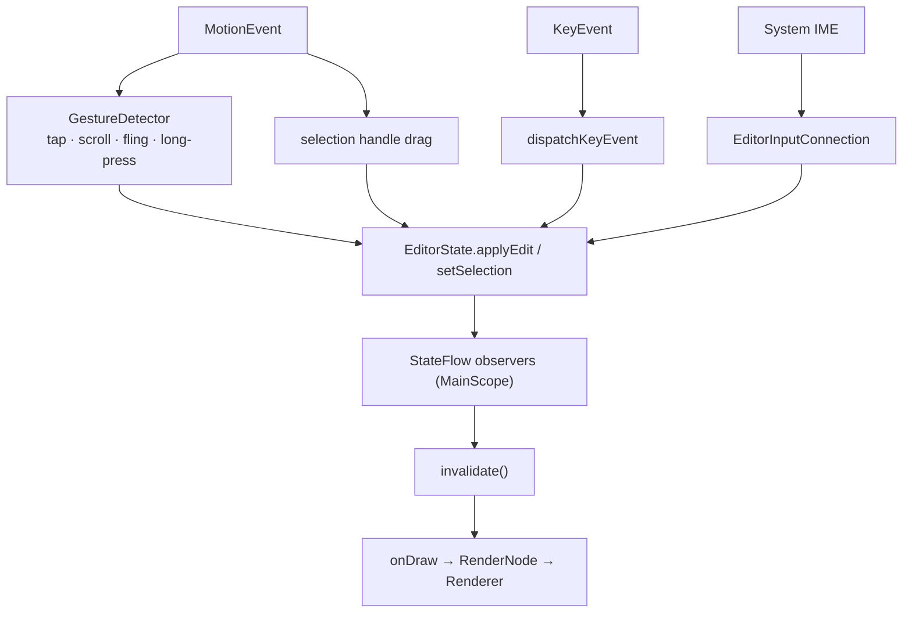

# Input, IME and gestures

| | |
|---|---|
| **Status** | Implemented |
| **Modules** | `:core:editor` |
| **Primary sources** | core/editor/src/main/java/dev/blamspot/jcode/core/editor/EditorView.kt (1,657 lines), core/editor/src/main/java/dev/blamspot/jcode/core/editor/WrapMap.kt |
| **Verified against** | commit `cea581c`, 2026-08-09 |

---

## 1. Purpose and scope

`EditorView` is the custom Android `View` that turns touch, keyboard and IME input into buffer
edits, and hosts the renderer. It is the largest file in `:core:editor` and the place where the
byte/char, touch/text, and IME/buffer impedance mismatches are resolved.

The in-app soft keyboard was removed; JCode uses the **system IME**.

---

## 2. Architecture



`attach(editorState)` subscribes to the state flows on a `MainScope()`; `detach()` cancels the
subscriptions and discards the cached display list.

---

## 3. Public contract

| Member | Purpose |
|---|---|
| `attach(editorState)` / `detach()` | Bind/unbind a document |
| `setEditorTypeface(tf)` | Swap the code font; invalidates cached advances |
| `scrollLines(lines)` | Programmatic vertical scroll |
| `beginTextSelection()` | Enter handle-based selection mode |
| `selectAll()` / `copySelection()` / `cutSelection()` / `pasteClipboard()` | Clipboard actions |
| `replaceRange(start, end, text, caretAfter)` | Used by completion acceptance |
| `updateImeCursor(composingStart, composingEnd)` | Push caret/composing state to the IME |
| `updateCompletionAnchor()` | Recompute the completion popup anchor |
| `var cursorDragVerticalLevel: Int` / `cursorDragHorizontalLevel: Int` | 1–5, default 2 |
| `var onCompletionAnchorChanged: ((CompletionAnchor?) -> Unit)?` | Popup callback |

### 3.1 Callback data types

```kotlin
data class EditorContextRequest(val xPx: Float, val yPx: Float, val word: String)

data class CompletionAnchor(
    val prefix: String, val replaceStart: Int, val caret: Int,
    val xPx: Float, val yPx: Float,
)

enum class EditorLanguageAction(val label: String) {
    GoToDefinition("Go to Definition"),
    FindReferences("Find References"),
    RenameSymbol("Rename Symbol"),
    FormatDocument("Format Document"),
}
```

`EditorLanguageAction` items are raised by the long-press context menu and **resolved by the host**;
the view itself has no language knowledge.

---

## 4. IME integration

### 4.1 `EditorInfo` configuration

```kotlin
outAttrs.inputType = TYPE_CLASS_TEXT or TYPE_TEXT_FLAG_MULTI_LINE or
    TYPE_TEXT_FLAG_NO_SUGGESTIONS or TYPE_TEXT_VARIATION_VISIBLE_PASSWORD
outAttrs.imeOptions = IME_FLAG_NO_EXTRACT_UI or IME_FLAG_NO_FULLSCREEN or
    IME_FLAG_NO_PERSONALIZED_LEARNING or IME_ACTION_NONE
```

`TYPE_TEXT_VARIATION_VISIBLE_PASSWORD` is the load-bearing choice, and the code says why: it makes
the system IME **commit each keystroke directly** — no autocorrect, no composing region. Composing
edits applied against the IME's own stale cursor model corrupt the buffer, which is unacceptable in
a code editor.

`initialSelStart` / `initialSelEnd` are seeded from the real caret. Without that the IME assumes
offset 0 and composes against the wrong position.

### 4.2 `EditorInputConnection`

An inner class implementing the full `InputConnection` surface: `commitText`, `setComposingText`,
`setComposingRegion`, `finishComposingText`, `deleteSurroundingText`, `sendKeyEvent`,
`getTextBeforeCursor` / `getTextAfterCursor` / `getSelectedText`, `performContextMenuAction`,
`commitContent`.

Composing sessions bracket the undo manager (`beginComposing` / `endComposing`) so an entire IME
composition undoes as one group.

### 4.3 Keeping the IME in sync

`updateImeCursor(composingStart, composingEnd)` calls
`InputMethodManager.updateSelection(...)`. Every edit and caret move funnels through it, and it also
refreshes the completion anchor unless `suppressAnchorUpdate` is set.

---

## 5. Gestures and touch

| Gesture | Behavior |
|---|---|
| Single tap | Place caret at `offsetAt(x, y)`; refresh the completion anchor |
| Scroll | Vertical, plus horizontal when wrap is off |
| Fling | Custom `Runnable` decay loop; `cancelFling()` on new touch |
| Long press | Emits `EditorContextRequest(x, y, wordAt(caret))` |
| Handle drag | `grabHandleAt(x, y)` then `dragHandleTo(x, y)` while `selectionHandlesVisible` |
| Gutter tap | `gutterLineAt(x, y)` → breakpoint toggle |

### 5.1 Drag-to-move-cursor

An optional mode (`EDITOR_DRAG_MOVES_CURSOR`, default off) where dragging moves the caret rather
than scrolling. Sensitivity is per-axis with five levels; `dragStepScale(level)` maps `1..5` to a
multiplier, and the step is `lineHeight × scale` vertically and `charWidth × scale` horizontally,
each clamped to at least 1 px.

### 5.2 Word selection

`wordAt(offset)` returns `Triple(start, end, text)` using the predicate
`c.isLetterOrDigit() || c == '_'`.

### 5.3 Clipboard

`pasteClipboard()` delegates to a private `pasteClipboard(retriesLeft)`: reading the clipboard can
transiently fail right after the app regains focus, so the read is retried rather than silently
dropping the paste.

---

## 6. Hardware keyboard

`dispatchKeyEvent` handles caret movement (`moveCaret`, `moveCaretLine`, `moveCaretLineEdge`),
page movement (`visiblePageLines`), selection collapse, `insertAtCaret`, `deleteAtCaret(forward)`,
and `dedentAtCaret` (Shift+Tab).

Caret movement is **codepoint-aware**: `prevCharStart` and `nextCharEnd` step over whole UTF-8
sequences so an arrow key never lands inside a multi-byte character.

Workbench-level shortcuts (Ctrl+S, Ctrl+G, …) are handled above the view — see
[Panels and tools](../06-workbench/03-panels-and-tools.md).

---

## 7. The `RenderNode` content cache

This is the single most intricate piece of `onDraw`, and it exists for a specific reason: **the IME
open/close animation resizes the view every frame while nothing about the content changes**, and the
content pass (a `readLines` JNI call plus span-segmented `drawText`) is far too heavy to re-run per
frame.

**Mechanism.** The content is recorded once into a `RenderNode` at the largest height seen for the
current width; each subsequent frame just replays the display list clipped to current bounds. The
full pre-keyboard height is recorded before the IME ever opens, so both the shrink and the grow
direction of a keyboard toggle replay for free.

**Re-record triggers** (identity comparison, not equality):

| Key | Changes on |
|---|---|
| `snapshot`, `carets`, `decorations`, `theme`, `config`, `typeface` | Real content or style change |
| `viewport.scrollX`, `viewport.scrollY`, `viewport.widthPx` | Scroll or resize |
| `viewport.heightPx > nodeRecordedHeight` | Growing past the watermark |
| `!node.hasDisplayList()` | See below |

**The `hasDisplayList()` guard.** A display list can vanish with *no key changing*: the framework
drops it on `destroyHardwareResources()` and on renderer-context loss, which another surface
appearing — an extension WebView in the right drawer — provokes on some drivers. Without this check
the replay draws nothing and the file looks closed until a tab switch re-attaches. `TerminalView`'s
grid cache uses the same guard.

**Width resets the watermark.** A width change (rotation, pane resize) resets `nodeRecordedHeight`
so a tall portrait recording does not linger into a short landscape; otherwise the maximum seen is
kept, which is what lets keyboard-close growth replay without re-recording.

**Bypass.** If the canvas is not hardware-accelerated, or the viewport has zero width or height, the
renderer draws straight to the canvas.

**Diagnostics.** Enable with:

```bash
adb shell setprop log.tag.EditorRecord DEBUG
```

Each re-record then logs which key forced it. A healthy IME toggle records approximately once.

Selection handles are drawn **after** the replay so they are unclipped over everything.

---

## 8. Byte versus UTF-16 offsets

The buffer addresses **UTF-8 bytes**. Android text measurement, `InputConnection`, and
`WrapMap` addressing all speak **UTF-16 chars**. The view converts at every boundary using
`WrapMap.byteColToCharIndex` / `charIndexToByteCol`.

For ASCII the two coincide, which is why bugs here surface only with non-ASCII content. A historical
crash in `Renderer` came from clamping a byte offset with a UTF-16 length.

---

## 9. Invariants and constraints

1. Never enable a composing region for ordinary typing — `VISIBLE_PASSWORD` exists to prevent it.
2. Seed `initialSelStart`/`initialSelEnd` on every `onCreateInputConnection`.
3. Call `updateImeCursor` after any edit or caret move.
4. Measure with a paint configured identically to the draw paint (size, typeface, font features).
5. Convert byte↔char at the `WrapMap` boundary; never mix the two.
6. Caret motion steps whole codepoints.
7. `detach()` must discard the display list, or a stale recording can be replayed against a new
   document.

---

## 10. Failure modes

| Failure | Symptom |
|---|---|
| Renderer context lost (WebView appears) | Blank editor until re-attach — mitigated by the `hasDisplayList()` guard |
| Byte offset treated as a char index | Caret misplacement, or an index-out-of-bounds crash on non-ASCII lines |
| IME model out of sync | Duplicated or dropped characters while typing |
| Invalidation storm | Re-record every frame during the IME animation; diagnose with the `EditorRecord` log tag |
| Clipboard read immediately after focus regain | Transient failure, retried |

---

## 11. Known gaps

- The context menu's semantic actions (`GoToDefinition`, `FindReferences`, `RenameSymbol`) are
  raised by the view but the host currently answers with a "needs a language server (coming soon)"
  notice; only `FormatDocument` is wired end to end. See
  [LSP client](../04-language-services/01-lsp-client.md).
- Only a single caret is created, though `EditorState.carets` is a list.

---

## 12. References

- [Editor state and undo](02-editor-state-and-undo.md)
- [Rendering and decorations](03-rendering-and-decorations.md)
- [Syntax highlighting and completion](05-syntax-highlighting-and-completion.md)
- [Panels and tools](../06-workbench/03-panels-and-tools.md) — workbench-level key bindings
