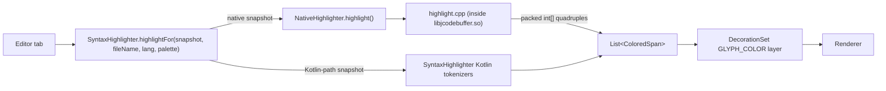

# Syntax highlighting and completion

| | |
|---|---|
| **Status** | Partially implemented — highlighting works via a hand-written tokenizer; the tree-sitter stack is built but unwired |
| **Modules** | `:core:buffer`, `:core:treesitter`, `:core:editor-completion`, `:native:buffer`, `:native:tree-sitter`, `:native:grammars`, `:app` |
| **Primary sources** | core/buffer/src/main/java/dev/jcode/core/buffer/NativeHighlighter.kt, native/buffer/src/highlight.cpp, app/src/main/java/dev/jcode/editor/SyntaxHighlighter.kt, core/treesitter/src/main/java/dev/jcode/core/treesitter/TsParseService.kt, core/treesitter/src/main/java/dev/jcode/core/treesitter/LanguageRegistry.kt, core/treesitter/src/main/java/dev/jcode/core/treesitter/TsHandles.kt, core/editor-completion/src/main/java/dev/jcode/core/editor/completion/, app/src/main/java/dev/jcode/editor/LanguagePackCompletions.kt, app/src/main/java/dev/jcode/editor/CodeFormatter.kt |
| **Verified against** | commit `cea581c`, 2026-08-09 |

---

## 1. Purpose and scope

Two related things: how text gets coloured, and how completions are produced and inserted.

> **Read this first.** JCode contains a complete tree-sitter binding, 14 compiled grammars, and a
> parse service — and **none of it colours any text**. The colours you see come from a hand-written
> tokenizer in C++ with a Kotlin twin. This document specifies the live path first and the unwired
> path second, because assuming tree-sitter is in play leads to wrong conclusions about performance,
> correctness limits, and where to add a language.

---

## 2. The live highlighting path



`NativeHighlighter` runs the tokenizer **directly over a native `Snapshot`'s bytes** — the document
text never crosses the JNI boundary — and returns packed
`[startByte, endByte, colorArgb, styleFlags]` quadruples in scan order, already byte-sorted to match
the renderer's span sweep.

`highlight()` returns `null` for a Kotlin-path snapshot (`nativeHandleOrZero == 0`), and the caller
falls back to the equivalent Kotlin tokenizers in `app/src/main/java/dev/jcode/editor/SyntaxHighlighter.kt`.

### 2.1 Modes

| Constant | Value | Selected when |
|---|---|---|
| `MODE_TOKENIZE` | 0 | Default — a Dev Pack's rules, or the generic profile when there is no pack |
| `MODE_MARKDOWN` | 1 | `isMarkdownFile(fileName)` |
| `MODE_MARKUP` | 2 | The pack is a markup language (HTML/XML-like) |
| `MODE_KEYVALUE` | 3 | The pack is a key/value language (YAML/INI-like) |
| `MODE_JSON` | 4 | `isJsonFile(fileName)` |

Selection order in `SyntaxHighlighter.highlightFor` is exactly: markdown → JSON → no pack
(generic profile) → markup → key/value → tokenize.

Modes 1, 2 and 4 need no profile; modes 0 and 3 take one.

### 2.2 Profiles

A `Profile` is a language configuration marshalled once into native memory and reused:

```kotlin
fun createProfile(
    lineComments: List<String>, blockStart: String?, blockEnd: String?,
    delimiters: List<String>, keywords: Collection<String>, types: Collection<String>,
    sep: Char = ':', sections: Boolean = false,
): Profile
```

`Profile` is `AutoCloseable` and `Cleaner`-backed, capturing only the primitive handle.

Profiles come from a **Dev Pack** (`LanguagePack`) — see
[Extension model and lifecycle](../07-extensions/01-extension-model-and-lifecycle.md). Files with no
pack get `genericProfile`.

### 2.3 Token palette

`TokenPalette` has 11 colours in a fixed constructor order, and that order **is** the wire format:
`highlight(..., palette: IntArray)` takes the 11 values positionally.

| Token | `DARK` | `LIGHT` |
|---|---|---|
| `keyword` | `0xFFCBA6F7` | `0xFF8839EF` |
| `type` | `0xFF89DCEB` | `0xFF179299` |
| `string` | `0xFFA6E3A1` | `0xFF40A02B` |
| `comment` | `0xFF7F849C` | `0xFF8C8FA1` |
| `number` | `0xFFFAB387` | `0xFFFE640B` |
| `function` | `0xFF89B4FA` | `0xFF1E66F5` |
| `variable` | `0xFFB4BEFE` | `0xFF7287FD` |
| `constant` | `0xFFEBA0AC` | `0xFFE64553` |
| `property` | `0xFF94E2D5` | `0xFF04A5E5` |
| `operator` | `0xFFBAC2DE` | `0xFF6C6F85` |
| `annotation` | `0xFFF9E2AF` | `0xFFDF8E1D` |

(Catppuccin Mocha and Latte, matching `EditorTheme`.)

### 2.4 Limits of this approach

`SyntaxHighlighter`'s own doc comment is candid: it is "a small, dependency-free tokenizer… Not a
full grammar, but it covers the common 'code coloring' need without a native grammar." Consequences:

- No semantic distinction between a type and a variable beyond keyword/type word lists.
- No nesting-aware constructs (template literals with embedded expressions, nested comments).
- No incremental reparse — the visible region is re-tokenized.
- Adding a language means shipping a Dev Pack with keyword/type/delimiter/comment rules, **not**
  adding a grammar.

Spans use UTF-8 byte offsets to match the renderer.

---

## 3. The tree-sitter path (built, not wired)

Everything below exists and works in isolation. Nothing calls it.

| Component | State |
|---|---|
| `native/grammars` | Builds 14 grammar `.so` files at pinned upstream tags |
| `TsHandles.kt` | Complete binding: `TsParser`, `TsTree`, `TsNode`, `TsCursor`, `TsQuery`, `TsLanguage`, all `Cleaner`-backed |
| `TsLanguage.load(libName, funcName, name, extensions)` | Real `dlopen`/`dlsym` loader in `jni_treesitter.c` |
| `TsParseService` | Real incremental service: 30 ms debounce, cancel-and-replace on a `generation` stamp, `applyDiffEdit` computing a common-prefix/suffix diff |
| `LanguageRegistry` | Registers 14 languages — **metadata only** |
| `HighlightSpanProducer.produce()` | Explicit stub: returns an empty list |

**Where the chain breaks.** `LanguageRegistry.registerDefaultLanguages()` calls
`TsLanguage.create(id, extensions)`, which yields `nativeHandle = 0`. It never calls
`TsLanguage.load(...)`, so no grammar `.so` is ever `dlopen`'d. Even if a grammar were loaded,
`HighlightSpanProducer.produce()` returns nothing.

**Registered language ids:** c, cpp, csharp, css, html, java, javascript, json, kotlin, markdown,
python, rust, typescript, tsx.

**One detail worth preserving if this is ever wired up:** `applyDiffEdit` marks tree edits in
**modified-UTF-8 byte space** — NUL encodes as 2 bytes and each surrogate half as 3 — because that
is what the tree-sitter JNI layer receives. Plain UTF-8 offsets would desynchronize the tree.

`TsParseService` keys per-document state on `editorState.hashCode().toString()`, which is not a
guaranteed-unique identity.

---

## 4. Completions

### 4.1 Model — `:core:editor-completion`

```kotlin
data class CompletionItem(
    val label: String, val kind: CompletionItemKind,
    val detail: String? = null, val documentation: String? = null,
    val insertText: String? = null, val snippetText: String? = null,
    val deprecated: Boolean = false,
    val sortText: String? = null, val filterText: String? = null,
    val source: String? = null,
)

interface CompletionProvider {
    suspend fun provide(text: String, offset: Int, triggerChar: Char?): List<CompletionItem>
}

data class CompletionContext(val items: List<CompletionItem>, val triggerOffset: Int, val triggerChar: Char?)
```

`CompletionItemKind` mirrors the 25 LSP completion kinds.

### 4.2 Sources

| Source | Where | Status |
|---|---|---|
| Dev Pack keywords/snippets | `app/src/main/java/dev/jcode/editor/LanguagePackCompletions.kt` → `languagePackCompletionItems(lang, prefix)` | Live |
| Language server | `:core:lsp` `LspSession.completion(...)` | Client exists; not fed into the editor popup |

### 4.3 Anchor and popup

`EditorView.updateCompletionAnchor()` produces a `CompletionAnchor(prefix, replaceStart, caret,
xPx, yPx)` — the identifier prefix at the caret, the byte range it occupies, and the pixel position
to anchor the popup. `null` means "no active prefix".

`CompletionWindow` is a Compose `Popup` with a `PopupPositionProvider` and a `LazyColumn`, filtering
and sorting live by `filterText` / `sortText`. Acceptance calls
`EditorView.replaceRange(start, end, text, caretAfter)`.

### 4.4 Snippets — `SnippetEngine`

Parses LSP snippet syntax:

| Construct | Meaning |
|---|---|
| `$0`, `$1`, `$2`, … | Tab stops (`$0` is the final position) |
| `${1:placeholder}` | Tab stop with default text |
| `${1\|a,b,c\|}` | Choice |
| `${1/regex/format/options}` | Transform |
| `$TM_SELECTED_TEXT`, `$TM_CURRENT_LINE` | Variables |
| `\$`, `\}` … | Escapes |

`parse(snippet): SnippetResult`; models are `TabStop` and `AppliedSnippet`.

---

## 5. Formatting

`CodeFormatter.format(text, lang)` is the built-in **Format Document**. It is deliberately modest:
normalizes line endings, trims trailing whitespace, and converts leading tabs to `indent` spaces
when the Dev Pack specifies an indent width (`expandLeadingTabs`).

A Dev Pack may declare an external `formatter.command`. That field is parsed but **not executed** —
see §7.

---

## 6. Threading and lifecycle

- Highlighting runs against an immutable `Snapshot`, so it is safe off the writer thread.
- `NativeHighlighter.Profile` is created once per pack and reused; it is `Cleaner`-backed.
- `SyntaxHighlighter` caches per-pack profiles in a `WeakHashMap`, so a pack that is uninstalled
  releases its native profile.
- `TsParseService` (if it were used) owns `Dispatchers.Default` with 30 ms debounce and
  cancel-and-replace.

---

## 7. Known gaps

- **Tree-sitter is entirely unwired** (§3). The 14 grammar `.so` files ship in the APK and are never
  loaded.
- **LSP completions do not reach the editor.** The client can issue `textDocument/completion`, but
  the popup is fed only from Dev Pack keywords.
- **External formatters are not executed.** A Dev Pack's `formatter.command` is parsed and ignored;
  only the built-in `CodeFormatter` runs.
- **LSP diagnostics do not become squiggles or Issues rows.** `SquiggleDecoration` and
  `DiagnosticsBus` both exist; the wiring from `LspSession` to them is absent.
- `ColoredSpan`'s KDoc still credits "tree-sitter's `HighlightSpanProducer`" as its producer.

---

## 8. References

- [Text buffer](01-text-buffer.md)
- [Rendering and decorations](03-rendering-and-decorations.md)
- [LSP client](../04-language-services/01-lsp-client.md)
- [Extension model and lifecycle](../07-extensions/01-extension-model-and-lifecycle.md)
- [Known gaps and unwired code](../09-platform/05-known-gaps-and-unwired-code.md)
