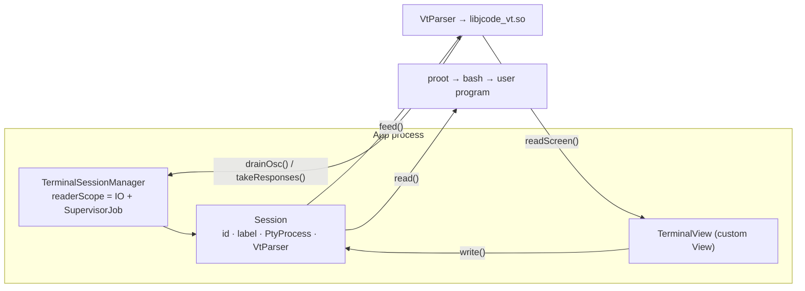

# Terminal, PTY and VT

| | |
|---|---|
| **Status** | Implemented |
| **Modules** | `:core:term`, `:native:pty`, `:native:vt` |
| **Primary sources** | core/term/src/main/java/dev/jcode/core/term/PtyProcess.kt, core/term/src/main/java/dev/jcode/core/term/VtParser.kt, core/term/src/main/java/dev/jcode/core/term/TerminalSessionManager.kt (923 lines), core/term/src/main/java/dev/jcode/core/term/TerminalView.kt (1,572 lines), native/pty/src/pty.cpp, native/vt/src/vt_parser.c (1,552 lines) |
| **Verified against** | commit `cea581c`, 2026-08-09 |

---

## 1. Purpose and scope

Real PTY sessions running Linux programs inside proot, a full xterm-compatible VT emulator, and a
session manager that keeps them alive independently of the UI.

The terminal is in-house by project decision — no third-party terminal widget.

---

## 2. Architecture



Each session owns **its own** `VtParser`, so screen state and scrollback survive the panel being
hidden. The manager drains every PTY continuously whether or not a view is attached — otherwise a
long-running CLI would block on a full kernel buffer while its tab was off screen.

---

## 3. `PtyProcess`

```kotlin
class PtyProcess private constructor(private var nativeHandle: Long) : Closeable {
    companion object {
        fun create(
            exe: String, argv: List<String>, envp: List<String> = emptyList(),
            cwd: String? = null, cols: Int = 80, rows: Int = 24,
        ): PtyProcess     // throws RuntimeException("Failed to create PTY") on failure
    }
}
```

| Member | Behavior |
|---|---|
| `read(buffer, offset, length): Int` | **Non-blocking.** Bytes read, `0` if none available, `-1` on error/EOF |
| `awaitReadable(timeoutMs): Boolean` | Parks in kernel `poll()` on the master fd |
| `write(data, offset, length): Int` / `write(text: String)` | |
| `resize(cols, rows): Boolean` | `TIOCSWINSZ` |
| `waitForExit(): Int` | Negative result indicates a signal |
| `isOpen: Boolean` | |
| `close()` | `@Synchronized`; `cleanable.clean()` then zero the handle |

Backed by `forkpty()` in `native/pty/src/pty.cpp`.

### 3.1 The `awaitReadable` caveat

The master fd is captured **once at construction** (`masterFd`) so the poll does not re-enter JNI.
The documented consequence:

> Linux `poll()` is NOT woken by a concurrent `close()` of the same fd, so the timeout is the
> teardown-notice bound — callers re-check session state on each wakeup.

Reader loops therefore use a bounded timeout (1 second in `LspSession`) and re-check liveness each
time round.

---

## 4. `VtParser`

```kotlin
class VtParser(rows: Int, cols: Int) : AutoCloseable
```

Wraps `libjcode_vt.so`. Unlike the other native wrappers it does **not** catch
`UnsatisfiedLinkError` — a terminal without a VT parser is not useful — and the constructor throws
`IllegalStateException("Failed to create VT parser")` if allocation fails.

### 4.1 API

| Member | Purpose |
|---|---|
| `feed(data, length)` | Process bytes. The array is not retained, so a reused read buffer can be passed without copying |
| `drainOsc(): List<Pair<Int, String>>` | JCode shell-integration OSC events — see [Shell integration protocol](02-shell-integration-protocol.md) |
| `takeResponses(): ByteArray?` | Answerback bytes the parser queued (DA/DSR/CPR/DECRQM/OSC-colour). The reader writes these back to the PTY |
| `inputModes(): Int` | Packed DEC private-mode snapshot |
| `resize(rows, cols)`, `reset()` | |
| `rows`, `cols`, `cursorRow`, `cursorCol`, `isCursorVisible`, `isAlternateScreen` | |
| `scrollbackSize`, `scrollbackPushed` | See §4.4 |
| `getCellCodePoint(row, col): Int` | Full Unicode codepoint (the native side decodes UTF-8, so values above `0xFFFF` occur) |
| `readRow(row, out): Int` | One row per JNI call |
| `readScreen(topRow, rowCount, out): Int` | Whole visible screen per JNI call — the per-frame path |
| `isOpen` | Never throws; safe to poll from a renderer before reading cells |

`takeResponses` matters for interoperability: programs that probe the terminal (Claude Code, fzf,
vim) block or degrade without the replies.

### 4.2 Cell encoding

`CELL_STRIDE = 4` ints per cell:

| Index | Meaning |
|---|---|
| `i*4 + 0` | Codepoint. **`0` marks the continuation cell of a wide character** — skip it |
| `i*4 + 1` | Foreground |
| `i*4 + 2` | Background (`-1` default, `0..255` indexed, or packed RGB truecolor) |
| `i*4 + 3` | Packed meta |

Meta decoders: `metaFgMode(meta) = meta and 0x3`, `metaBgMode(meta) = (meta shr 2) and 0x3`,
`metaAttrs(meta) = meta shr 4`.

Attribute flags: `ATTR_BOLD=1`, `ATTR_DIM=2`, `ATTR_ITALIC=4`, `ATTR_UNDERLINE=8`, `ATTR_BLINK=16`,
`ATTR_INVERSE=32`, `ATTR_HIDDEN=64`, `ATTR_STRIKETHROUGH=128`.

### 4.3 Input modes

`inputModes()` returns a packed `Int` mirroring `VT_MODE_*` in `native/vt/src/vt_parser.h`:

| Constant | Bit | DEC mode | Effect |
|---|---|---|---|
| `MODE_APP_CURSOR_KEYS` | 0 | `?1` DECCKM | Arrows send the SS3 (`ESC O A`) form |
| `MODE_BRACKETED_PASTE` | 1 | `?2004` | Wrap pastes in `ESC[200~` / `ESC[201~` |
| `MODE_FOCUS_EVENTS` | 2 | `?1004` | Report focus as `ESC[I` / `ESC[O` |
| `MODE_ALT_SCROLL` | 3 | `?1007` (default on) | Wheel → arrows on the alternate screen |
| `MODE_SYNC_OUTPUT` | 4 | `?2026` | A synchronized update is open |
| `MODE_ALT_SCREEN` | 5 | — | Alternate screen buffer active |

**Mouse tracking**, `modeMouseMode(modes) = (modes shr 8) and 0x7`:

| Constant | Value | DEC mode |
|---|---|---|
| `MOUSE_OFF` | 0 | — |
| `MOUSE_X10` | 1 | `?9` press only |
| `MOUSE_NORMAL` | 2 | `?1000` press + release + wheel |
| `MOUSE_BUTTON` | 3 | `?1002` + drag motion |
| `MOUSE_ANY` | 4 | `?1003` + all motion |

**Mouse encoding**, `modeMouseEncoding(modes) = (modes shr 12) and 0x3`:

| Constant | Value | DEC mode |
|---|---|---|
| `MOUSE_ENC_X10` | 0 | default |
| `MOUSE_ENC_SGR` | 2 | `?1006` |
| `MOUSE_ENC_URXVT` | 3 | `?1015` |

`?1005` (UTF-8 mouse) is **not recognized** and falls back to X10 encoding.

### 4.4 Scrollback

`scrollbackSize` is the number of lines available above the live screen (0 on the alternate
screen). Scrollback cells are addressed with **negative rows**: `-1` is the most recently
scrolled-off line, `-scrollbackSize` the oldest.

`scrollbackPushed` is a monotonic total of lines ever pushed. Unlike `scrollbackSize` it keeps
growing once the ring is full, which is how a scrolled-back view detects that content shifted
underneath it.

### 4.5 JNI shape

Hot-path natives are `@JvmStatic` and take the handle directly, so the JNI side never resolves the
`nativeHandle` field reflectively (`GetObjectClass` + `GetFieldID`) per call. Only the rarely-called
`nativeCreate` / `nativeResize` / `nativeReset` / `nativeIsAlternateScreen` are instance methods.

---

## 5. `TerminalSessionManager`

```kotlin
class TerminalSessionManager(
    private val prootManager: ProotManager,
    private val rootfsManager: RootfsManager,
    maxSessions: Int = 12,
)
```

`maxSessions` is coerced into `1..MAX_SESSIONS_CAP` (24).

### 5.1 `Session`

| Field | Purpose |
|---|---|
| `id`, `label`, `pty`, `cols`, `rows` | Identity and geometry |
| `parser: VtParser` | This session's own screen and scrollback |
| `foreground: String?` | Program reported by OSC 7712; `null` at the prompt |
| `lastActivityAt: Long` | Epoch millis of last I/O, for idle reaping |
| `onUpdate: (() -> Unit)?` | Invoked off the main thread after output is parsed |
| `inputModesSnapshot: Int` | Mode snapshot published after each feed |
| `relocationParentId`, `relocationFifoHost`, `spawnSpec` | Nested-shell relocation state |

`resize(newCols, newRows)` resizes the parser (under `synchronized(this)`, against the reader's
feed) and the PTY together, and is safe to call from the UI thread.

**`inputModesSnapshot` is the reason the UI never races the parser**: the UI thread reads the
snapshot instead of calling into a live native parser, so it always sees a mutually consistent
modes + alt-screen pair.

```kotlin
data class SpawnSpec(
    val distroId: String, val binds: List<DistroBind>,
    val user: String, val rootfsArch: Arch, val workdir: String,
)
```

### 5.2 Host callbacks

All `@Volatile`, all invoked off the main thread:

| Callback | Fired by |
|---|---|
| `onSessionExit(id)` | The shell exited on its own and the session was auto-reaped |
| `onExternalKill(id)` | The same exit, but unexplainable by an ordinary one — see below |
| `onOpenFileRequest(path)` | OSC 7711 |
| `onTitleChange(id, program)` | OSC 7712 |
| `onTaskComplete(id, payload)` | OSC 7713 |
| `onOpenUrlRequest(url)` | OSC 7714 |
| `onNestedShellOpen(parentId, payload)` | OSC 7715 |
| `onTaskProgress(id, payload)` | OSC 7716 |
| `onClipboardWrite(text)` | OSC 52 |
| `onOutput(id, buffer, length)` | Raw PTY bytes mirrored to the Output panel |

> `onOutput` receives the **reused read buffer**. It must be consumed synchronously; retaining the
> array yields garbage on the next read.

### 5.3 Session creation

`createSession(distroId, binds, workdir, user, shellCommand = "/bin/bash --login", rootfsArch, label)`
returns `null` when the session cap is reached, proot is not installed, or the distro is not
installed. Before spawning it performs several guest-side repairs:

| Step | Reason |
|---|---|
| `rootfsManager.ensureRootfsNetworking(rootfsPath)` | Minimal ubuntu-base images ship no usable `/etc/resolv.conf`, so `apt` from the terminal would fail. Guarded writes, so it is a cheap no-op once configured |
| Create `~/.hushlogin` for root and the user | Suppresses Debian/Ubuntu's `/etc/bash.bashrc` sudo hint, which runs `$(groups)` and prints `groups: cannot find name for group ID N` for the inherited Android gids. Also quiets the login MOTD |
| Write a default `htoprc` (only when absent) | htop's desktop default packs so many wide columns that the Command column falls off a phone screen, leaving a wall of `root`. The compact layout is PID/CPU%/MEM%/Command with threads hidden. Never clobbers a user's own settings |
| Install `/etc/profile.d/jcode-open.sh` | The shell-integration script |
| Install the `xdg-open` shim | OSC 7714 URL routing |
| Install nested-shell wrappers | Only when `nestedShellTabs` is on |

It also injects environment: `androidSdkEnvVars` supplies `ANDROID_HOME` when the SDK is installed,
and `adbEnvVars` supplies `ANDROID_SERIAL` and `JCODE_ADB_PORT` when the ADB bridge is up.

### 5.4 Idle reaping

`onExternalKill` fires from `reapExitedSession` when the child's exit status is **SIGKILL**
(`PtyProcess.waitForExit` reports a signal as its negation) or the exit lands within
`EXTERNAL_KILL_BURST_MS` (1.5 s) of another self-exit. The wait is bounded to 300 ms on a throwaway
thread — EOF on the master only *usually* means the child is gone, and a program that closes its tty
and keeps running would otherwise wedge the reader. Neither rule fires on a normal exit; both are the
signature of Android's **phantom-process trim**: ActivityManager kills every
process an app forked past `activity_manager/max_phantom_processes` (32 by default), taking proot and
the whole distro with it while the app itself keeps running. The app cannot raise that cap — it lives
in DeviceConfig behind a signature permission — so the workbench surfaces a prompt pointing at
Settings → Environment → *Background process limit*, which carries the adb commands
(`AppProcesses.RAISE_LIMIT_COMMANDS`) and a live count from `AppProcesses.count()`.

`reapIdle(idleMillis)` closes sessions with `foreground == null` (no running program), not in the
protected set, and `now - lastActivityAt >= idleMillis`. Controlled by the
`AUTO_CLOSE_IDLE_TERMINALS` (default `false`) and `IDLE_TIMEOUT_MINUTES` (default 30) settings.

### 5.5 Nested sub-shell relocation

When `nestedShellTabs` is enabled, typing `bash` (or `dash`, `ash`, `zsh`, `ksh`, `mksh`, `sh`) at a
JCode prompt moves that interactive shell into its **own tab**. The mechanism:

```mermaid
sequenceDiagram
    participant U as User types `bash`
    participant W as /usr/local/bin/bash wrapper
    participant H as Host (TerminalSessionManager)
    participant C as New child tab

    W->>W: bail to `exec real` unless bare + interactive + both ends a tty
    W->>W: mkfifo, write launcher script
    W->>H: OSC 7715 `open;<token>;<label>`
    H->>C: createNestedShellSession(parentId, token, label) — clones SpawnSpec
    C->>W: launcher opens fd4 → FIFO, writes "A\n" (ACK)
    W->>W: parent blocks reading the FIFO
    C->>W: on exit writes "E <code>\n"
    W->>W: unblocks, returns that exit code
```

Safety rails in the wrapper:

- `JCODE_NSH_TOP` marks a tab's own top shell so it never relocates itself; the variable is cleared
  so that shell's *own* sub-shells can still relocate.
- Inline `exec` (no relocation) when: either end is not a tty, `JCODE_NSH_INLINE` is set, `-c` or
  `--command` is present, a script operand or an operand after `--` appears, or the shell is not
  present in the distro.
- A **3-second watchdog** writes an abort marker and `T\n` to the FIFO if no ACK arrives — a PTY the
  app does not own (tmux, ssh) or a declining host falls back to inline.
- The parent traps `INT QUIT TSTP` to nothing while inert, so a stray Ctrl-C there cannot orphan the
  child tab.
- Relocation tokens are restricted to `[A-Za-z0-9_]+` because they are interpolated into guest and
  host paths.
- `writeRelocationBackstop` writes the exit line if the child is force-closed before its launcher
  reports.

Wrappers are marked with `#!/bin/sh\n# jcode-nsh-wrapper` so toggling the feature off removes only
JCode's own files and leaves a distro's real shell in `/usr/local/bin` alone.

User environment variables are validated against `[A-Za-z_][A-Za-z0-9_]*` before export, because they
are emitted unquoted as `export NAME=...`.

---

## 6. `TerminalView`

A custom `View` mirroring `EditorView`'s structure:

- Gestures: tap, long-press, double-tap, scroll; teardrop **selection handles** operating on
  **logical rows** with cell-centre anchors.
- Mouse reporting: `dispatchScroll` and `sendMouseEvent` emit xterm mouse reports when the program
  has enabled tracking, gated by `appConsumesMouse(modes)`.
- IME: `commitText`, `sendKeyEvent`, `deleteSurroundingText`. `sendKeyEvent` routes through the same
  `sendKey` table as the hardware path, and latches a standalone `KEYCODE_SHIFT_*` into
  `pendingShift` (folded into the next key's meta state) so Shift+Enter — encoded as `ESC CR`, the
  "insert a newline" sequence CLIs like Claude Code expect — and Shift+Tab work from a soft keyboard.
- Font size: `setFontSize` takes raw pixels; the workbench scales the sp-based global setting by the
  display density.
- Cursor blink: `startBlink` / `stopBlink` / `resetBlink`.
- Colour resolution: `sgrFg` / `sgrBg` / `resolveCellColor` handle SGR, 256-indexed and truecolor.
- Paste: OSC 52 text is shell-quoted via `shellQuote` before being written.
- A grid `RenderNode` cache with the same `hasDisplayList()` guard as the editor.

---

## 7. Threading and lifecycle

| Concern | Handling |
|---|---|
| Reader loops | `readerScope = CoroutineScope(Dispatchers.IO + SupervisorJob())`, process-lifetime |
| Session map | `synchronized(sessionsLock)` — readers/reaper on IO, create/close on the UI thread |
| Parser resize vs feed | `synchronized(session)` |
| Mode publication | `inputModesSnapshot` written after each feed |
| Idle blocking | `pty.awaitReadable(timeout)` rather than a spin |
| Process survival | `BackendService` foreground service holds the app alive |

`relocationParents` is a `ConcurrentHashMap<childId, parentId>` that deliberately **outlives** the
`Session`, so the exit path can still find the parent tab to refocus.

---

## 8. Invariants and constraints

1. `onOutput`'s buffer is reused — consume it synchronously.
2. Read `inputModesSnapshot`, never call the parser from the UI thread.
3. Resize the PTY and the parser together, under the session lock.
4. Codepoint `0` in a cell is a wide-character continuation, not a space.
5. Negative row indices address scrollback.
6. `awaitReadable` callers must re-check session state on every wakeup.
7. Nested-shell tokens must match `[A-Za-z0-9_]+`.
8. `VtParser.MODE_*` / `MOUSE_*` must stay in lockstep with `VT_MODE_*` in `vt_parser.h`.

---

## 9. Failure modes

| Failure | Effect |
|---|---|
| `libjcode_vt.so` missing | Hard failure — no fallback |
| Session cap reached | `createSession` returns `null` |
| proot or rootfs missing | `createSession` returns `null` |
| Child tab force-closed mid-relocation | Backstop exit line written to the FIFO so the parent unblocks |
| No ACK within 3 s | Abort marker set; the wrapper execs the real shell inline |
| Program enables `?1005` | Falls back to X10 mouse encoding |

---

## 10. Known gaps

- `VtParser.drainOsc`'s KDoc documents the OSC 7715 payload as
  `open;<token>;<b64label>;<b64cwd>;<b64user>`. The emitting wrapper and
  `TerminalSessionManager.onNestedShellOpen` both use `open;<token>;<label>` — the base64 cwd/user
  fields do not exist. The KDoc is stale; see
  [Shell integration protocol](02-shell-integration-protocol.md) for the live format.
- `:feature:terminal-pane` is a stub; the terminal UI host lives in
  `app/src/main/java/dev/jcode/TerminalSessionHost.kt`.
- `VtParser` rolls its own `Cleaner` rather than using `:core:resource`'s `NativeHandle`.

---

## 11. References

- [Shell integration protocol](02-shell-integration-protocol.md)
- [Embedded Linux runtime](03-embedded-linux-runtime.md)
- [Concurrency and resource lifecycle](../01-architecture/03-concurrency-and-resource-lifecycle.md)
- [Panels and tools](../06-workbench/03-panels-and-tools.md)
