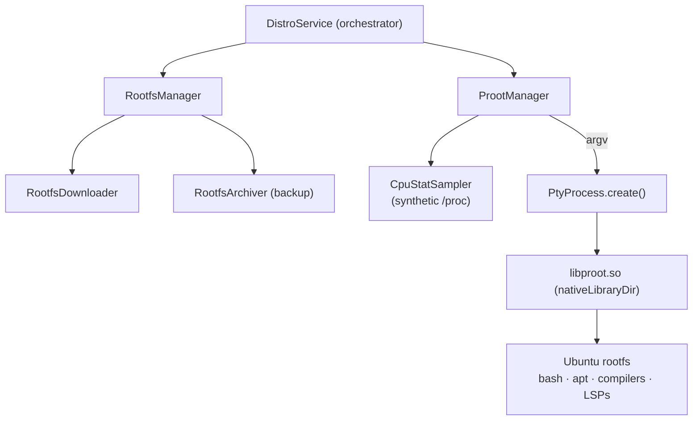

# Embedded Linux runtime

| | |
|---|---|
| **Status** | Implemented |
| **Modules** | `:core:distro`, `:native:proot` |
| **Primary sources** | core/distro/src/main/java/dev/blamspot/jcode/core/distro/ProotManager.kt, core/distro/src/main/java/dev/blamspot/jcode/core/distro/RootfsManager.kt, core/distro/src/main/java/dev/blamspot/jcode/core/distro/RootfsDownloader.kt, core/distro/src/main/java/dev/blamspot/jcode/core/distro/RootfsArchiver.kt, core/distro/src/main/java/dev/blamspot/jcode/core/distro/CpuStatSampler.kt, core/distro/src/main/java/dev/blamspot/jcode/core/distro/DistroService.kt (2,388 lines), core/distro/src/main/java/dev/blamspot/jcode/core/distro/DistroModels.kt, core/distro/src/main/java/dev/blamspot/jcode/core/distro/Arch.kt, native/proot/libandroid-shmem/ |
| **Verified against** | commit `cea581c`, 2026-08-09 |

---

## 1. Purpose and scope

A complete Linux userland running inside an unprivileged Android app: how the rootfs gets there, how
proot is invoked, and the Android-specific workarounds that make ordinary Linux tooling behave.

> **Hard invariant: no host root, ever.** Isolation is proot userspace only. `-0` gives *fake* root
> inside the guest. No `su`, no libsu, no Shizuku. Enforced by `scripts/check-no-host-root.sh` in
> CI, in the pre-commit hook, and as a release pre-flight.

---

## 2. Architecture



`ProotManager` builds argv; `PtyProcess` spawns it. There is no daemon and no `proot-distro`
wrapper — every guest process is a direct child of a PTY the app owns.

---

## 3. proot packaging

| Artifact | Location | Reason |
|---|---|---|
| `libproot.so`, `libproot-loader.so`, `libproot-loader32.so` | `native/proot/src/main/jniLibs/arm64-v8a/` → `nativeLibraryDir` | `nativeLibraryDir` is the only app-owned location W^X allows `execve` from at `targetSdk` ≥ 29 |
| `libtalloc-arm64-v8a.so` | asset → `filesDir/bin/proot/lib/` | Only `mmap`'d; proot links against it dynamically (`LD_LIBRARY_PATH`) |
| `libandroid-shmem-arm64-v8a.so` | asset → `filesDir/bin/proot/lib/` | `DT_NEEDED` by proot; backs `--sysvipc` |

`SUPPORT_LIBS_VERSION` (currently `3`) is bumped whenever the asset libs change, so existing installs
re-extract them on the next runtime prep. Version 2 is the memfd-based `libandroid-shmem`; version 3
is that shim taking its named-key registry directory from `PROOT_TMP_DIR` at runtime instead of a
compiled-in path. The old literal named the base `applicationId`, so on `.debug` and `.beta` — whose
data directories carry the suffix — it pointed at a directory that does not exist, and a named-key
`shmget` looped on a `symlink()` that could never succeed.

`ensureProotTmpDir()` runs before every invocation; after the first successful prep it costs a single
`stat` and re-preps fully if the directory was cleared. The one-time prep also deletes proot/loader
binaries extracted by pre-`jniLibs` app versions — dead weight that W^X forbids exec'ing.

---

## 4. The proot command line

`buildProotCommand(rootfsPath, command, binds, workdir, rootfsArch)` emits, in order:

| Argument | Purpose |
|---|---|
| `<prootBinary>` | Absolute path in `nativeLibraryDir` |
| `--qemu=<path>` | Only when `needsQemu(rootfsArch)` — foreign-architecture rootfs. Inert today (§9) |
| `-r <rootfs>` | Guest root |
| `-b <host>:<target>` … | Caller-supplied binds |
| `-b /dev`, `-b /proc`, `-b /sys` | Android compatibility |
| `-b <fakeproc>/{stat,loadavg,uptime,version}:/proc/…` | Synthetic `/proc` — see §6 |
| `-b <transferRoot>:/jcode-transfer` | Extension file import/export bridge |
| `-b <sourcesRoot>:/sources` | Clone staging |
| `-w <workdir>` | Default `/workspace` |
| `-0` | Fake root (uid 0) inside the guest — needed by `apt` |
| `--link2symlink` | Emulate hard links as symlinks |
| `--sysvipc` | Emulate SysV IPC |
| `-k 6.1.0` | Reported kernel release |
| `--verbose=-1` | Silence proot diagnostics |
| `--kill-on-exit` | Kill the whole guest tree when the top command exits |
| `<command>` … | The program and its arguments |

Order matters for the `/proc` overlay: the specific file binds are declared **after** `-b /proc` so
they win over the directory bind. Real `/proc/meminfo` and the per-process files stay live; only the
CPU/load counters are synthetic.

### 4.1 Why each unusual flag exists

**`--link2symlink`.** `dpkg`/`apt` atomically back up their database by hard-linking
(`/var/lib/dpkg/status` → `status-old`). Many Android kernels and filesystems reject `link()` in the
app data directory with `EPERM`/`EACCES`, so without this flag dpkg dies with
`error creating new backup file '/var/lib/dpkg/status-old': Permission denied`, and every later
`apt`/`dpkg` — including the `dpkg --configure -a` self-heal — then fails too. Device-dependent:
observed on some Android 13 devices and not others.

**`--sysvipc`.** Android kernels ship with `CONFIG_SYSVIPC` off, so `shmget`/`shmat` return `ENOSYS`.
The extension backs segments with the bundled memfd `libandroid-shmem`. Device-verified for both
single- and cross-process shm attach.

**`-k 6.1.0`.** Reporting a modern kernel release reduces false "unknown syscall" warnings.

**`--verbose=-1` rather than `-q`.** This proot build uses `-q` / `--qemu` for QEMU emulation, and
that flag **takes an argument** — a bare `-q` would swallow the next token and break the command
line.

**`--kill-on-exit`.** Without it, tearing down only the proot launcher (`PtyProcess.close`,
`Process.destroy`) orphans its descendants — for example a debug adapter's `python3` — leaking a
proot tree on every close. It requires a graceful signal (`SIGTERM`) so proot can run its cleanup.

**No `--` terminator.** This build reports `unknown option '--'`. proot stops parsing options at the
first non-option token, so the command path is passed directly and its own arguments follow.

### 4.2 Shell helpers

`buildShellCommand(rootfsPath, shellCommand, binds, env, workdir, user, rootfsArch)` wraps a command
for a given guest user, and `buildInteractiveShell(...)` builds a login shell for a terminal session.
When `user != "root"` the command is routed through `su - <user> -c …`, which is why explicitly
needed variables (such as `JCODE_PROGRESS_TOKEN`) must be re-exported inside the quoted command — a
login shell drops the inherited environment.

---

## 5. Rootfs lifecycle

### 5.1 Distro profiles

```kotlin
data class DistroProfile(
    val id: String, val label: String, val installRecipe: String,
    val approxFootprint: String, val arch: Arch = Arch.ARM64,
)
```

| `id` | Label | Recipe | Footprint |
|---|---|---|---|
| `ubuntu-24.04` | Ubuntu 24.04 LTS (ARM64) | `ubuntu:24.04` | ~2.5 GB |
| `ubuntu-26.04` | Ubuntu 26.04 LTS (ARM64) | `ubuntu:26.04` | ~2.5 GB |

`ubuntu-24.04` is the default. `DistroProfile.fromId` accepts an id, an install recipe, or the legacy
bare string `"ubuntu"` (mapped to `ubuntu:24.04`).

### 5.2 Download

`RootfsDownloader` fetches `<baseUrl>/manifest.json`
(`DEFAULT_ROOTFS_BASE_URL = "https://distro.jcode.dev/rootfs"`) and falls back to a built-in default
manifest when that fetch fails. The built-in entries point at public upstreams:

| Distro | URL |
|---|---|
| Ubuntu 24.04 ARM64 | `https://raw.githubusercontent.com/EXALAB/Anlinux-Resources/master/Rootfs/Ubuntu/arm64/ubuntu-rootfs-arm64.tar.xz` |
| Ubuntu 26.04 ARM64 | `https://cdimage.ubuntu.com/ubuntu-base/releases/26.04/release/ubuntu-base-26.04-base-arm64.tar.gz` |

```kotlin
data class RootfsEntry(val id: String, …, val sha256: String, …)
```

The server's `Content-Length` is preferred over the manifest's `sizeBytes` (an estimate) for progress
reporting. SHA-256 is computed during download and verified **only when the manifest supplies a
non-blank hash** — the default entries carry `sha256 = ""`, so the built-in fallback path is
unverified. Downloads land in `filesDir/tmp` and support resumption.

### 5.3 Extraction

`extractRootfs(tarball, targetDir)` is a pure-Kotlin tar reader handling `.xz`, `.bz2` and `.gz`.

Hard links fall back to symlinks — SELinux and the app-data filesystem deny real `link()` — mirroring
the `--link2symlink` rationale.

Extraction preserves upstream ownership and permissions, which historically broke `apt`. The known
post-extraction repairs are:

| Problem | Fix |
|---|---|
| GPG keyring files unreadable → `apt-get update` fails with `NO_PUBKEY` | `find … -type f -exec chmod a+r {} +` **and** `find … -type l -exec chmod a+r {} +` over `/etc/apt/trusted.gpg.d` and `/usr/share/keyrings`. `chmod -R` does not handle the symlinks |
| `/var/lib/dpkg` and friends too restrictive | Created and `chmod`'d before the first apt run |
| `apt` cannot switch to the `_apt` sandbox user (`setgroups … Operation not permitted`) | `-o APT::Sandbox::User=root` |
| Keyring checks still failing on some devices | Retry with insecure-repository fallback flags so onboarding can continue |
| `systemd` postinst aborts under proot (`Assertion 'path_is_absolute(p)' failed`) | The `full-upgrade` step was removed; only required packages are installed |
| Bootstrap pulled 500 MB+ of recommends | `--no-install-recommends` |
| A single 15-minute chained apt command killed by Android's watchdog | Bootstrap split into 5 sequential steps, each with a 10-minute timeout |

### 5.4 Networking self-heal

`ensureRootfsNetworking(rootfsDir)` writes a usable `/etc/resolv.conf` and `/etc/hosts` when the
existing ones are missing or empty. Minimal `ubuntu-base` images (notably 26.04) ship an empty
`resolv.conf`, which leaves the guest with no DNS at all and makes `apt` fail confusingly.

It is idempotent (`isUsableResolvConf` guards the write), so `TerminalSessionManager.createSession`
calls it unconditionally — repairing installs created before the fix existed. The correct fix is
this, **not** rewriting apt sources to `ports.ubuntu.com`.

### 5.5 Backup

`RootfsArchiver` is the inverse of extraction: a `tar.gz` packer behind Settings → Back up
environment.

### 5.6 Removal and metadata

`RootfsManager` keeps distros at `filesDir/distros/<id>/` with `rootfs/` and `metadata.json`
(`METADATA_FILE`). `writeMetadata(profile)` records the profile; `readMetadataArch(distroId)` reads
back the architecture so `buildProotCommand` knows whether emulation is needed.

---

## 6. Synthetic `/proc` and `CpuStatSampler`

Android's SELinux sandbox denies app processes the real `/proc/stat`, so `htop`, `top` and `uptime`
abort with `Cannot open /proc/stat`.

**The workaround:** the per-core cpuidle C-state timers
(`/sys/devices/system/cpu/cpuN/cpuidle/stateX/time`, microseconds spent idle) *are* readable by an
app, and proot runs as the app's real uid. `CpuStatSampler` samples them on a background daemon
thread, derives `busy = wall − idle` per core, accumulates `USER_HZ` jiffie counters, and rewrites
the synthetic `/proc/stat` that `ProotManager` binds over the guest's. Tools that delta `/proc/stat`
then show true load.

Cost: roughly two small sysfs reads per core plus one small file write per second, on one daemon
thread. Started lazily on first proot use and left running (the OS suspends it during doze anyway).

**Process-wide singleton via `CpuStatSampler.shared`.** There are two `ProotManager` instances —
`DistroService`'s and `TerminalSessionHost`'s — binding the same synthetic file, but only one sampler
may own it. Two accumulators writing the same file would make the counters non-monotonic and glitch
htop.

Live per-core frequency and temperature are read straight from `/sys` by the tools themselves; only
the `/proc/stat` load counters need synthesis.

---

## 7. Guest-side conveniences

Installed by `TerminalSessionManager` at session creation — see
[Terminal, PTY and VT §5.3](01-terminal-pty-and-vt.md#53-session-creation): `~/.hushlogin` to silence
the `$(groups)` sudo hint and the MOTD, a phone-friendly `htoprc`, the shell-integration script, the
`xdg-open` shim, and optionally the nested-shell wrappers.

---

## 8. Bootstrap package set

`DEFAULT_BOOTSTRAP_PACKAGES` (installed at the `ToolchainBootstrapped` wizard step):

```
build-essential, clang, clangd, lldb, gdb, cmake, ninja-build, git,
python3, python3-pip, nodejs, npm, openjdk-21-jdk-headless, sudo
```

Everything beyond this comes from the toolchain catalog — see
[Toolchain catalog and onboarding](04-toolchain-catalog-and-onboarding.md).

---

## 9. Known gaps

- **Cross-architecture emulation is not shipped.** `Arch`, `needsQemu`, `qemuBinaryFor`,
  `extractQemu` and the `--qemu=` argument all exist, but no QEMU binary is bundled, so the branch is
  inert. The code notes two open items: the exact flag spelling must be confirmed on-device via
  `proot --help`, and — because proot `execve`s the `--qemu` binary on the *host* — a shipped
  emulator must be a `jniLib` in `nativeLibraryDir`, not an asset in `filesDir`, exactly like proot
  itself.
- **Only ARM64 distro profiles exist**, so x86-only tooling cannot run.
- **Default rootfs entries carry no SHA-256**, so the built-in fallback download path is
  integrity-unverified. Verification only engages when a served manifest supplies a hash.
- `DistroService.kt` is 2,388 lines and mixes orchestration, catalog execution, apt self-heal and
  user management.
- The rootfs lives under `filesDir` and is therefore **lost on uninstall or "Clear data"**.

---

## 10. References

- [Storage and path model](../01-architecture/05-storage-and-path-model.md)
- [Toolchain catalog and onboarding](04-toolchain-catalog-and-onboarding.md)
- [Terminal, PTY and VT](01-terminal-pty-and-vt.md)
- [Security and privacy](../09-platform/04-security-and-privacy.md)
- [`THIRD-PARTY-NOTICES.md`](../../../THIRD-PARTY-NOTICES.md) — proot (GPL) and talloc (LGPL)
