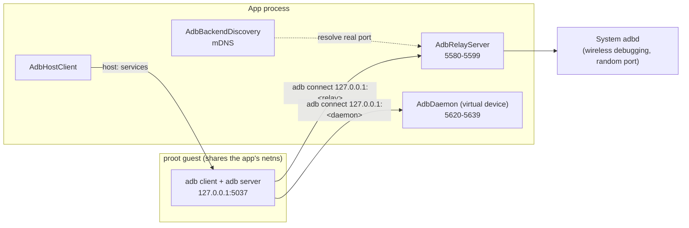

# ADB bridge

| | |
|---|---|
| **Status** | Implemented |
| **Modules** | `:core:distro` (package `dev.blamspot.jcode.core.distro.adb`), `:app` (`dev.blamspot.jcode.adb`) |
| **Primary sources** | core/distro/src/main/java/dev/jcode/core/distro/adb/AdbWire.kt, AdbAuth.kt, AdbDaemon.kt, AdbHostClient.kt, AdbRelayServer.kt, AdbBackendDiscovery.kt, AdbBridge.kt, AdbBridgeLocator.kt, AdbModels.kt, app/src/main/java/dev/jcode/adb/VirtualDeviceAdbService.kt |
| **Verified against** | device-verified on Android 13, 2026-08-11 |

---

## 1. Purpose and scope

JCode speaks ADB in **both directions**:

- **As a client** — so a project built inside the distro can `adb install` and `adb shell` against
  the very device JCode is running on, and so the Java debugger can forward JDWP.
- **As a daemon** — so the guest's `adb` can connect to JCode's own *virtual device* (the app
  sandbox) as if it were a phone.

All of it is loopback-only and unprivileged. There is no root and no `WRITE_SECURE_SETTINGS`.

---

## 2. Architecture



**The key enabling fact:** proot shares the app's network namespace, so the guest's
`127.0.0.1:5037` *is* the app's `127.0.0.1:5037`. No bind, no tunnel, no port forwarding.

---

## 3. `AdbWire` — the transport protocol

What an adb server speaks to a **device** (as distinct from the `host:` service protocol in §5).

Every message is a **24-byte header** of six little-endian `uint32`s:

```
command, arg0, arg1, data_length, data_check, magic
```

optionally followed by `data_length` payload bytes. `magic` is `command` with every bit flipped and
is the only header field either side still validates.

| Command | Value |
|---|---|
| `CNXN` | `0x4E584E43` |
| `OPEN` | `0x4E45504F` |
| `OKAY` | `0x59414B4F` |
| `CLSE` | `0x45534C43` |
| `WRTE` | `0x45545257` |
| `AUTH` | `0x48545541` |

The daemon announces **the last protocol version that predates STARTTLS**. Announcing anything newer
invites the client to negotiate TLS (`A_STLS`), which this daemon does not speak.

`AdbProtocolException` is raised when a peer refuses a request or sends something unparseable.

---

## 4. `AdbAuth` — device-side authentication

The standard adb handshake: the device sends a random `AUTH TOKEN`; the client answers
`AUTH SIGNATURE` with the token signed by one of its private keys, or — once out of keys —
`AUTH RSAPUBLICKEY`, which on a real phone raises the "Allow USB debugging?" dialog.

**JCode's daemon has no such dialog and no notion of a trusted user gesture, so only a *signature* by
an enrolled key is ever accepted.** `AUTH RSAPUBLICKEY` is refused.

### 4.1 The verification subtlety

adb calls `RSA_sign(NID_sha1, token, 20, ...)`, which signs the token **as if it were already a
SHA-1 digest**. Verification therefore **cannot** use `Signature("SHA1withRSA")` — that would hash
the token a second time. `AdbAuth.verify` does the raw public-key operation followed by an
EMSA-PKCS1-v1_5 check against `DigestInfo(SHA-1, token)`.

Enrolled keys come from the distro's own `~/.android/adbkey.pub`
(`AdbAuthorizedKeys(File(filesDir, "distros"))`), so the guest's adb authenticates to JCode's
virtual device without any user interaction.

---

## 5. `AdbHostClient` — the host protocol

Speaks the `host:` service protocol to a running adb server (the one started by `adb start-server`
inside the distro).

**Wire format:** a request is `%04x` of its UTF-8 byte length followed by the service string; the
reply is `OKAY` or `FAIL`, and every payload that follows carries its own 4-hex-digit length prefix.

| Member | Purpose |
|---|---|
| `version(): Int?` | Protocol version, or `null` when no server is listening — the "is it up?" probe |
| `devices()` | `host:devices-l` |
| shell (v2 framing) | Command execution with separated stdout/stderr |
| `forward` / `killforward` | Port forwarding, used by the Java debugger |

Defaults: `LOOPBACK`, `DEFAULT_SERVER_PORT = 5037`.

---

## 6. `AdbRelayServer` — a stable endpoint

**Problem:** adbd re-randomizes its wireless-debugging port on every toggle of the setting, but the
guest's `adb connect 127.0.0.1:<relay>` — and the device serial derived from it — must survive that.

**Solution:** a transparent TCP pump on a fixed port that forwards to whatever port adbd currently
uses. The guest sees one stable endpoint and one stable serial.

Port range: `PREFERRED_PORT = 5580`, `LAST_PORT = 5599` (the first free port in range is taken).

The serial is persisted through `AdbBridge`, so it stays consistent across app restarts.

---

## 7. `AdbBackendDiscovery` — finding adbd's real port

adbd advertises its wireless-debugging listener over **mDNS** as `_adb-tls-connect._tcp` and
re-randomizes the port on every toggle. Pairing endpoints appear as `_adb-tls-pairing._tcp`, and
adbd only advertises those while the pairing dialog is open.

| Constant | Value |
|---|---|
| `SERVICE_TYPE_CONNECT` | `_adb-tls-connect._tcp` |
| `SERVICE_TYPE_PAIRING` | `_adb-tls-pairing._tcp` |

> There is deliberately no shortcut. The system property `service.adb.tls.port` holds exactly the
> value wanted, but SELinux denies an ordinary app read access to it, so discovery goes through
> `NsdManager`.

---

## 8. `AdbBridge` — the facade

Wires relay + discovery + host client together and persists the serial in DataStore.
`AdbBridgeLocator` provides the process-wide instance.

```kotlin
sealed interface AdbBridgeState {
    data object Stopped
    data object Discovering
    data class Ready(val relayPort: Int, val backendPort: Int)
    data class Degraded(val reason: String)   // relay up, device not usable yet
    data class Failed(val message: String)
}
```

`Degraded` covers wireless debugging being off, the device not being paired, or the device being
offline — states where the relay exists but nothing useful is behind it.

When the bridge is `Ready`, `TerminalSessionManager.adbEnvVars` injects `ANDROID_SERIAL` and
`JCODE_ADB_PORT` into every new terminal session, so plain `adb` commands in the guest target the
right device with no arguments.

---

## 9. Data model

```kotlin
data class AdbDevice(val serial: String, val state: String, val model: String? = null) {
    val isOnline get() = state == STATE_DEVICE   // "device"
}

data class AdbExec(val stdout: String = "", val stderr: String = "", val exitCode: Int? = null) {
    val succeeded get() = exitCode == 0
}
```

`state` keeps adb's own vocabulary verbatim (`device`, `offline`, `unauthorized`, `connecting`) so
the UI reports exactly what adb reported.

> **`AdbExec.exitCode == null` means "unknown", never "succeeded".** The `exec:` service never
> reports one.

---

## 10. `AdbDaemon` — serving the virtual device

A device-side adb daemon so the guest's `adb` can drive JCode's app sandbox.

- A **Unix socket**, not a port: `<rootfs>/run/jcode-vdevice-adb.sock`, which the distro sees as
  `/run/jcode-vdevice-adb.sock`. Clients reach it with `adb connect localfilesystem:<path>`.
- Authenticated by `AdbAuth` against the distro's enrolled key.

> **Why not a port.** This daemon exposes `exec:cmd package install` — "run this APK inside JCode" —
> which is arbitrary code execution with JCode's uid and permissions. On Android every app shares one
> loopback interface, so `127.0.0.1:<port>` is reachable by *every other app on the phone*, and adb's
> AUTH exchange was the only thing between them and that service. A socket bound in JCode's own
> storage (`srwx------`, JCode's uid) cannot be opened by another uid at all, so the proot distro
> reaches it and nothing else does. Authentication is unchanged; it is now the second line rather
> than the only one.
>
> Two consequences worth stating. The transport's **serial is the socket spec**, so `adb devices`
> reads `localfilesystem:/run/jcode-vdevice-adb.sock` rather than an address — there is no port to
> scan for and none to type. And the device is **unreachable from a computer**: a Unix socket cannot
> be `adb forward`ed, so driving the virtual device from a desktop is no longer possible. That is the
> point rather than a regression, but it does mean the device is a JCode-terminal-only target.
>
> `adb connect localfilesystem:` is supported by adb on Linux and refused on Windows
> (`socket type localfilesystem is unavailable on this platform`), which is why the client end only
> ever runs inside the distro.
- `AdbStream` is one open stream from the answering service's point of view, carrying the requested
  service string (for example `shell:getprop ro.build.version.sdk`).

`VirtualDeviceAdbService` (in `:app`) implements the service handler. Supported services:

| Service | Behavior |
|---|---|
| `shell:getprop` | Answers from the virtual identity |
| `shell:echo` | |
| `shell:pm list packages` | Lists sandbox-installed packages |
| `shell:pm uninstall\|clear\|path <pkg>` | Removes the APK and its data, wipes its data, or prints its staged path |
| `shell:am start -n …` | Routes to `AppSandbox.requestOpen` (embedded tab) or `VirtualDevice.launch` (full screen, `--windowingMode 1`) |
| `shell:am force-stop <pkg>` | Takes the guest off the device, leaving the screen on |
| `shell:input tap\|swipe\|text\|keyevent` | Synthesised into the running guest through the tab's own AIDL input path; with nothing running, a `tap` hits the device's **launcher** and starts the app whose icon it landed on |
| `shell:uiautomator dump` | The guest's view tree as uiautomator-shaped XML, on the stream — or the launcher's icons when nothing is running |
| `shell:wm size` / `shell:wm density` | The device's resolution and density |
| `shell:logcat [-d] [-t n] [-c]` | The **virtual device's** log — see §10.1 |
| `shell:screencap [-p] [<path>]` | PNG via `VirtualScreen`, on the stream or written to the device |
| `shell:ls [-l]`, `cat`, `rm [-r]`, `mkdir`, `mv`, `df` | The device's storage — see §10.2 |
| `sync:` | `adb pull` and `adb push` — see §10.2 |
| `exec:cmd package 'install' -S <n>` | Single-stream `adb install` |
| `exec:cmd package install-create\|install-write\|install-commit\|install-abandon` | Session-based `adb install-multiple`, for an app bundle's base plus its config splits — see [App sandbox architecture §7a](../08-virtual-device/01-app-sandbox-architecture.md#virtualdeviceapps--the-package-store) |

Between `install`, `am start`, `input`, `uiautomator dump` and `screencap`, an agent with nothing but
a terminal can put an app on the device, drive it, read what is on screen, and take it off again.
`input` events are built as a touchscreen's would be — real down/move/up streams sharing one down
time — and go through the same calls a finger does, so the guest cannot tell them apart.

`uiautomator dump` and `screencap` answer **on the stream** when given no path, so
`adb exec-out screencap -p > shot.png` returns a PNG intact. Given a path they write it to the
device's storage and print where it went, which is the form every script written against a phone
uses — `dump /sdcard/w.xml` and then `pull` it.

An **idle device is not a dead one** — it is showing its launcher, so all three answer it rather than
refusing: `screencap` returns the wallpaper with the app icons on it, `uiautomator dump` lists those
icons (`content-desc` is the package, which is what `am start` and `pm uninstall` take), and
`input tap` on one starts it. All three read the same layout, so the coordinates agree. `swipe`,
`text` and `keyevent` still need a guest and say so in one line — the home screen has nothing else to
act on.

> The device is emptied on every JCode start (see
> [App sandbox architecture §7a](../08-virtual-device/01-app-sandbox-architecture.md#7a-the-device-with-nothing-on-it)),
> so a session always begins with `pm list packages` empty.

`unwrap` strips the shell wrapper adb puts around some commands before dispatch. `adb logcat` does
not send `logcat`; it sends `export ANDROID_LOG_TAGS="…"; exec logcat …`, because on a real device
there is a shell to run that. There is none here, so leading assignments, `export`, `exec` and `;`
are dropped and what remains is the command.

### 10.1 `logcat` — the device's own log, not the phone's

**Another app's log is not on offer and could not be** — reading it needs `READ_LOGS`, which is
`signature|privileged`. But the log daemon **scopes an unprivileged reader to its own uid** rather
than refusing it, and that distinction is the whole of this section: a reader started inside `:guest`
gets `:guest`'s entries, with no permission at all.

`VirtualDeviceLog` writes `filesDir/vdevice/device.log` from four sources:

| Source | Written by |
|---|---|
| **The `:guest` process's own system log** | `captureProcessLog` — `logcat -v threadtime --pid=<self>`, teed in. This is where the guest's `android.util.Log` **and its native `__android_log_print`** live, and where the container's own ~60 `Log` calls go |
| Container events (loaded, started, refused) | `GuestLoader`, `GuestRuntime`, `GuestDocuments`, `AppSandboxSession.fail` |
| Anything the guest **printed** | `System.out`/`System.err` tee'd in `:guest` — catches `println` and `printStackTrace()` |
| Why the guest process **died** | `ActivityManager.getHistoricalProcessExitReasons` — public API for one's own package |

Filtered by **pid**, not uid: JCode's own process shares the uid, and the device's log is the
device's business.

> This used to be missing, on the belief that an app can read nothing back from `logcat` at all, and
> the cost was measured: a session in which the phone's document picker had opened over the IDE and
> an app had been left waiting for a result for ever produced a device log of **three lines**, while
> the system log for the same pid carried the app's own "asking for the document picker" and the
> container's `outgoing startActivity: null`, which names the bug outright.

A file, deliberately: `:guest` and the IDE both write it, and the two processes share a uid and a
data directory. `resetOnStart` wipes it with everything else, so the log covers exactly one JCode
session. There is no follow mode — the reader that fills the file is already running and there is no
second one to hold open — so `-d` is implied.

---

### 10.2 The device's filesystem — `sync:` and the shell commands

The virtual device has storage now (see
[App sandbox architecture §7g](../08-virtual-device/01-app-sandbox-architecture.md#7g-the-devices-internal-storage)),
presented as `/sdcard`, so the services that need one are answerable.

**`sync:`** is `adb pull` and `adb push`. It is the one service that is a *session* rather than a
command: the client opens a single stream and sends framed requests down it until `QUIT`, so
`AdbSync` is a loop rather than another `when` branch. Version 1 only — `STAT`, `LIST`, `RECV`,
`SEND` — and the banner deliberately **stops advertising `stat_v2` and `ls_v2`**, because those
switch the client to a second parallel encoding to gain a 64-bit size and an errno on a filesystem
that has neither large files nor interesting failures.

`ls`, `cat`, `rm`, `mkdir`, `mv` and `df` are the rest of it: enough of a shell to check that a push
arrived and tidy up after it, and no more.

**Every path is resolved through `VirtualStorage.resolve`**, which compares *canonical* paths against
the device's root — so neither `../` nor a symlink a guest planted can walk out of the device's
storage into JCode's own data directory. A path outside it is refused by name rather than clamped.

---

## 11. Threading and lifecycle

Every component runs on `Dispatchers.IO` with its own `SupervisorJob`. `AdbDaemon` tracks streams in
a `ConcurrentHashMap` with a `Mutex` around writes; `AdbRelayServer` pumps each direction in its own
coroutine.

---

## 12. Invariants and constraints

1. Loopback only. Nothing binds a routable interface.
2. Never announce a post-STARTTLS protocol version.
3. Never accept `AUTH RSAPUBLICKEY` — signature-only.
4. Verify signatures with the raw RSA operation, not `SHA1withRSA`.
5. The relay port must stay stable across adbd port changes; the serial depends on it.
6. `exitCode == null` is "unknown".

---

## 13. Failure modes

| Failure | State | Effect |
|---|---|---|
| Wireless debugging off | `Degraded` | No backend to relay to |
| Device not paired | `Degraded` | adbd refuses the connection |
| mDNS resolution fails | `Discovering` persists | No backend port found |
| All ports in a range busy | `Failed` | Relay or daemon cannot bind |
| Guest sends `sync:` to the virtual device | Refused | `adb push`/`pull` unsupported |
| `input swipe/text/keyevent` with an idle device | Refused | One line naming `am start`; nothing hangs |
| `input tap` on an idle device's wallpaper | Refused | Names the coordinates that hit nothing |

---

## 14. Known gaps

- The virtual device's `sync:` is version 1 only; `stat_v2`/`ls_v2` are not advertised, so a client
  reports a 32-bit size and no errno for a failed stat.
- Wireless debugging must be enabled manually by the user; the app cannot toggle it without
  `WRITE_SECURE_SETTINGS`, which is deliberately never requested.
- Pairing is out of scope — the user pairs through the system UI.

---

## 15. References

- [App sandbox architecture](../08-virtual-device/01-app-sandbox-architecture.md)
- [Android app debugging](../08-virtual-device/03-android-app-debugging.md)
- [Terminal, PTY and VT](01-terminal-pty-and-vt.md)
- [Security and privacy](../09-platform/04-security-and-privacy.md)
