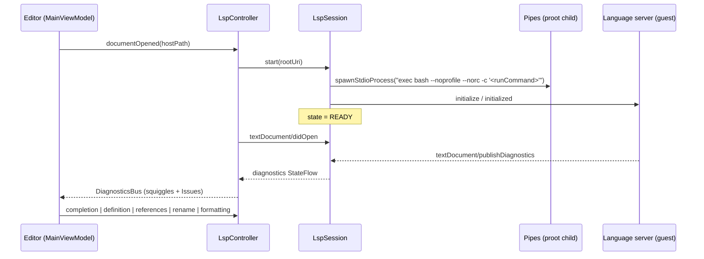

# LSP client

| | |
|---|---|
| **Status** | Implemented — the client runs the catalogued servers and is wired to the editor (diagnostics, completions, go-to-definition, references, rename, formatting) |
| **Modules** | `:core:lsp`, `:core:distro` (catalog + process spawn), `:feature:lsp-manager` (install UI), `:app` (`dev.jcode.lsp.LspController`) |
| **Primary sources** | core/lsp/src/main/java/dev/jcode/core/lsp/LspSession.kt, core/lsp/src/main/java/dev/jcode/core/lsp/LspTransport.kt, core/lsp/src/main/java/dev/jcode/core/lsp/LspServerDescriptor.kt, core/lsp/src/main/java/dev/jcode/core/lsp/DiagnosticsBus.kt, app/src/main/java/dev/jcode/lsp/LspController.kt, core/distro/src/main/java/dev/jcode/core/distro/LspCatalogModels.kt |

---

## 1. Purpose and scope

A hand-rolled Language Server Protocol client that runs real language servers inside the guest Linux
environment and talks JSON-RPC to them over their stdio pipes.

The client is built directly on `org.json`; there is no `lsp4j` dependency.

Nothing in the client or the controller is per-language. Which server handles a file, how it is
installed and launched, and what marks its project root all come from
[`LspServerCatalog`](../03-runtime/04-toolchain-catalog-and-onboarding.md#3-language-server-catalog),
so adding a language is a catalog entry, not code.

---

## 2. Architecture



```kotlin
class LspSession(
    val descriptor: LspServerDescriptor,
    val projectRoot: String,
    private val transportFactory: (command: String) -> LspTransport?,
) : Closeable
```

The `transportFactory` indirection keeps `:core:lsp` free of any knowledge of proot: the caller turns
a command string into a running guest process.

The server is launched as `exec bash --noprofile --norc -c '<runCommand>'` — `--noprofile --norc` so
a user's shell configuration cannot inject output into the JSON-RPC stream.

### 2.1 The transport is pipes, never a PTY

`LspTransport` is backed by `DistroService.spawnStdioProcess`, which gives the child separate stdin,
stdout and stderr pipes.

**A PTY would break the protocol outright.** A PTY echoes everything written to it back into the read
stream, so the client would parse its own requests as server messages and the framing would never
resynchronise. `ProcessLspTransport` also drains stderr on a daemon thread — a server that logs
steadily (jdtls, rust-analyzer) blocks forever once that pipe buffer fills.

The DAP client reached the same conclusion independently; `spawnStdioProcess` is shared by both.

---

## 3. Public contract

| Member | Purpose |
|---|---|
| `state: StateFlow<LspState>` | `DISCONNECTED`, `STARTING`, `RUNNING`, `READY`, `ERROR` |
| `diagnostics: StateFlow<Map<String, List<Diagnostic>>>` | Keyed by HOST path |
| `serverCapabilities: JSONObject?` | Populated by the handshake |
| `errorMessage: String?` | Why the session is in `ERROR` |
| `onNotification: ((String, JSONObject) -> Unit)?` | Server-pushed notifications other than diagnostics |
| `onApplyEdit: ((JSONObject) -> Boolean)?` | Server-initiated `workspace/applyEdit` |
| `start(rootUri)` | Handshake (§4) |
| `sendRequest(method, params, timeoutMs): Any?` | Result is a `JSONObject`, a `JSONArray`, or null |
| `sendNotification(method, params)` | |
| `didOpen` / `didChange` / `didSave` / `didClose` | Document synchronisation |
| `completion` / `hover` / `definition` / `references` / `rename` / `formatting` | Language features |
| `supportsCompletion`, `supportsHover`, `supportsDefinition`, `supportsReferences`, `supportsRename`, `supportsFormatting` | Read from `serverCapabilities` |
| `hostToDistroUri(hostPath)` / `distroToHostPath(distroUri)` | Path translation |
| `parseWorkspaceEdit(json)` | `WorkspaceEdit` → edits keyed by host path |
| `close()` | `shutdown` + `exit`, then tears the transport down |

Every request except `initialize` times out after 15 s. `initialize` gets 120 s: jdtls builds a
workspace index before answering, which on a cold project on a phone is well past any ordinary
timeout.

### 3.1 Descriptor

```kotlin
data class LspServerDescriptor(
    val id: String, val languageIds: List<String>,
    val verifyCommand: String, val installCommand: String, val runCommand: String,
    val extensions: List<String> = emptyList(),
    val rootDetectors: List<String> = emptyList(),
)
```

`BUILT_IN` is **derived** from `dev.jcode.core.distro.LspServerCatalog.BUILT_IN` rather than
duplicating it, "so the catalog never drifts". Lookup helpers: `findForLanguage(languageId)`,
`findForExtension(extension)`, `findForFile(fileName)`.

`languageIdFor(extension)` picks the `languageId` to announce in `didOpen`. Most entries list
extensions and language ids in matching order (`.ts`/`.tsx`/`.js` → `typescript`/`typescriptreact`/
`javascript`), so index matching is exact. Entries covering more extensions than language ids —
clangd's six C/C++ extensions over `c` and `cpp` — fall back to the C-family split, then to the
primary language id.

The 12 catalogued servers are listed in
[Toolchain catalog §3](../03-runtime/04-toolchain-catalog-and-onboarding.md#3-language-server-catalog).

---

## 4. Handshake

1. `state = STARTING`.
2. Spawn the process; `state = RUNNING`.
3. Launch the read loop.
4. Send `initialize` with `processId` (the app's real pid), `rootUri`, `workspaceFolders`, and these
   advertised capabilities:

   | Capability | Value |
   |---|---|
   | `textDocument.synchronization.didSave` | `true` |
   | `textDocument.completion.contextSupport` | `true` |
   | `textDocument.completion.completionItem.snippetSupport` | `true` |
   | `textDocument.completion.completionItem.documentationFormat` | `["markdown", "plaintext"]` |
   | `textDocument.hover.contentFormat` | `["markdown", "plaintext"]` |
   | `textDocument.definition.linkSupport` | `false` |
   | `textDocument.references` / `rename` / `formatting` | advertised |
   | `textDocument.publishDiagnostics.relatedInformation` | `true` |
   | `workspace.applyEdit` / `configuration` / `workspaceFolders` | `true` |
   | `window.workDoneProgress` | `true` |
   | `general.positionEncodings` | `["utf-16"]` |

   `linkSupport` is deliberately `false`: servers then answer with plain `Location[]` rather than
   `LocationLink[]`, which keeps one parse path for definition results.

5. Send the `initialized` notification.
6. `state = READY`.

Any exception during this sequence records `errorMessage`, sets `state = ERROR` and calls `close()`.
`start()` is a no-op unless the current state is `DISCONNECTED`, so it is safe to call twice.

---

## 5. Wire protocol

JSON-RPC 2.0 with LSP framing:

```
Content-Length: <n>\r\n
\r\n
{"jsonrpc":"2.0", …}
```

Requests carry a monotonically increasing `id` from an `AtomicInteger`; replies are matched through
`pending: ConcurrentHashMap<Int, CompletableDeferred<Any?>>`, and the entry is removed in a `finally`
so a timeout cannot leak it.

**Results are not always objects.** `textDocument/definition`, `references` and `formatting` all
return JSON *arrays*, and a request with no result returns null. `sendRequest` therefore returns
`Any?` and each feature method parses its own shape.

### 5.1 Framing is byte-exact

```kotlin
private var acc = ByteArray(READ_CHUNK * 2)
private var accLen = 0
```

`Content-Length` is a **byte** count, so the header scan and the body slice both work on bytes.
Decoding to a `String` first mis-slices any message containing multi-byte UTF-8 — a hover body with
typographic quotes is enough — and every later message on the stream is then misframed.

The accumulator grows by doubling and is compacted in place rather than reallocated per chunk: a
large completion response arrives as hundreds of 8 KiB chunks, and `acc += chunk` would copy the
whole buffer for each one.

### 5.2 Server-initiated requests are answered

A message carrying `method` is server-initiated — a request when it also carries `id`, otherwise a
notification. **Checking `id` first would mistake `workspace/configuration` for a response** and
leave the server waiting forever; that is exactly how jdtls and typescript-language-server stall.

| Server request | Reply |
|---|---|
| `workspace/configuration` | One empty object per requested item (no per-server settings are stored; an empty object rather than null, because serde-based servers fail to deserialise null) |
| `workspace/workspaceFolders` | The session's single root |
| `workspace/applyEdit` | Delegated to `onApplyEdit`, answered `{applied: <bool>}` |
| `client/registerCapability`, `client/unregisterCapability`, `window/workDoneProgress/create`, `window/showMessageRequest` | null |
| anything else | JSON-RPC error `-32601` (method not found) |

---

## 6. Data model

```kotlin
data class Diagnostic(
    val startLine: Int, val startCol: Int, val endLine: Int, val endCol: Int,
    val severity: DiagnosticSeverity, val message: String,
    val source: String, val code: String?,
)

enum class DiagnosticSeverity(val value: Int) { ERROR(1), WARNING(2), INFORMATION(3), HINT(4) }

data class CompletionResult(
    val label: String, val kind: Int, val detail: String?, val documentation: String?,
    val insertText: String, val insertTextFormat: Int,   // 1 = plain text, 2 = snippet
    val sortText: String?,
)

data class LocationResult(val path: String, val line: Int, val character: Int)   // HOST path

data class TextEditResult(
    val startLine: Int, val startChar: Int, val endLine: Int, val endChar: Int, val newText: String,
)

data class WorkspaceEditResult(val editsByPath: Map<String, List<TextEditResult>>)
```

`DiagnosticSeverity.fromLsp(value)` maps 1–4 and **defaults to `ERROR`** for anything else.

> This `DiagnosticSeverity` is a different type from `dev.jcode.core.editor.decor.DiagnosticSeverity`,
> which carries a colour instead of the LSP number. Conversion happens at the editor boundary.

Positions in `TextEditResult` and `LocationResult` are LSP coordinates — 0-based line, UTF-16
`character`. The buffer addresses text by byte offset, so every crossing goes through
`Snapshot.offsetToUtf16Position` / `utf16PositionToOffset` in `:core:buffer`; the two agree only for
ASCII.

---

## 7. `DiagnosticsBus`

A single process-wide aggregator (held by `LspModule.diagnosticsBus`, a plain `object`, not a Hilt
module despite the name).

```kotlin
private val diagnosticsBySource = ConcurrentHashMap<String, Map<String, List<Diagnostic>>>()
val allDiagnostics: StateFlow<Map<String, List<Diagnostic>>>
val totalCount: StateFlow<DiagnosticCount>   // errors, warnings, infos
```

Diagnostics are keyed **by source** so independent producers cannot clobber each other:

| Source id | Producer |
|---|---|
| `lsp:<serverId>:<projectRoot>` | A running `LspSession`. Keyed by root as well as server so two projects sharing a server cannot clobber each other. |
| `syntax` | The on-open/on-save `python3 -c compile` / `node --check` check |
| `config-workspace`, `config-project` | `.jcode` YAML parse errors |

| Method | Effect |
|---|---|
| `updateDiagnostics(source, fileUri, diagnostics)` | Replace one file's diagnostics from one source |
| `updateSourceDiagnostics(source, map)` | Replace everything from one source |
| `clearSource(source)` | |
| `clearFile(fileUri)` | Remove one file from every source |
| `getDiagnosticsForFile(fileUri)` | Merged across sources |

Every mutation calls `recompute()`, which re-merges, re-sorts and re-tallies — `O(all diagnostics)`
per update, with no incremental path.

---

## 8. `LspController` — session management

`app/src/main/java/dev/jcode/lsp/LspController.kt` owns the running servers and routes the editor's
requests. It mirrors `DebugController`, but a debug session is singular and user-started while
language servers start implicitly and several run at once.

### 8.1 Activation is paired to an extension

A catalog match on the file extension selects *which* server could handle a file; it does not by
itself start one. A server runs only when an installed extension pairs with it:

| Pairing | Source |
|---|---|
| The extension names the server in `requires.lsps` / `suggests.lsps` | [Manifest reference §2.3](../07-extensions/03-manifest-reference.md) — e.g. the C/C++ Dev Pack requires `clangd` |
| The extension ships a Dev Pack that claims the file's language | `InstalledExtension.languageFor(fileName)` |

Either is enough. Both exist because Dev Packs predate the catalog ids: a pack that owns `.css`
is what makes the CSS server that language's implementation, whether or not it names it.

A language server is a language's *implementation*, so the extension that owns the language decides
whether it should run. This also means an unpaired language never prompts to install a server — the
missing piece there is the Dev Pack, not the server.

Installing or removing an extension re-evaluates every open document (`retryOpenDocuments`), so
adding a Dev Pack starts its server for files that are already open, with no restart.

### 8.2 Session keying

Sessions are keyed by **(serverId, projectRoot)** and shared by every open file resolving to that
pair. The root is the nearest ancestor holding one of the descriptor's `rootDetectors`, bounded by
the projects root, falling back to the project directory itself.

Files outside the workspace resolve to no root and get no session: proot binds only the projects
root, so a server could not read them anyway.

### 8.3 Document synchronisation

| Editor event | Controller | Notes |
|---|---|---|
| `openLocalFile` | `documentOpened` | Starts the session if this is the first file needing it |
| `EditorState.snapshot` emits | `documentChanged` | Debounced 400 ms |
| `saveTabAwait` | `documentSaved` | Flushes the pending change, then `didSave` |
| `closeTabsNow` | `documentClosed` | Stops the session when its last document closes |
| `clearEditorTabs` (project switch), `onCleared` | `shutdownAll` | |

Sync is **full-document**: `didChange` sends the whole text. Servers advertising incremental sync
still accept a change object with no `range` as a whole-document replacement, so one path covers the
whole catalog without plumbing edit deltas out of the editor.

A document opened while its session is still handshaking is held back and replayed on `READY`;
`opened` is an `AtomicBoolean` so only one of the two paths can send `didOpen`.

Sessions stop when their last document closes — these processes are heavy (jdtls holds a JVM,
rust-analyzer an index) and a phone has no room for idle ones.

### 8.4 Missing servers

Opening a file whose catalog server is not installed emits `missingServer` once per server per
session. `JCodeShell` turns that into a snackbar with an **Install** action routed through
`installLspCatalogEntry`, which resolves `requiredSdks` first. It stays an explicit choice because
some servers pull a whole SDK (jdtls a JDK, csharp-ls the .NET SDK).

---

## 9. Editor integration

| Feature | Path |
|---|---|
| Squiggles + Issues panel | `LspSession.diagnostics` → `DiagnosticsBus` → `JCodeShell` decorations / `IssuesPanel` |
| Completions | `CompletionSource` → `MainViewModel.lspCompletions` → merged with Dev Pack keywords ([Syntax highlighting and completion §4](../02-editor/05-syntax-highlighting-and-completion.md#4-completions)) |
| Go to Definition | `editorLanguageAction` → single result opens directly, several open the location picker |
| Find References | `editorLanguageAction` → location picker (file, line, source preview) |
| Rename Symbol | Rename dialog → `textDocument/rename` → `WorkspaceEditResult` applied to open buffers (undoable) and to closed files on disk |
| Format Document | `textDocument/formatting` when a ready server offers it, else the built-in `CodeFormatter` |

When an action cannot run, the reason is reported rather than silently ignored: no server for this
file type, not installed, still starting, failed to start, or the server lacks that capability.

Workspace edits are applied **last-first** by byte offset so an earlier edit's offsets are still valid
when its turn comes.

---

## 10. Known gaps

- **Sync is full-document, not incremental.** Every debounced change re-sends the whole file; a
  server then re-analyses all of it. Acceptable at a 400 ms debounce, but it is the main cost on a
  large file.
- **Hover is implemented in the client but has no editor UI.** `LspSession.hover` and
  `LspController.hover` work; nothing calls them.
- No code actions, semantic tokens, signature help, document symbols, or workspace symbol search.
- No `prepareRename`, so an invalid rename position is only reported after the request round-trips.
- `DiagnosticsBus.recompute()` is `O(n)` over all diagnostics on every update.
- The client has no automated tests; it is exercised only through the app.

---

## 11. References

- [Toolchain catalog and onboarding](../03-runtime/04-toolchain-catalog-and-onboarding.md)
- [Debug Adapter Protocol](02-debug-adapter-protocol.md) — the sibling stdio client
- [Syntax highlighting and completion](../02-editor/05-syntax-highlighting-and-completion.md)
- [Storage and path model](../01-architecture/05-storage-and-path-model.md)
- [Known gaps and unwired code](../09-platform/05-known-gaps-and-unwired-code.md)
