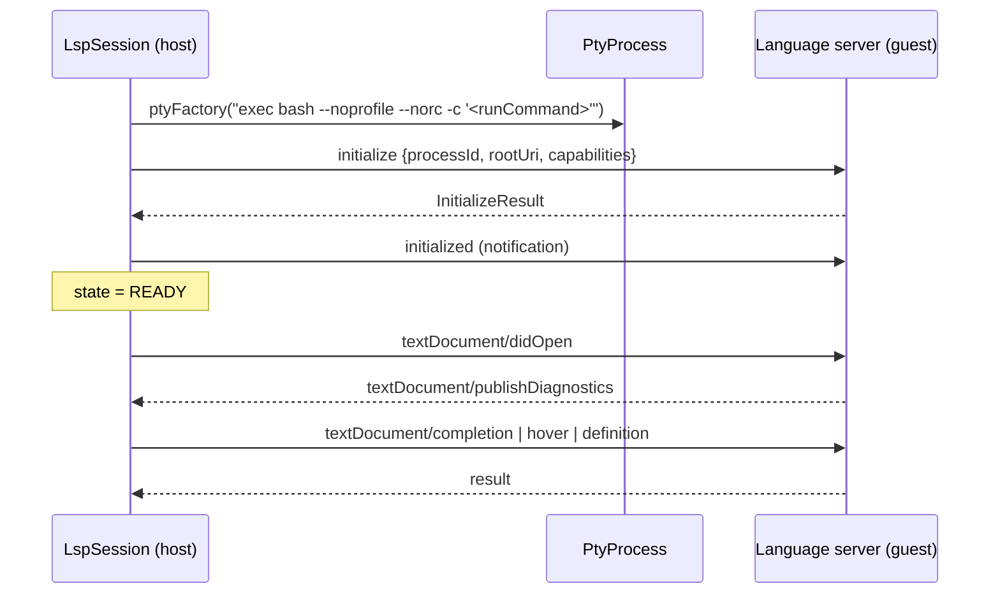

# LSP client

| | |
|---|---|
| **Status** | Partially implemented — the client works; it is not connected to the editor's semantic actions or the Issues panel |
| **Modules** | `:core:lsp`, `:core:distro` (catalog), `:feature:lsp-manager` |
| **Primary sources** | core/lsp/src/main/java/dev/jcode/core/lsp/LspSession.kt (464 lines), core/lsp/src/main/java/dev/jcode/core/lsp/LspServerDescriptor.kt, core/lsp/src/main/java/dev/jcode/core/lsp/DiagnosticsBus.kt, core/lsp/src/main/java/dev/jcode/core/lsp/LspModule.kt, core/distro/src/main/java/dev/jcode/core/distro/LspCatalogModels.kt |
| **Verified against** | commit `cea581c`, 2026-08-09 |

---

## 1. Purpose and scope

A hand-rolled Language Server Protocol client that runs real language servers inside the guest Linux
environment and talks JSON-RPC to them over a PTY.

> The `lsp4j` dependency is declared in `core/lsp/build.gradle.kts` and **never imported**. The
> client is built directly on `org.json`.

---

## 2. Architecture



```kotlin
class LspSession(
    val descriptor: LspServerDescriptor,
    val projectRoot: String,
    private val ptyFactory: (command: String) -> PtyProcess,
) : Closeable
```

The `ptyFactory` indirection keeps `:core:lsp` free of any knowledge of proot: the caller supplies a
function that turns a command string into a running guest process.

The server is launched as `exec bash --noprofile --norc -c '<runCommand>'` — `--noprofile --norc`
so a user's shell configuration cannot inject output into the JSON-RPC stream.

---

## 3. Public contract

| Member | Purpose |
|---|---|
| `state: StateFlow<LspState>` | `DISCONNECTED`, `STARTING`, `RUNNING`, `READY`, `ERROR` |
| `diagnostics: StateFlow<Map<String, List<Diagnostic>>>` | Keyed by URI |
| `onNotification: ((String, JSONObject) -> Unit)?` | Raw server-pushed notifications |
| `start(rootUri)` | Handshake (§4) |
| `sendRequest(method, params): JSONObject` | 30-second timeout |
| `sendNotification(method, params)` | |
| `didOpen(uri, languageId, version, text)` / `didChange(uri, version, text)` | |
| `completion(uri, line, character): List<CompletionResult>` | |
| `hover(uri, line, character): String?` | |
| `definition(uri, line, character): LocationResult?` | |
| `hostToDistroUri(hostPath)` / `distroToHostPath(distroUri)` | Path translation |
| `close()` | |

### 3.1 Descriptor

```kotlin
data class LspServerDescriptor(
    val id: String, val languageIds: List<String>,
    val verifyCommand: String, val installCommand: String, val runCommand: String,
    val extensions: List<String> = emptyList(),
    val rootDetectors: List<String> = emptyList(),
)
```

`BUILT_IN` is **derived** from `dev.jcode.core.distro.LspServerCatalog.BUILT_IN` rather than
duplicating it, "so the catalog never drifts". Lookup helpers: `findForLanguage(languageId)`,
`findForExtension(extension)`.

The 12 catalogued servers are listed in
[Toolchain catalog §3](../03-runtime/04-toolchain-catalog-and-onboarding.md#3-language-server-catalog).

---

## 4. Handshake

1. `state = STARTING`.
2. Spawn the PTY; `state = RUNNING`.
3. Launch the read loop.
4. Send `initialize` with `processId` (the app's real pid), `rootUri`, and these advertised
   capabilities:

   | Capability | Value |
   |---|---|
   | `textDocument.completion.completionItem.snippetSupport` | `true` |
   | `textDocument.completion.completionItem.documentationFormat` | `["markdown", "plaintext"]` |
   | `textDocument.hover.contentFormat` | `["markdown", "plaintext"]` |
   | `textDocument.publishDiagnostics.relatedInformation` | `true` |

5. Send the `initialized` notification.
6. `state = READY`.

Any exception during this sequence sets `state = ERROR` and calls `close()`.

`start()` is a no-op unless the current state is `DISCONNECTED`, so it is safe to call twice.

---

## 5. Wire protocol

JSON-RPC 2.0 with LSP framing:

```
Content-Length: <n>\r\n
\r\n
{"jsonrpc":"2.0", …}
```

Requests carry a monotonically increasing `id` from an `AtomicInteger`; replies are matched through
`pendingRequests: ConcurrentHashMap<Int, CompletableDeferred<JSONObject>>`.

`writeMessage` computes the header length from `content.toByteArray().size` (correct) and serializes
writes under a `writeMutex`.

Every request is wrapped in `withTimeout(30_000)`.

### 5.1 Read loop

```kotlin
val buffer = ByteArray(8192)
var accumulated = ""
…
if (n > 0) {
    accumulated += String(buffer, 0, n)
    accumulated = processAccumulated(accumulated)
} else if (n < 0) break
else pty.awaitReadable(1000)
```

When idle it blocks in `poll()` rather than spinning. The 1-second timeout bounds teardown notice,
because `close()` does not wake an in-flight `poll()`.

> **The accumulator is a `String`, not a `ByteArray`.** See §9 — this differs from the DAP client,
> which is byte-exact and documents why.

---

## 6. Data model

```kotlin
data class Diagnostic(
    val startLine: Int, val startCol: Int, val endLine: Int, val endCol: Int,
    val severity: DiagnosticSeverity, val message: String,
    val source: String, val code: String?,
)

enum class DiagnosticSeverity(val value: Int) { ERROR(1), WARNING(2), INFORMATION(3), HINT(4) }

data class CompletionResult(
    val label: String, val kind: Int, val detail: String?, val documentation: String?,
    val insertText: String, val insertTextFormat: Int,   // 1 = plain text, 2 = snippet
)

data class LocationResult(val uri: String, val line: Int, val character: Int)
```

`DiagnosticSeverity.fromLsp(value)` maps 1–4 and **defaults to `ERROR`** for anything else.

> This `DiagnosticSeverity` is a different type from `dev.jcode.core.editor.decor.DiagnosticSeverity`,
> which carries a colour instead of the LSP number. Conversion happens at the editor boundary.

---

## 7. `DiagnosticsBus`

A single process-wide aggregator (held by `LspModule.diagnosticsBus`, a plain `object`, not a Hilt
module despite the name).

```kotlin
private val diagnosticsBySource = ConcurrentHashMap<String, Map<String, List<Diagnostic>>>()
val allDiagnostics: StateFlow<Map<String, List<Diagnostic>>>
val totalCount: StateFlow<DiagnosticCount>   // errors, warnings, infos
```

Diagnostics are keyed **by source** so independent producers cannot clobber each other. Source ids
follow the pattern `lsp:<serverId>`, `tree-sitter`, `yaml-schema`.

| Method | Effect |
|---|---|
| `updateDiagnostics(source, fileUri, diagnostics)` | Replace one file's diagnostics from one source |
| `updateSourceDiagnostics(source, map)` | Replace everything from one source |
| `clearSource(source)` | |
| `clearFile(fileUri)` | Remove one file from every source |
| `getDiagnosticsForFile(fileUri)` | Merged across sources |

Every mutation calls `recompute()`, which re-merges, re-sorts and re-tallies — `O(all diagnostics)`
per update, with no incremental path.

---

## 8. Threading and lifecycle

One `CoroutineScope(SupervisorJob() + Dispatchers.IO)` per session, holding the read loop.
`close()` cancels the scope, closes the PTY, and completes any pending deferreds exceptionally.

---

## 9. Known gaps

- **Framing is not byte-exact.** `Content-Length` is a **byte** count, but `processAccumulated`
  operates on a `String` and slices by char index. Any message containing multi-byte UTF-8 —
  non-ASCII identifiers, a hover body with typographic quotes, a large `variables`-style payload —
  is mis-sliced, and every later message on that stream is misframed. There is a second, related
  defect: `String(buffer, 0, n)` decodes each 8 KiB chunk independently, so a multi-byte character
  straddling a chunk boundary becomes replacement characters. `DebugSession.process` solves exactly
  this problem on `ByteArray` and carries a comment explaining why; the LSP client has not adopted
  it.
- **Editor semantic actions are not wired.** Go to Definition, Find References and Rename Symbol
  still surface a "needs a language server (coming soon)" notice even though
  `definition(...)` exists and `sendRequest` can reach `textDocument/references` and
  `textDocument/rename`.
- **Diagnostics never reach the UI.** `LspSession.diagnostics` is populated, but nothing forwards it
  into `DiagnosticsBus`, so LSP errors do not appear as squiggles or in the Issues panel. The Issues
  panel is fed by config-file errors and on-save syntax checks only.
- **Completions never reach the popup.** See
  [Syntax highlighting and completion](../02-editor/05-syntax-highlighting-and-completion.md).
- **`lsp4j` is declared and unused.**
- The KDoc still refers to launching servers "via `proot-distro login`"; JCode spawns proot
  directly and has no `proot-distro` dependency.
- `DiagnosticsBus.recompute()` is `O(n)` over all diagnostics on every update.

---

## 10. References

- [Toolchain catalog and onboarding](../03-runtime/04-toolchain-catalog-and-onboarding.md)
- [Debug Adapter Protocol](02-debug-adapter-protocol.md) — the byte-exact framing to copy
- [Syntax highlighting and completion](../02-editor/05-syntax-highlighting-and-completion.md)
- [Storage and path model](../01-architecture/05-storage-and-path-model.md)
- [Known gaps and unwired code](../09-platform/05-known-gaps-and-unwired-code.md)
