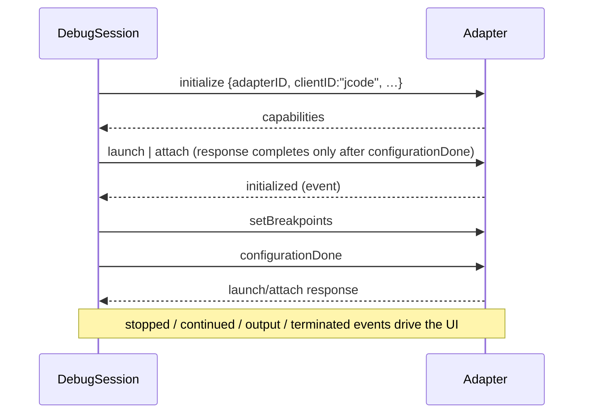

# Debug Adapter Protocol

| | |
|---|---|
| **Status** | Implemented — device-verified for Python (debugpy) and Java; other adapters have known issues |
| **Modules** | `:core:debug`, `:core:distro` (engine catalog), `:feature:debug`, `:app` |
| **Primary sources** | core/debug/src/main/java/dev/jcode/core/debug/DebugSession.kt (395 lines), core/distro/src/main/java/dev/jcode/core/distro/DebugEngineModels.kt, app/src/main/java/dev/jcode/debug/DebugController.kt (702 lines), app/src/main/java/dev/jcode/DebugSessionPanel.kt, tools/java-dap/ |
| **Verified against** | commit `cea581c`, 2026-08-09 |

---

## 1. Purpose and scope

A Debug Adapter Protocol client that runs standard VS Code debug adapters inside the guest Linux
environment and drives the IDE's breakpoints, stepping, call stack, variables and debug console.

The transport deliberately mirrors [LSP client](01-lsp-client.md) — same `Content-Length` framing,
same PTY-adjacent plumbing — but the message envelope differs:

| | LSP | DAP |
|---|---|---|
| Envelope | JSON-RPC 2.0: `{jsonrpc, id, method, params}` | `{seq, type: request\|response\|event, command\|event, arguments\|body}` |

---

## 2. Architecture

```kotlin
class DebugSession(
    val debugType: String,                                 // DAP adapterID / config type
    val projectRoot: String,
    private val transportFactory: (command: String) -> DapTransport?,
) : Closeable

interface DapTransport {
    fun read(buffer: ByteArray): Int   // blocks; bytes read, 0 idle, <0 EOF
    fun write(bytes: ByteArray)
    fun close()
}
```

`DapTransport` is a **byte-level** abstraction rather than a `PtyProcess`, and the reason is
documented: process **stdio pipes are preferred for DAP because a PTY echoes**, which corrupts the
framed stream. A PTY remains available as a fallback.

---

## 3. Handshake

Follows the VS Code order exactly:



The `launch`/`attach` request is fired in a **separate coroutine** and deliberately not awaited
inline — its response only completes after `configurationDone`, so blocking on it would deadlock the
handshake.

### 3.1 Advertised capabilities

| Field | Value |
|---|---|
| `clientID` | `"jcode"` |
| `clientName` | `"JCode"` |
| `adapterID` | `debugType` |
| `locale` | `"en"` |
| `linesStartAt1`, `columnsStartAt1` | `true` |
| `pathFormat` | `"path"` |
| `supportsRunInTerminalRequest` | `false` |
| `supportsStartDebuggingRequest` | `true` |
| `supportsVariableType` | `true` |

### 3.2 Reverse requests and child sessions

`supportsStartDebuggingRequest = true` exists for **js-debug's multi-session model**, where the
parent adapter delegates the actual debuggee to a child session in which breakpoints bind. Without
advertising it, js-debug stalls on launch.

```kotlin
var onStartDebugging: ((request: String, configuration: JSONObject) -> Unit)?
```

The `configuration` carries `__jsDebugChildServer` — the port the child session must connect to.
`handleReverseRequest` dispatches `startDebugging` to this callback and **rejects every other reverse
request**, including `runInTerminal` (consistent with `supportsRunInTerminalRequest = false`).

---

## 4. Framing — byte-exact by design

```kotlin
/**
 * Frame DAP messages from the raw byte stream. `Content-Length` is a BYTE count, so the header
 * scan and body slice must operate on bytes — decoding to a String first would mis-slice any
 * response containing multi-byte UTF-8 (e.g. a large `variables` body), stalling every later request.
 */
private fun process(data: ByteArray): ByteArray
```

- `indexOfHeaderEnd(data)` scans for the literal bytes `0D 0A 0D 0A`.
- The header is decoded as **US-ASCII**, the body as **UTF-8**, and only the body.
- The remainder is carried forward as a `ByteArray`.

Writes compute the header from `content.toByteArray().size` and are serialized under a `writeMutex`.

Requests use a monotonic `seq` from an `AtomicInteger`, are tracked in
`ConcurrentHashMap<Int, CompletableDeferred<JSONObject>>`, and time out after **30 seconds**.

The read loop uses `delay(10)` when idle (the LSP client instead blocks in `poll()`, which it can
because it owns a PTY).

---

## 5. Public contract

| Member | Purpose |
|---|---|
| `state: StateFlow<DebugState>` | `DISCONNECTED`, `STARTING`, `INITIALIZING`, `RUNNING`, `STOPPED`, `TERMINATED`, `ERROR` |
| `threads: StateFlow<List<DapThread>>` | Refreshed on the `thread` event |
| `stopped: StateFlow<StoppedInfo?>` | Last `stopped` event; `null` while running |
| `onOutput: ((category, text) -> Unit)?` | `category` is `stdout` / `stderr` / `console` |
| `onTerminated: (() -> Unit)?` | |
| `onStartDebugging` | Reverse request (§3.2) |
| `setBreakpoints(distroPath, lines): List<DapBreakpoint>` | Sends both `breakpoints` and the legacy `lines` array |
| `continueThread` / `next` / `stepIn` / `stepOut` / `pause` | Stepping |
| `stackTrace(threadId)` | `startFrame = 0`, `levels = 50` |
| `scopes(frameId)`, `variables(variablesReference)` | |
| `evaluate(expression, frameId?, context = "repl"): String` | Debug console |
| `hostToDistroPath` / `distroToHostPath` | Via `WorkspaceHostPaths`, with separator normalization |
| `close()` | |

Each stepping call clears `stopped` and sets `state = RUNNING`.

`close()` sends `disconnect {terminateDebuggee: true}`, cancels the read job, closes the transport,
cancels every pending deferred and cancels the scope.

---

## 6. Data model

```kotlin
data class DapThread(val id: Int, val name: String)
data class DapStackFrame(val id: Int, val name: String, val sourcePath: String?, val line: Int, val column: Int)
data class DapScope(val name: String, val variablesReference: Int, val expensive: Boolean)
data class DapVariable(val name: String, val value: String, val type: String?, val variablesReference: Int) {
    val expandable get() = variablesReference > 0
}
data class DapBreakpoint(val id: Int, val verified: Boolean, val line: Int)
data class StoppedInfo(val reason: String, val threadId: Int, val description: String, val text: String)
```

`DapStackFrame.sourcePath` is translated back to a **host** path during parsing, so the UI can open
the frame's file directly.

---

## 7. Engine catalog

`DebugEngineCatalog.BUILT_IN` (`:core:distro`):

| `id` | `debugType` | `transport` | Notes |
|---|---|---|---|
| `debugpy` | `python` | `stdio` | Fully working, device-verified |
| `lldb-dap` | `lldb` | `stdio` | |
| `netcoredbg` | `coreclr` | `stdio` | Attach stalls (§10) |
| `js-debug` | `pwa-node` | `tcp` | Child-session model; loopback transport issue under proot (§10) |
| `java-debug` | `java` | `stdio` | Backed by `tools/java-dap/` |

`debugType` is what a `.jcode/run.yaml` `debugEntry` resolves against — see
[Run and build configurations](../05-workspace/03-run-and-build-configurations.md).

### 7.1 `tools/java-dap`

A small Gradle project wrapping Microsoft's java-debug with JCode-specific providers:
`JCodeSourceLookUpProvider`, `JCodeEvaluationProvider`, `JCodeCompletionsProvider`,
`JCodeHotCodeReplaceProvider`, `JCodeVirtualMachineManagerProvider`, and a `Main` entry point.

---

## 8. `DebugController`

The `:app` orchestrator (702 lines) that resolves a run configuration into a live session:

- Picks the engine from `debugEntry` / project type.
- Detects an Android application module via `AndroidAppProject.appModuleFor` and routes to
  `prepareAndroidAttach` instead of a plain JVM launch — see
  [Android app debugging](../08-virtual-device/03-android-app-debugging.md).
- Bridges breakpoints to `GutterMarkerDecoration` and the stopped line to
  `LineHighlightDecoration` in the editor.
- Feeds `DebugSessionPanel` (call stack, variables, console).

---

## 9. Threading and lifecycle

One `CoroutineScope(SupervisorJob() + Dispatchers.IO)` per session, holding the read loop, with a
`writeMutex` serializing writes — the same shape as `LspSession`.

---

## 10. Known gaps

Device-verified findings:

- **debugpy (Python) works fully.**
- **js-debug**: a proot loopback **transport** problem, not a JCode protocol defect — the child
  session cannot reach `__jsDebugChildServer` over the guest's loopback.
- **netcoredbg**: attach stalls.
- **java-debug**: functional through `tools/java-dap` for Android attach; the general JVM launch path
  is thin.
- `:feature:debug`'s `DebugFeature` is a stub; the real UI is `app/src/main/java/dev/jcode/DebugSessionPanel.kt` and
  `app/src/main/java/dev/jcode/RunDebugPanel.kt`.
- `kotlinx-serialization-json` is declared in `core/debug/build.gradle.kts` and unused — parsing is
  `org.json`.
- `stackTrace` is capped at 50 frames with no paging.
- The idle read loop polls every 10 ms rather than blocking, unlike the LSP client.

Design note recorded elsewhere: [docs/java-debug-adapter-plan.md](../../java-debug-adapter-plan.md).

---

## 11. References

- [LSP client](01-lsp-client.md)
- [Run and build configurations](../05-workspace/03-run-and-build-configurations.md)
- [Toolchain catalog and onboarding](../03-runtime/04-toolchain-catalog-and-onboarding.md)
- [Android app debugging](../08-virtual-device/03-android-app-debugging.md)
- [Rendering and decorations](../02-editor/03-rendering-and-decorations.md) — gutter markers
