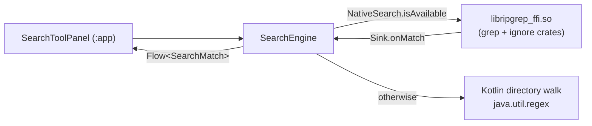

# Search and source control

| | |
|---|---|
| **Status** | Search: implemented. Source control: implemented as an extension, not as `:core:vcs` |
| **Modules** | `:core:search`, `:native:ripgrep-ffi`, `:feature:search` (stub), `:feature:scm` (stub), `:core:vcs` (stub), `:app` |
| **Primary sources** | core/search/src/main/java/dev/jcode/core/search/SearchEngine.kt (316 lines), core/search/src/main/java/dev/jcode/core/search/NativeSearch.kt, native/ripgrep-ffi/rust/src/lib.rs (241 lines), app/src/main/java/dev/jcode/workbench/SearchToolPanel.kt, app/src/main/java/dev/jcode/workbench/ScmExtensionHost.kt, feature/explorer/src/main/java/dev/jcode/feature/explorer/ExplorerScmUi.kt |
| **Verified against** | commit `cea581c`, 2026-08-09 |

---

## 1. Purpose and scope

Two unrelated features grouped because both are "find and act on things across the project": the
project-wide search engine, and the Git integration.

They are grouped for a second reason worth stating up front: **neither lives where the module layout
suggests.** Search's UI is in `:app`, not `:feature:search`; source control is a WebView-hosted
extension, not `:core:vcs`.

---

## 2. Search architecture



---

## 3. Public contract

```kotlin
data class SearchMatch(
    val filePath: String,     // relative to the search root
    val lineNumber: Int,      // 0-based
    val columnStart: Int,     // 0-based
    val columnEnd: Int,
    val lineText: String,
    val matchText: String,
)

data class SearchOptions(
    val query: String,
    val isRegex: Boolean = false,
    val caseSensitive: Boolean = false,
    val wholeWord: Boolean = false,
    val includePatterns: List<String> = emptyList(),
    val excludePatterns: List<String> = emptyList(),
    val maxResults: Int = 10000,      // 0 = unlimited
    val includeHidden: Boolean = false,
)
```

| `SearchEngine` member | Purpose |
|---|---|
| `search(rootDir, options): Flow<SearchMatch>` | Content search; native when available |
| `searchFileNames(rootDir, options): Flow<SearchMatch>` | Name-only; **always Kotlin** — there is no I/O win from going native |
| `searchLines(...)` | Searches an in-memory document through a `lineText: (Int) -> String` callback — this is how the dirty editor buffer is searched |
| `countMatches(...)` | |
| `replaceAll(...): ReplaceResult` | |

> **Columns are UTF-16 code-unit offsets on both paths.** The Rust side converts explicitly so its
> output matches Kotlin string indexing.

---

## 4. Native path

```kotlin
internal object NativeSearch {
    const val FLAG_REGEX = 1
    const val FLAG_CASE_SENSITIVE = 2
    const val FLAG_WHOLE_WORD = 4
    const val FLAG_INCLUDE_HIDDEN = 8

    val isAvailable: Boolean by lazy { probe() }

    fun interface Sink {
        fun onMatch(filePath: String, lineNumber: Int, columnStart: Int, columnEnd: Int, lineText: String): Boolean
    }
}
```

The Rust implementation uses `ignore::WalkBuilder` (so it is **gitignore-aware**) and
`grep::regex::RegexMatcherBuilder`, and wraps the whole call in `catch_unwind` so a Rust panic cannot
unwind into the JVM.

`Sink.onMatch` returning **`false` stops the search early** — that is how flow cancellation
back-pressures the native walk (`trySendBlocking` returning failure propagates as `false`).

### 4.1 Availability detection

```kotlin
private fun probe(): Boolean = try {
    System.loadLibrary("ripgrep_ffi")
    nativeProbe() == 1
} catch (e: Throwable) { false }
```

The CMake **stub** library (built when cargo is unavailable) loads successfully but has no
`nativeProbe` symbol, so the resulting `UnsatisfiedLinkError` is the detection signal. Catching
`Throwable` rather than `UnsatisfiedLinkError` is deliberate.

The `FLAG_*` values must mirror the constants in `native/ripgrep-ffi/rust/src/lib.rs`.

---

## 5. Kotlin fallback

A directory walk compiling `java.util.regex.Pattern`. Non-regex queries are quoted; `wholeWord`
wraps the pattern in `\b…\b`; case-insensitivity uses `Pattern.CASE_INSENSITIVE`.

`shouldInclude` applies, in order: user excludes → default excludes → user includes (if any) →
hidden-file skip.

**Default excludes** (hard-coded, always applied on the Kotlin path):

```
.git/  .jcode/trash/  node_modules/  build/  .gradle/  .idea/
*.class  *.jar  *.so  *.png  *.jpg  *.gif
```

---

## 6. Search UI

`app/src/main/java/dev/jcode/workbench/SearchToolPanel.kt`, in the left drawer.

```kotlin
internal enum class SearchScope(val label: String, val placeholder: String) {
    Content("Content", "Search in files"),
    Names("Names", "Search file names"),
    CurrentDoc("Current", "Search in current document"),
}
```

| Constant | Value |
|---|---|
| `MIN_QUERY_LENGTH` | 2 |
| `MAX_DISPLAY_RESULTS` | 2000 |

Scope routing: `Content` → `SearchEngine.search`, `Names` → `searchFileNames`, `CurrentDoc` →
`searchLines` over the **live buffer** (so unsaved edits are searchable). `CurrentDoc` is disabled
when no document tab is active.

The scope switch is a segmented control filling its row in equal thirds, so labels never truncate or
scroll regardless of drawer width.

---

## 7. Source control

### 7.1 Where it actually lives

| Component | Reality |
|---|---|
| `:core:vcs` | **Stub.** A marker object; the KDoc says "libgit2 JNI + porcelain API, Phase 9" |
| `:native:libgit2` | **Built but unwired.** Links real libgit2, libssh2 and mbedTLS into `libgit2_ffi.so`, exposes no JNI |
| `:feature:scm` | **Stub.** A marker object |
| The working Git UI | An **installed extension** rendered in a WebView, hosted by `app/src/main/java/dev/jcode/workbench/ScmExtensionHost.kt` |

The Git panel therefore runs the real `git` binary inside the guest distro, driven by extension
JavaScript over the extension bridge — not through an in-process library.

### 7.2 `ScmExtensionHost`

Hosts the SCM extension's web UI in the left drawer. It uses `PersistentWebViewHost` (its own
`FrameLayout` plus a `parent !== host` check) so the WebView survives rotation: the workbench swaps
between a modal and a docked drawer, and a naive `AndroidView` `onDispose` would remove the WebView
from the mount that had just adopted it, blanking the panel.

It also handles `onRenderProcessGone` so a killed WebView renderer is recovered rather than leaving
a dead panel.

### 7.3 Explorer VCS decorations

Extensions push file status into the Explorer through a `CompositionLocal`:

```kotlin
@Immutable
data class ExplorerScmUi(
    val status: Map<String, String> = emptyMap(),          // keyed by FsPath.stableId (absolute host path)
    val submodules: Set<String> = emptySet(),
    val contextActions: List<ExplorerContextAction> = emptyList(),
    val onContextAction: ((ExplorerContextAction, FsNode) -> Unit)? = null,
    val onFsActivity: (() -> Unit)? = null,
)

val LocalExplorerScmUi = compositionLocalOf { ExplorerScmUi() }
val LocalProjectRootId = compositionLocalOf<String?> { null }
```

`onFsActivity` fires when the Explorer changes files (create, rename, delete, paste, refresh), so a
decoration-pushing extension knows to re-run `git status`.

`LocalProjectRootId` suppresses Cut and Delete on the project root row — the root must not be moved
or deleted from the file tree.

```kotlin
@Immutable
data class ExplorerContextAction(
    val key: String,                              // "extensionId:actionId"
    val label: String,
    val icon: JCodeIcon,
    val fileExtensions: List<String> = emptyList(),   // lowercase, no dot; empty = every file
    val targets: List<String> = emptyList(),          // "file" / "directory"; empty = both
)
```

`explorerActionAppliesTo(action, name, isDirectory)` is the shared visibility predicate.

### 7.4 Clone staging

Remote clones land in `/sources` (host `filesDir/sources`), where the user classifies each as a
Project or a Workspace before it moves under the projects root. See
[Storage and path model](../01-architecture/05-storage-and-path-model.md).

`git pull` is invoked with `--autostash`.

---

## 8. Invariants and constraints

1. `NativeSearch.FLAG_*` mirrors the Rust constants.
2. Match columns are UTF-16 code units on both paths.
3. `Sink.onMatch` returning `false` must stop the walk — cancellation depends on it.
4. `.jcode/trash/` is always excluded, so deleted files never resurface in results.
5. Explorer status maps are keyed by `FsPath.stableId` (an absolute host path).
6. The SCM WebView must be hosted persistently; a plain `AndroidView` blanks on rotation.

---

## 9. Failure modes

| Failure | Effect |
|---|---|
| `libripgrep_ffi.so` is the CMake stub | `isAvailable` false; Kotlin fallback (slower, not gitignore-aware) |
| Rust panic | Contained by `catch_unwind`; the search returns what it had |
| Query shorter than 2 characters | Search not run |
| More than 2,000 matches | Display truncated (`MAX_DISPLAY_RESULTS`); `maxResults` caps the engine at 10,000 |
| SCM WebView renderer killed | Recovered via `onRenderProcessGone` |

---

## 10. Known gaps

- The Kotlin fallback is **not gitignore-aware** — it applies only the hard-coded default excludes,
  so results differ between the two paths on a project with a rich `.gitignore`.
- `:core:vcs` and `:native:libgit2` carry a full statically-linked libgit2/libssh2/mbedTLS stack that
  nothing calls; it is dead weight in the APK.
- `:feature:search` and `:feature:scm` are stubs whose real implementations live in `:app`.
- Result truncation at `MAX_DISPLAY_RESULTS` is silent in the list.

---

## 11. References

- [Native layer and JNI](../01-architecture/04-native-layer-and-jni.md)
- [Storage and path model](../01-architecture/05-storage-and-path-model.md)
- [Extension API and hosts](../07-extensions/04-extension-api-and-hosts.md)
- [Panels and tools](../06-workbench/03-panels-and-tools.md)
- [Known gaps and unwired code](../09-platform/05-known-gaps-and-unwired-code.md)
