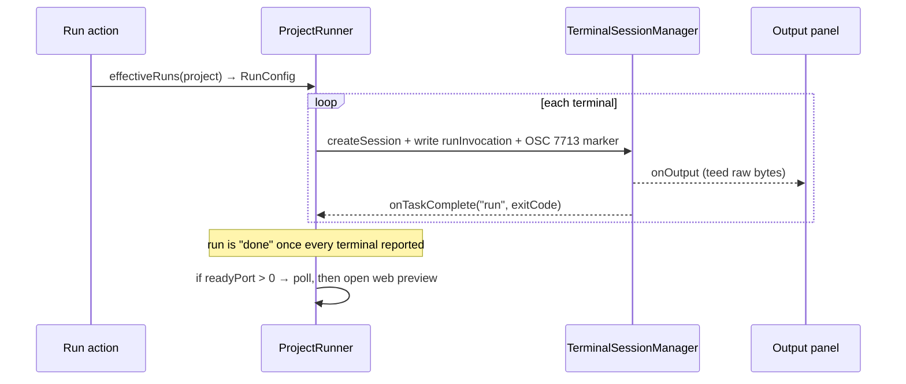

# Run and build configurations

| | |
|---|---|
| **Status** | Implemented |
| **Modules** | `:core:config`, `:app` |
| **Primary sources** | core/config/src/main/java/dev/jcode/core/config/RunConfig.kt, app/src/main/java/dev/jcode/run/ProjectRunner.kt, app/src/main/java/dev/jcode/run/RunConfigPage.kt, app/src/main/java/dev/jcode/run/BuildConfigPage.kt, app/src/main/java/dev/jcode/RunDebugPanel.kt, app/src/main/java/dev/jcode/debug/DebugController.kt, core/design/src/main/java/dev/jcode/design/DesignSystem.kt (`AndroidRunTargets`) |
| **Verified against** | commit `4d87b40`, 2026-08-14 |

---

## 1. Purpose and scope

How a project is built, run and debugged: the `.jcode/run.yaml` format, how configurations are
suggested when none exist, and how a run hands off to the debugger.

There is **one** "Run" tool. Debug is not a separate configuration type — it is a property of a run
configuration (`debugEntry`).

---

## 2. Data model

```kotlin
data class RunConfigTerminal(val label: String, val command: String)

data class RunConfig(
    val name: String,
    val readyPort: Int,
    val debugEntry: String = "",
    val terminals: List<RunConfigTerminal>,
)

data class BuildConfig(val name: String, val command: String)

data class ProjectConfigs(val runs: List<RunConfig>, val builds: List<BuildConfig>) {
    companion object { val EMPTY = ProjectConfigs(emptyList(), emptyList()) }
}
```

| Field | Meaning |
|---|---|
| `terminals` | Run **side by side**, each in its own terminal tab. Build-then-serve is expressed inside the bash command, not as separate phases |
| `readyPort` | When `> 0`, polled after launch and opened in the web preview |
| `debugEntry` | Guest path to the source file the Debug action launches under DAP. **Blank means this configuration is not debuggable** |

A multi-terminal configuration is the normal way to express a full-stack dev setup — for example an
ASP.NET Core API in one terminal and a Vite dev server in another.

---

## 3. `.jcode/run.yaml`

`RunConfigStore` (`REL_PATH = ".jcode/run.yaml"`) reads and writes it.

### 3.1 Current format (v2)

```yaml
version: 2
runs:
  - name: Dev server
    readyPort: 5173
    debugEntry: /workspace/myapp/src/main.ts
    terminals:
      - label: API
        command: dotnet run --project api
      - label: Web
        command: npm run dev
builds:
  - name: Release
    command: dotnet publish -c Release -o out
```

Written with SnakeYAML block flow style and key order `version`, `runs`, `builds`.

### 3.2 Legacy format (v1)

v1 had a **single configuration at the top level**:

```yaml
name: Dev server
readyPort: 5173
terminals:
  - label: Web
    command: npm run dev
```

`load()` detects the absence of a `runs:` key and parses the top-level map as a one-element `runs`
list, keeping it only if it has at least one terminal. v1 files are read but never written back —
the first save upgrades the file to v2.

### 3.3 Parsing tolerance

- Any parse failure returns `null` from `load()` (the whole read is wrapped in `runCatching`), so a
  broken `run.yaml` disables Run rather than crashing the app.
- A `name` that is missing or blank falls back to the **project directory name**.
- `readyPort` accepts a YAML number or a numeric string; anything else becomes `0`.
- A terminal entry without a non-blank `label` is dropped.
- A build entry without a non-blank `name` is dropped.
- `command` defaults to an empty string rather than failing.

> `version` is written but **not read**. Version detection is structural — the presence of `runs:`.

---

## 4. `ProjectRunner`

```kotlin
data class RunPlan(val kindLabel: String, val readyPort: Int, val terminals: List<RunTerminal>) {
    val url: String get() = "http://localhost:$readyPort"
}
```

| Member | Purpose |
|---|---|
| `loadProjectConfigs(project)` / `saveProjectConfigs(project, configs)` | Persist `run.yaml` |
| `effectiveRuns(project)` / `effectiveBuilds(project)` | Stored configurations, falling back to detection |
| `detectRunPlan(project)` | Probe a project opened without a JCode template |
| `runConfigToPlan(config)` | Adapt a stored configuration to a plan |
| `upsertRun` / `upsertRuns` / `upsertBuild` / `deleteRun` / `deleteBuild` | Editing |
| `suggestRunTriggers(project, extensionPresets)` | Run suggestion list (§5) |
| `suggestBuildChoices(project, extensionPresets)` | Build suggestion list (§5) |
| `runInvocation(project, terminal, androidSerial)` | The exact bash line executed in a run terminal |

Every suggestion pass shares **one** bounded walk of the project (`ProjectScan`), so opening a picker
on a large monorepo costs a single scan rather than one per kind.

Detection is deliberately **not** persisted: recipes self-heal, so a probe result is recomputed
rather than frozen into `run.yaml` behind the user's back.

---

## 5. Suggestions

Both segments merge the same two sources, each labelled with its origin — `"Detected"` for a built-in
probe, or the contributing extension's name.

| Source | Where |
|---|---|
| Built-in probes | `ProjectRunner` — file-glob matches such as `package.json` scripts, `*.csproj`, `gradlew` |
| Extension presets | `contributes.runConfigPresets` in an installed extension's manifest |

An extension preset declares `id`, `label`, `requires` (globs) or `match`, and either
`terminals: [{label, command}]` or a single `command` + `terminalLabel`, plus an optional `readyPort`
and `kind`. See [Manifest reference](../07-extensions/03-manifest-reference.md).

A preset's `kind` decides which segment offers it: `run` (the default) feeds `suggestRunTriggers`,
`build` feeds `suggestBuildChoices`. A preset is never offered in both.

Probe helpers substitute project-relative and guest paths (`rel(f)`, `guest(f)`,
`sanitizeStageName`), and a scan cap (`SCAN_TOTAL_CAP`) bounds work on a large monorepo. Extension
presets are evaluated **first** so a busy repository's generic probes cannot crowd them out of the
cap. In the Build segment, a built-in probe whose Gradle tasks a preset already covers is then
dropped, so a pack that ships `gradlew assembleDebug` does not produce a duplicate row. Task paths
are compared **qualified**: `:wear:assembleDebug` is not the same work as a project-wide
`assembleDebug`, and collapsing them would drop the more precise one.

### 5.1 Android

An Android project's suggestions are per **application module** — every module whose build script
applies `com.android.application` (a version-catalog alias is resolved through
`gradle/libs.versions.toml`, and manifests declaring a LAUNCHER activity are the last resort, used
only when no build script matched). A clone with an app plus a wear module therefore offers each by
its Gradle path rather than one row that could only have meant the first.

Only what **launches** the app is a run — `Run on a device` and `Run in a virtual device`. Gradle's
build tasks belong to the Build segment, where the Android Dev Pack contributes the rest
(`assembleRelease`, `bundleRelease`, `installDebug`, tests, lint, clean) plus a project check and
fixer for a repository written against a desktop SDK.

---

## 6. Running



Each terminal's command is written as:

```
[ANDROID_SERIAL="<serial>" ]<runInvocation>; printf '\033]7713;run;%s\007' "$?"
```

so completion and exit code are reported through
[OSC 7713](../03-runtime/02-shell-integration-protocol.md#34-osc-7713--task-completion). The run is
complete once every terminal has reported.

Run terminals also inherit the shell integration, so via `BASH_ENV` the tab is named after the
actual tool (`npm`, `vite`, `dotnet`) rather than the wrapper script.

The **Output** panel is a read-only log teed from the run terminals via
`TerminalSessionManager.onOutput`.

`readyPort > 0` is polled after launch, then opened in the web preview or the user's chosen browser
(Settings → Web preview). Guest programs can also request a URL themselves through OSC 7714, and
both paths honour the same browser choice.

### 6.2 The Android run target

An Android run reaches a device through `adb`, and which device that is comes from `ANDROID_SERIAL`.
`AndroidRunTargets` (in `:core:design`, provided through `LocalAndroidRunTargets`) holds the choice:

| Member | Purpose |
|---|---|
| `available` | Everything the runtime's adb server lists, from `AdbBridge.devices()` |
| `defaultSerial` | What sessions already carry — the virtual device, else the relay |
| `projectChoice(key)` / `onSetProject` | The per-project pick, persisted in DataStore under `android_run_target_projects` |
| `effective(key)` | The device shown in the panel's target row |
| `serialFor(key)` | The serial to force, or blank |

The runtime's adb server is the **only** source of devices: JCode's own virtual device and this phone
both become reachable by being connected to it, so anything it does not list cannot be launched on.

`serialFor` returns blank unless there is an explicit pick that is **still connected**, and
`runInvocation` then prefixes nothing — so a project the user has never chosen a device for behaves
exactly as it did before there was a picker, and a pick for a device that has since gone away
degrades to the default instead of sending the run nowhere.

> The virtual device is reachable **both** ways: as an adb target (JCode's own daemon serves
> `install` and `am start`) and through the container recipe, which only builds and is handed the APK
> by the workbench afterwards. The container path uses no adb at all, which is why it still works on a
> phone that was never paired — and why the panel shows it its own row rather than a target picker.

### 6.1 The `noexec` constraint

Compiled output must be run from **ext4**, not from a FUSE-backed shared-storage path — the latter
is mounted `noexec`. Since projects live under `filesDir` this is satisfied by default; it matters
when a user points a run command at shared storage.

---

## 7. Debugging

`debugEntry` is a **guest** path. When non-blank, the Debug action on that configuration resolves an
engine from `DebugEngineCatalog` by project type and starts a `DebugSession` against it instead of a
plain run.

For an Android application module, `DebugController` detects the module
(`AndroidAppProject.appModuleFor`) and routes to `prepareAndroidAttach` instead — see
[Android app debugging](../08-virtual-device/03-android-app-debugging.md).

---

## 8. UI

| Screen | File | Tab kind |
|---|---|---|
| Run configuration editor | `app/src/main/java/dev/jcode/run/RunConfigPage.kt` | `EditorPageKind.RunConfig` |
| Build configuration editor | `app/src/main/java/dev/jcode/run/BuildConfigPage.kt` | `EditorPageKind.BuildConfig` |
| Run & Debug drawer tool | `app/src/main/java/dev/jcode/RunDebugPanel.kt` | `WorkbenchTool.RunDebug` |

---

## 9. Invariants and constraints

1. `debugEntry` is a guest path, not a host path.
2. Terminals within a configuration are concurrent, not sequential.
3. Detection results are never written to `run.yaml`.
4. Every run terminal must emit the OSC 7713 marker, or the run never completes.
5. A malformed `run.yaml` must degrade to "no configurations", never crash.
6. Saving always writes v2.
7. Executables must run from an exec-capable filesystem.
8. The run target is **not** part of a configuration: `run.yaml` stays portable across devices, and
   which phone a run lands on is device-local state.
9. Only a pick that adb still lists forces `ANDROID_SERIAL`.

> **Naming collision:** `dev.jcode.core.config.BuildConfig` shares its simple name with the
> Gradle-generated `dev.jcode.BuildConfig`. In `:app` sources, importing the config type shadows the
> generated one. Qualify explicitly when both are needed.

---

## 10. Failure modes

| Failure | Effect |
|---|---|
| `run.yaml` unparseable | `load()` returns `null`; Run falls back to detection |
| Terminal exits without the marker | The run appears to hang as incomplete |
| `readyPort` never opens | Web preview never launches; the terminals keep running |
| Session cap reached mid-run | `createSession` returns `null`; that terminal does not start |
| Project on a `noexec` mount | Compiled output fails with permission denied |
| No adb server in the runtime | `available` is empty; the target row becomes the way into the pairing page |
| Picked device unplugged | `serialFor` returns blank and the run falls back to the session default |

---

## 11. Known gaps

- `version:` is written but ignored on read; a future v3 would need structural detection again or a
  read of that field.
- Detection is recomputed on every invocation, so a very large monorepo pays the probe cost each
  time (bounded by `SCAN_TOTAL_CAP`).
- There is no per-run environment-variable block in the schema; environment is set inside the bash
  command or through the global Env Var settings tab.

---

## 12. References

- [Configuration model](02-configuration-model.md)
- [Shell integration protocol](../03-runtime/02-shell-integration-protocol.md)
- [Debug Adapter Protocol](../04-language-services/02-debug-adapter-protocol.md)
- [Manifest reference](../07-extensions/03-manifest-reference.md)
- [File format index](../09-platform/01-file-format-index.md)
