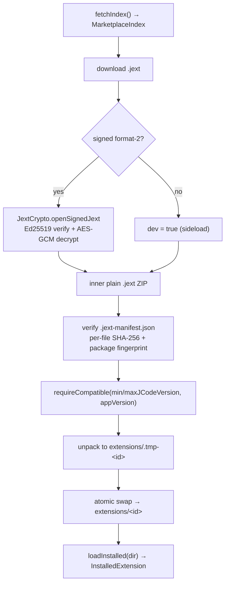

# Extension model and lifecycle

| | |
|---|---|
| **Status** | Implemented |
| **Modules** | `:feature:marketplace`, `:app` |
| **Primary sources** | feature/marketplace/src/main/java/dev/blamspot/jcode/feature/marketplace/MarketplaceModels.kt, feature/marketplace/src/main/java/dev/blamspot/jcode/feature/marketplace/ExtensionInstaller.kt (664 lines), feature/marketplace/src/main/java/dev/blamspot/jcode/feature/marketplace/ExtensionManifestValidator.kt, feature/marketplace/src/main/java/dev/blamspot/jcode/feature/marketplace/MarketplaceServiceLocator.kt, app/src/main/java/dev/blamspot/jcode/workbench/marketplace/ExtensionsPanel.kt, app/src/main/java/dev/blamspot/jcode/workbench/marketplace/ExtensionActivationLocal.kt |
| **Verified against** | commit `cea581c`, 2026-08-09 |

---

## 1. Purpose and scope

What an extension is, how it is installed and updated, when its contributions become active, and how
its capabilities are governed.

Extensions come from the [JCode marketplace](https://github.com/blamspotdev/j-code-marketplace) as
cryptographically verified `.jext` packages, or are sideloaded (unsigned, developer only), or are
imported from a VS Code `.vsix`.

---

## 2. Extension types

```kotlin
enum class ExtensionType { Templates, Language, Formatter, App, DbManager, Scm, Vm, Unknown }
```

| Type | Provides | Surface |
|---|---|---|
| `Templates` | Project templates | The New Project dialog |
| `Language` | A **Dev Pack**: syntax rules, completions, snippets, formatter config | Editor |
| `Formatter` | Formatting rules | Editor |
| `App` | A web frontend ("Manage" UI), e.g. a runtime or tool manager | Editor tab / drawer |
| `DbManager` | Like `App` | The "DB Managers" drawer tool |
| `Scm` | Like `App` | The left-drawer "SCM" panel |
| `Vm` | Like `App` | The left-drawer "VM" panel |
| `Unknown` | — | Generic fallback, no type-specific surfaces |

`ExtensionType.from(raw)` accepts aliases: `app`/`tool`/`runtime`; `dbmanager`/`db-manager`/`database`;
`scm`/`source-control`/`sourcecontrol`/`vcs`; `vm`/`vmmanager`/`vm-manager`/`virtualmachine`/`virtualization`.

> "Dev Pack" is the current user-facing name for a `type: language` extension; the manifest key is
> still `language`.

---

## 3. Activation

```kotlin
enum class ExtensionActivation { AutoStart, OnDemand, Manual }
```

| Mode | Meaning |
|---|---|
| `AutoStart` | Active from launch — always on |
| `OnDemand` | Active when relevant (for example a file the extension supports is open). **The default** |
| `Manual` | Disabled — features stay off until the mode is changed |

`from(raw)` accepts `autostart`/`auto`/`auto-start`, `manual`, `ondemand`/`on-demand`; anything else
falls back to `OnDemand`.

Surfaced through `ExtensionActivationSetting` (a `CompositionLocal`), alongside
`ExtensionCapabilitySetting` (per-capability revocation) and `ExtensionKeepAliveSetting` (whether the
extension's process survives in the background).

---

## 4. `InstalledExtension`

```kotlin
data class InstalledExtension(
    val id: String, val name: String,
    val author: String? = null, val authors: List<String> = emptyList(),
    val type: ExtensionType, val version: String?, val description: String,
    val dir: File,
    val longDescription: String? = null,
    val samples: List<CodeSample> = emptyList(),
    val templates: List<ProjectTemplate> = emptyList(),
    val languages: List<LanguagePack> = emptyList(),
    val iconFile: File? = null,
    val webUiEntry: String? = null,
    val apiMinVersion: Int = 0,
    val apiCapabilities: List<String> = emptyList(),
    val settings: List<ExtensionSetting> = emptyList(),
    val requires: ExtensionDeps = ExtensionDeps.EMPTY,
    val suggests: ExtensionDeps = ExtensionDeps.EMPTY,
    val contributes: ExtensionContributions = ExtensionContributions.EMPTY,
    val dev: Boolean = false,
)
```

| Field | Note |
|---|---|
| `id` | Globally-unique reverse-DNS install id |
| `authors` | Ordered; first is primary. Empty falls back to `author` |
| `apiMinVersion` | Lowest extension-API version needed. `0` = the legacy exec-only bridge |
| `webUiEntry` | Relative path to the HTML entry, e.g. `www/index.html`. Set **only when the file exists** |
| `dev` | `true` **only** for an unsigned sideload — the only kind debuggable in the Ext Dev tools |

Helpers: `languageFor(fileName)`, `hasWebUi` (`webUiFile != null || isVsix` — a `.vsix` builds its UI
at runtime, so it has one with no HTML on disk), `isVsix`.

---

## 5. Dependencies

```kotlin
data class ExtensionDeps(
    val sdks: List<String>, val lsps: List<String>,
    val dbg: List<String>, val extensions: List<String>,
)
```

Declared as `requires:` (installed with the extension) or `suggests:` (offered, not forced). The
`dbg` list accepts either `dbg:` or `debuggers:` as the manifest key.

> `requires` resolution happens on **fresh install only**. Running it on update once aborted updates
> for extensions whose required toolchain was not installed, so the update path is gated on
> `freshInstall`.

Most Dev Packs use `suggests.sdks` rather than `requires.sdks`, so installing a language pack does
not force a multi-hundred-megabyte toolchain download.

---

## 6. Contributions

```kotlin
data class ExtensionContributions(
    val editorStartActions: List<ContributedAction>,
    val drawerActions: List<ContributedAction>,
    val editorContextActions: List<ContributedAction>,
    val explorerContextActions: List<ContributedAction>,
    val explorerDecorations: Boolean,
    val runConfigPresets: List<RunConfigPreset>,
)
```

Full key-by-key reference in [Manifest reference](03-manifest-reference.md).

---

## 7. Install pipeline



- Install root: `filesDir/extensions/<safeDirName(id)>`.
- Unpacking goes to `.tmp-<id>` first and is swapped in, so a failed install cannot leave a
  half-written extension in place.
- The install id and `minJCodeVersion` now live in `extension.yaml`; a legacy `extension.jehm` is
  read as a fallback for packages built before the header merge.
- `installedVersionOf(dir)` reads `extension.yaml` — **the manifest's `version` is authoritative**,
  not the filename.
- `ensureBundledExtensionsInstalled(specs, appVersion)` pre-installs the `.jext` files shipped in
  `app/src/main/assets/builtin-extensions/` on first run.

Entry points: `install(entry, appVersion)`, `installLocalJext(file, appVersion)`,
`installLocalPackage(file, appVersion)`, `installLocalVsix(file, appVersion)`,
`inspectVsix(file)`.

---

## 8. Manifest validation

`ExtensionManifestValidator.validate(ext, hostApiVersion)` returns
`List<ManifestIssue>` with severities `Error`, `Warning`, `Info`. It is surfaced in the Ext Dev
panel.

Checks include:

| Check | Severity |
|---|---|
| Missing `version` | Warning — updates and publishing need one |
| `name` equals `id` | Warning |
| Unrecognized `type` | Warning — falls back to a generic extension |
| Unknown top-level key | Warning — a typo silently drops a whole section |
| `entry.ui` points at a missing file | **Error** |
| `api.minApiVersion` > host API version | **Error** — will not run here |
| Unknown API capability | Warning |

The `entry.ui` check reads the **raw** YAML value against disk, because a typo'd path resolves to
`webUiEntry = null` (the installer only sets it when the file exists) and would otherwise be
invisible.

`KNOWN_TOP_LEVEL` and `KNOWN_CAPABILITIES` are the authoritative key lists — see
[Manifest reference](03-manifest-reference.md).

---

## 9. Update flow

The marketplace index lists each extension's `.jext` path plus a fingerprint. An update downloads,
verifies and swaps as above, then the workbench offers a snackbar with two actions:

| Action | Effect |
|---|---|
| **Reload extension** | `webView.reload()` — enough for a web-UI change |
| **Restart app** | Needed when hardware-accelerated rendering state must be rebuilt |

## 9a. Uninstall flow

Deleting the files does not remove the extension from the running workbench, so an uninstall ends in
one of two prompts, chosen by what the extension left behind:

| Condition | Prompt | Action |
|---|---|---|
| `NativeExtensionLoader.hasLoadedCode(id)` — its dex loaded into this process | **Restart JCode** | `restartApp()`; Android cannot unload a `DexClassLoader`, so nothing less finishes it |
| Otherwise, a live host / `.vsix` session / page tab of its own | **Reload** | `unloadRemovedExtension(id)` — destroys its view holders and closes its page tabs |

Its *detail* page and its source attribution deliberately survive both: that page is where the
uninstall was pressed, and it keeps a working Install.

A pack providing the virtual device is additionally stopped **before** the files go — device, adb,
sandbox and hardware tabs — and `VirtualDeviceBridge.evict()` runs after, so the bridge stops
answering with a pack that is no longer installed. See
[App sandbox §2](../08-virtual-device/01-app-sandbox-architecture.md).

---

## 10. Importing a package, and developer mode

There is **one** import action, the file button in the Extensions panel header
(`ExtensionsPanel.onImportExtension`). It accepts both package formats and tells them apart by what
is inside the file rather than by its name — a file picked through SAF often arrives without a usable
extension — so `MainViewModel.importExtension` hands everything to
`ExtensionInstaller.installLocalPackage`, whose `SideloadOutcome` says which it turned out to be.

An **unsigned** package installs like any other and is marked `dev = true`; the import reports that
it was unsigned rather than refusing it. Developer options does not gate importing. What it gates is
what an unsigned extension may then *do*: only `dev` extensions appear in the Ext Dev tools, where
their `console` output is captured to the **Ext Dev log** rather than logcat, and
`NativeExtensionLoader` refuses to load a `dev` extension's **native code** into JCode's process
unless it is on.

Signed marketplace packages are always `dev = false` and are not debuggable.

---

## 11. Invariants and constraints

1. Extension ids are reverse-DNS and permanent — they key the install directory and persisted state.
2. `extension.yaml`'s `version` is authoritative for update comparison.
3. Unpack to a temp directory and swap; never write in place.
4. `requires` resolution runs on fresh install only.
5. Only unsigned sideloads are `dev = true`.
6. `webUiEntry` is set only when the file exists on disk.
7. A new extension's source repository must be added as a submodule to the marketplace repo at
   `extensions/<short-name>` in the publishing PR, after the source PR merges so the pin has content.

---

## 12. Failure modes

| Failure | Effect |
|---|---|
| Signature verification fails | Install aborted: "not an official package or it was tampered with" |
| File SHA-256 or package fingerprint mismatch | Install aborted |
| `minJCodeVersion` newer than the app | Install refused with a version message |
| `maxJCodeVersion` older than the app | Install refused; the Extensions list badges the row **Unsupported** and disables Install before anything downloads |
| `api.minApiVersion` newer than the host | Validation error; the extension will not run |
| Extension has no `extension.yaml` id | Install fails: "package has no extension.yaml id" |
| Interrupted install | The `.tmp-<id>` directory is discarded; the previous version stays intact |

---

## 13. Known gaps

- Extension **settings** are declared and surfaced generically, but there is no per-extension
  settings schema validation.
- Theme bundles are not yet a contribution point, though the design system would support
  them.
- `:core:ext` — the intended WASM host and contribution dispatcher — was a marker-only stub and was
  removed at 1.6.2; everything here runs
  in a WebView or a Node process instead.

---

## 14. References

- [`.jext` package format](02-jext-package-format.md)
- [Manifest reference](03-manifest-reference.md)
- [Extension API and hosts](04-extension-api-and-hosts.md)
- [Templates and scaffolding](05-templates-and-scaffolding.md)
- [Panels and tools](../06-workbench/03-panels-and-tools.md)
