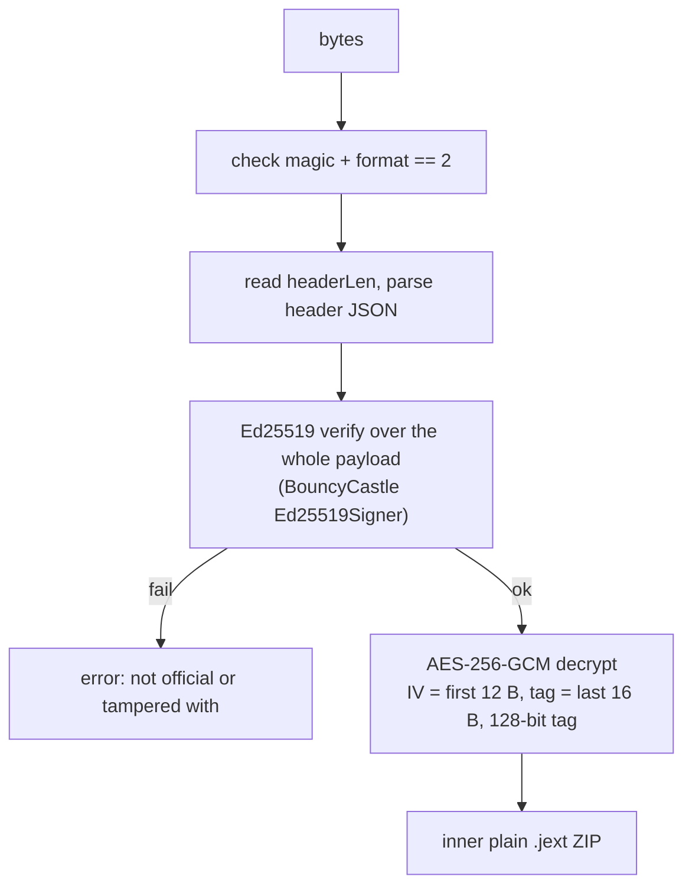

# `.jext` package format

| | |
|---|---|
| **Status** | Implemented |
| **Modules** | `:feature:marketplace` |
| **Primary sources** | feature/marketplace/src/main/java/dev/blamspot/jcode/feature/marketplace/JextCrypto.kt, feature/marketplace/src/main/java/dev/blamspot/jcode/feature/marketplace/ExtensionInstaller.kt (`verifyManifest`, `installFromJextBytes`, `parseJehmHeader`) |
| **Verified against** | commit `cea581c`, 2026-08-09 |

---

## 1. Purpose and scope

The binary format of a JCode extension package, its integrity and authenticity guarantees, and
exactly what those guarantees do and do not cover.

Packages are produced by the [`j-code-make-tools`](https://github.com/blamspotdev/j-code-make-tools)
CLI (`jext pack`, then `jsign` for the signed/encrypted wrapper).

---

## 2. Two forms

| Form | Description | Origin |
|---|---|---|
| **Plain `.jext`** | An ordinary ZIP containing the extension's files plus `.jext-manifest.json` and `extension.yaml` | Development output; sideloadable only via Developer options, installs with `dev = true` |
| **Signed `.jext` (format 2)** | A signed and encrypted container wrapping the plain ZIP | Marketplace; installs with `dev = false` |

`JextCrypto.isSignedJext(bytes)` distinguishes them by the magic and format byte.

---

## 3. Format-2 container layout

```
┌────────┬────────┬──────────────┬─────────────┬──────────────────────────────────┐
│ "JEXT" │ format │  headerLen   │ header JSON │             payload              │
│  4 B   │  1 B   │ 4 B u32 BE   │  headerLen  │  IV(12) ‖ ciphertext ‖ tag(16)   │
└────────┴────────┴──────────────┴─────────────┴──────────────────────────────────┘
```

| Field | Value |
|---|---|
| Magic | ASCII `JEXT` (`0x4A 0x45 0x58 0x54`) |
| Format | `2` |
| `headerLen` | Big-endian `uint32`, must be in `1 ..< (size - 9)` |
| Header | UTF-8 JSON; carries `sig` |
| Payload | `IV(12) ‖ AES-256-GCM ciphertext ‖ tag(16)`, must be more than 28 bytes |

### 3.1 Header

```json
{ "sig": { "value": "<base64 Ed25519 signature>", … } }
```

The signature covers the **whole payload** (`IV ‖ ciphertext ‖ tag`).

### 3.2 Open sequence



Verification comes **before** decryption, so a forged package is rejected without its ciphertext ever
being processed.

Java expects `ciphertext ‖ tag` for GCM, which is why the payload is sliced as
`IV = payload[0..12)` and `ctPlusTag = payload[12..)`.

---

## 4. Security model — read this before relying on it

The source states the boundary explicitly:

> **SECURITY:** the `ED25519_PUB_B64U` verify key is the real authenticity guarantee. The
> `AES256_KEY_B64` is embedded for offline decryption, so it is extractable from the (decompilable)
> app — the encryption layer is obfuscation ("not casually unzippable"), **NOT true secrecy**.

| Property | Guaranteed? |
|---|---|
| **Authenticity** — the package was signed by the JCode key | **Yes**, via Ed25519 |
| **Integrity** — the package was not modified after signing | **Yes**, via Ed25519 and GCM |
| **Confidentiality** — contents are secret from the device owner | **No.** The symmetric key ships in the APK |

Consequences:

- Do not put secrets in a `.jext`.
- The signing key id is `jcode-official-v1`. **Rotating the key requires re-signing every published
  package.**
- Both key constants live in `JextCrypto.kt`; they are not reproduced here, since the file is the
  authoritative copy.

---

## 5. Inner package

The decrypted ZIP is an ordinary plain `.jext`:

```
.jext-manifest.json     per-file SHA-256 + package fingerprint
extension.yaml          the manifest (see 03-manifest-reference.md)
extension.jehm          legacy header (frontmatter only) — packages built before the header merge
www/…                   optional web UI
templates/…             optional project templates
<other files>
```

### 5.1 `.jext-manifest.json`

```json
{
  "files": [
    { "path": "extension.yaml", "sha256": "…" },
    { "path": "www/index.html", "sha256": "…" }
  ],
  "fingerprint": { "value": "…" }
}
```

### 5.2 Fingerprint algorithm

```
lines       = files[] in manifest order, each rendered as "<path>\t<sha256>"
fingerprint = SHA-256( lines.join("\n") as UTF-8 )   → lowercase hex
```

The fingerprint is recomputed over the manifest's file list **in order**, matching how `jext pack`
produced it.

### 5.3 Verification (`verifyManifest`)

1. `files[]` must exist, else `.jext manifest has no files[]`.
2. Every listed file must be present, else `.jext is missing a listed file: <path>`.
3. Every file's SHA-256 must match, else `.jext checksum mismatch for <path>`.
4. If the manifest declares a fingerprint, it must equal the recomputed value, else
   `.jext fingerprint does not match its contents`.
5. If the marketplace index supplied an expected fingerprint, it must equal the recomputed value,
   else `.jext fingerprint does not match the marketplace index (possible tampering)`.

Step 5 is what binds the downloaded artifact to the index entry the user chose.

> Files **not** listed in `files[]` are extracted without being checked. The fingerprint covers the
> declared list, not the archive as a whole.

---

## 6. Legacy `.jehm` header

Packages built before the header merge carry `extension.jehm`, a Markdown-ish file whose **YAML
frontmatter** holds the install id (`uniqueName`) and `minJCodeVersion`:

```
---
uniqueName: dev.example.mypack
minJCodeVersion: 1.3.5
---
…prose…
```

`parseJehmHeader` extracts only the frontmatter, between the leading `---` and the next `---`
(and strips a UTF-8 BOM first). New packages put these keys in `extension.yaml`; the fallback exists
purely for older archives.

---

## 7. Version gate

```kotlin
requireCompatible(minVersion, appVersion, name)
// error("$name requires JCode $minVersion or newer (you have $appVersion)")
```

A blank or absent `minJCodeVersion` means "no floor", and a blank or absent `maxJCodeVersion`
means "no ceiling". Both bounds include the version they name: `1.7.0`–`1.8.4` runs on both ends
and not on 1.9. Comparison is semantic, not lexical. `jext pack` refuses a ceiling below the floor,
since that describes no JCode at all.

---

## 8. Installation on disk

```
filesDir/extensions/
├─ <safeDirName(id)>/        the live extension
└─ .tmp-<safeDirName(id)>/   staging during install
```

`installed()` lists directories, **skipping any `.tmp-` prefix**, and loads each via
`loadInstalled(dir)` — which requires a parseable `extension.yaml` with an `id`.

`isInstalled(id)` checks for `extensions/<id>/extension.yaml`.
`uninstall(id)` is a recursive delete of that directory.

---

## 9. Invariants and constraints

1. Verify the signature **before** decrypting.
2. Fingerprint lines are `"<path>\t<sha256>"` joined with `"\n"`, in manifest order — any change to
   this rendering invalidates every published package.
3. The AES layer is obfuscation; never treat package contents as confidential.
4. Rotating the Ed25519 key means re-signing everything.
5. `.tmp-` directories are never listed as installed extensions.
6. Reject a package whose declared fingerprint disagrees with its contents, even if every individual
   file hash matches.

---

## 10. Failure modes

| Condition | Error |
|---|---|
| Not a format-2 container when one is required | `not a signed .jext` |
| `headerLen` out of range | `corrupt signed .jext (bad header length)` |
| Payload ≤ 28 bytes | `corrupt signed .jext (payload too small)` |
| No `sig` in the header | `signed .jext has no signature` |
| Signature mismatch | `signed .jext failed signature check — not an official package or it was tampered with` |
| GCM tag mismatch | `AEADBadTagException` from `doFinal` |
| Any manifest check | See §5.3 |
| `minJCodeVersion` too new | `<name> requires JCode <v> or newer (you have <appVersion>)` |
| `maxJCodeVersion` too old | `<name> supports JCode up to <v> (you have <appVersion>)` |

---

## 11. Known gaps

- Files present in the archive but absent from `files[]` are unverified.
- There is no revocation mechanism: a package signed with a compromised key stays valid until the key
  is rotated and every package re-signed.
- Format 1 is not documented here — only format 2 is accepted as signed, and anything else is treated
  as a plain ZIP.

---

## 12. References

- [Extension model and lifecycle](01-extension-model-and-lifecycle.md)
- [Manifest reference](03-manifest-reference.md)
- [Security and privacy](../09-platform/04-security-and-privacy.md)
- [File format index](../09-platform/01-file-format-index.md)
