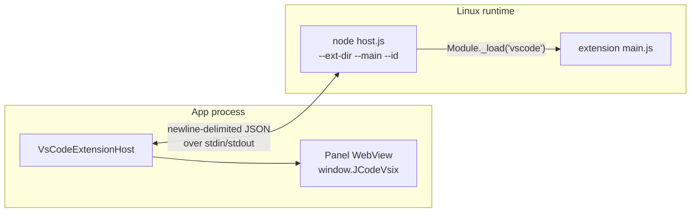

# Extension API and hosts

| | |
|---|---|
| **Status** | Implemented |
| **Modules** | `:app`, `:feature:marketplace` |
| **Primary sources** | app/src/main/java/dev/blamspot/jcode/workbench/ExtensionWebView.kt (1,245 lines), app/src/main/java/dev/blamspot/jcode/workbench/VsCodeExtensionHost.kt (270), app/src/main/assets/vscode-host/host.js (662), app/src/main/java/dev/blamspot/jcode/workbench/VsixDrawerPanel.kt, app/src/main/java/dev/blamspot/jcode/workbench/ScmExtensionHost.kt, app/src/main/java/dev/blamspot/jcode/workbench/ExtensionDevPanel.kt, app/src/main/java/dev/blamspot/jcode/workbench/ExtensionDevLog.kt, feature/marketplace/src/main/java/dev/blamspot/jcode/feature/marketplace/VsixPackage.kt (278) |
| **Verified against** | commit `cea581c`, 2026-08-09 |

---

## 1. Purpose and scope

There are **two independent extension runtimes**, with two different protocols:

| Runtime | For | Executes | Protocol |
|---|---|---|---|
| **WebView bridge** | First-party `.jext` extensions with a web UI | JavaScript in an Android `WebView` | `window.JCodeNative` ↔ `window.JCode._on*` |
| **VS Code host** | Imported `.vsix` extensions | Node inside the Linux runtime | Newline-delimited JSON over stdio |

Conflating them is easy and wrong; they share no code.

---

## 2. The WebView bridge

### 2.1 Injected object — `window.JCodeNative`

```kotlin
class ExtensionBridge(
    private val onExec: (reqId: String, command: String, timeoutMs: Long) -> Unit,
    private val onRequest: (reqId: String, envelopeJson: String) -> Unit = { _, _ -> },
) {
    @JavascriptInterface fun exec(reqId: String, command: String, timeoutMs: Int)
    @JavascriptInterface fun request(reqId: String, envelopeJson: String)
}
```

Exactly two methods:

| Method | Purpose |
|---|---|
| `exec(reqId, command, timeoutMs)` | **Legacy** shell bridge — run a command in the guest |
| `request(reqId, envelopeJson)` | **Extension API v1** — a typed envelope |

### 2.2 Envelope

```json
{ "type": "family.verb", "payload": { … } }
```

Replies are delivered by evaluating JavaScript in the page:

| Callback | Payload |
|---|---|
| `window.JCode._onExec(reqId, result)` | Legacy `exec` result |
| `window.JCode._onResult(reqId, json)` | `{"ok":true,"data":{…}}` or `{"ok":false,"error":"…"}` |
| `window.JCode._onEvent(name, json)` | Host-pushed events, e.g. the focused editor file |

The host side is `WorkbenchModel`'s

```kotlin
val onExtensionApiRequest: suspend (extensionId: String, envelopeJson: String) -> String
val extensionEvents: SharedFlow<Pair<String, String>>?
```

with the default returning `{"ok":false,"error":"extension API unavailable"}`.

Capability **families** are declared in the manifest (`api.capabilities`) and gate the envelope's
`type` prefix: `api`, `exec`, `fs`, `config`, `workbench`, `service`. A user can revoke a capability
per extension (`ExtensionCapabilitySetting`), and a revoked family's requests are refused.

`api.minApiVersion` of `0` means the legacy exec-only bridge.

### 2.3 Hosting

| Composable / class | Role |
|---|---|
| `ExtensionWebViewPage` | Full-screen in-editor page for `webUiFile` |
| `VsixViewHolder` / `VsixSession` | Imported `.vsix` panels |
| `PersistentWebViewHost` | Keeps a WebView alive across rotation and tab switches |
| `ScmWebViewHolder` | The SCM drawer panel |

`PersistentWebViewHost` owns its own `FrameLayout` and checks `parent !== host` before re-parenting.
Without it, `AndroidView`'s `onDispose` removes the WebView from the mount that had just adopted it
and the panel goes blank on rotation.

`NoFullscreenWebView` overrides `onCreateInputConnection` to add `IME_FLAG_NO_FULLSCREEN` and
`IME_FLAG_NO_EXTRACT_UI`, so a text field inside an extension does not trigger the IME's fullscreen
extract mode in landscape.

SAF import and export bridges stage files through `/jcode-transfer` so an extension can reach a
user-picked file by a runtime path without a base64 round trip.

### 2.4 The WebView viewport quirk

On some devices the system WebView is an old AOSP Chromium that lays pages out against a
**zero-height viewport**, so `vh` and percentage heights compute to `0` while `window.innerHeight`
reports correctly. The host therefore publishes a CSS custom property,
`--jcode-viewport-height`, that extension stylesheets should prefer over `100vh`.

### 2.5 Developer tooling

An unsigned sideload (`dev = true`) appears in the **Ext Dev** panel with an inspector, the manifest
validator, and a live log. **Its `console` output goes to the Ext Dev log, not to logcat.**

---

## 3. The VS Code host

### 3.1 Architecture



`VsCodeExtensionHost` reuses the debug-adapter spawn path, because the shape is the same: a child
process with framed JSON on its stdio.

### 3.2 The staging problem

An extension installs into app-private storage, which the Linux runtime cannot see. Only
`WorkspaceHostPaths.transferRoot` is bind-mounted, so:

- The extension's files and `host.js` are **staged** into `/jcode-transfer`.
- Staging is skipped when the staged copy already matches the installed version.
- Hard links are used where the filesystem allows, so re-activating costs nothing and stores nothing
  twice.

Launch: `bash -lc "… node host.js --ext-dir <dir> --main <entry> --id <extensionId>"`.

### 3.3 Wire protocol

One JSON object per line.

**Requests** (either direction) carry an `id`; **notifications** do not:

```json
{ "id": 7, "method": "webview/postMessage", "params": { … } }   // request
{ "method": "host/log", "params": { "level": "info", "text": "…" } }   // notification
{ "id": 7, "result": null }                                     // response
{ "id": 7, "error": "…" }                                       // error response
```

**Host → extension** methods:

| Method | Meaning |
|---|---|
| `activate` | Load `main` and call its `activate(context)` |
| `resolveWebviewView` | Ask a registered provider to build a view |
| `command/execute` | `{ id, args }` — run a registered command |
| `webview/message` | `{ handle, message }` — a message from the panel |
| `state/activeFile` | The focused editor file |
| `state/theme` | `{ kind }` |
| `state/configuration` | `{ configuration }` |
| `deactivate` | Call the extension's `deactivate()` and exit |

**Extension → host** methods:

| Method | Meaning |
|---|---|
| `host/ready` | `{ id, node }` — sent once at startup with the Node version |
| `host/log` | `{ level, text }` |
| `webview/providerRegistered` | `{ viewId }` |
| `webview/panelCreated` | `{ handle, viewType, title }` |
| `webview/html` | `{ handle, viewId, html }` |
| `webview/postMessage` | `{ handle, message }` (a request — resolves to `true`) |
| `webview/reveal` | `{ handle }` |
| `webview/disposed` | `{ handle }` |

A `createWebviewPanel` becomes an **editor tab** (`EditorPageKind.VsixPanel`); a
`registerWebviewViewProvider` becomes a **right-drawer tab** for that extension
(`RightPanelSelection.Extension`). Menu contributions under `view/title` become the panel's chip and
its `⋮` menu.

The panel page exposes `window.JCodeVsix.postMessage(...)` to the extension's own webview HTML.

### 3.4 The `vscode` module shim

`host.js` intercepts `Module._load` so `require('vscode')` returns JCode's implementation. Provided:
`Uri`, `Disposable`, `EventEmitter`, `commands`, `window`, `workspace`, `env`, `l10n`.

`languages`, `debug`, `tasks` and `scm` are **throwing `Proxy` objects**. The rationale is stated in
the file:

> Anything outside it throws by name — `vscode.debug.startDebugging is not implemented by JCode` —
> because an extension failing loudly at the call it actually made is far easier to act on than one
> that silently does nothing.

`host.js` requires `--ext-dir` and `--main`, exiting with code 2 if either is missing; `--id`
defaults to `extension`.

---

## 4. `.vsix` import

`VsixPackage` reads `extension/package.json` (plus `package.nls.json` for `%key%` localization) into:

```kotlin
data class VsixManifest(
    val publisher: String, val name: String, val version: String,
    val displayName: String, val description: String,
    val main: String?, val icon: String?, val engineRange: String?,
    val activationEvents: List<String>, val contributeKeys: List<String>,
) { val id: String get() = "$publisher.$name" }
```

`engines.vscode` is **recorded but not enforced**.

### 4.1 Compatibility report

```kotlin
val SUPPORTED_CONTRIBUTES = setOf(
    "commands", "configuration", "configurationDefaults",
    "menus", "submenus", "views", "viewsContainers",
)
```

Anything else is reported as unsupported rather than dropped quietly, **so an import says up front
what will not work**.

```kotlin
data class VsixCompatibility(
    val supportedContributes: List<String>,
    val unsupportedContributes: List<String>,
    val warnings: List<String>,
) { val fullySupported: Boolean get() = unsupportedContributes.isEmpty() && warnings.isEmpty() }
```

Warnings are raised when: there is no `main` ("no extension code to run"), unsupported contribution
points exist, or neither `views` nor `viewsContainers` is contributed ("may have no visible surface
in JCode").

`inspectVsix(file)` returns the manifest and this report **before** installing.

### 4.2 Synthesized `extension.yaml`

The `extension/` subtree becomes the install directory, a `.jcode-vsix` marker file is written, and
a manifest is generated:

```yaml
# Generated by JCode from a .vsix. Edits here are lost on reinstall.
id: "publisher.name"
name: "Display Name"
publisher: "publisher"
version: "1.2.3"
type: app
description: "…"
api:
  minApiVersion: 1
  capabilities:
    - workbench
images:
  icon: "…"
vsix:
  main: "out/extension.js"
  engine: "^1.80.0"
  activationEvents:
    - "onStartupFinished"
```

Every scalar is quoted and escaped so punctuation survives the YAML round trip.

> The `workbench` capability is declared so JCode can answer the host's questions about which file
> is open, which project, and which theme. Without it those calls are refused and the extension falls
> back to whatever it last persisted, showing the wrong project. It remains a *declaration* — the
> user can still revoke it from the extension's permissions page.

An `extension.yaml` present inside the `.vsix` is **ignored**: the generated manifest is the source
of truth.

`VsixCommand.codicon` extracts the bare name from VS Code's `$(name)` icon reference, keeping the
raw form because only the presenting layer knows which of its own icons it can map onto.

---

## 5. Invariants and constraints

1. `@JavascriptInterface` methods return immediately; results are delivered asynchronously by
   evaluating JavaScript.
2. WebViews are re-parented via `PersistentWebViewHost`, never disposed on a layout swap.
3. Extension web UIs should use `--jcode-viewport-height` rather than `100vh`.
4. `host.js` and the extension must be staged into `/jcode-transfer` — the runtime cannot read
   app-private storage.
5. Unimplemented `vscode` APIs throw by name; do not silently no-op them.
6. The generated `extension.yaml` overrides any shipped one.
7. Extension `console` output belongs in the Ext Dev log.

---

## 6. Failure modes

| Failure | Effect |
|---|---|
| Capability revoked | The request is refused with `{"ok":false,"error":…}` |
| `api.minApiVersion` too new | Validation error; the extension does not run |
| Node not installed in the guest | The `.vsix` host cannot start |
| Extension calls an unimplemented `vscode` API | Throws by name in the extension's own stack |
| WebView renderer killed | `onRenderProcessGone` recovers the panel |
| Rotation without persistent hosting | Blank panel |
| `.vsix` with no `main` | Imports, but has no code to run (reported up front) |

---

## 7. Known gaps

- The `.vsix` surface is the webview slice only — `languages`, `debug`, `tasks` and `scm` throw.
- `engines.vscode` is not enforced, so an extension targeting a much newer VS Code imports and then
  fails at its first unimplemented call.
- `:core:ext` (the intended WASM host and contribution dispatcher) was removed at 1.6.2, as was
  `:native:wasmtime-ffi`; there is no WASM extension runtime.

---

## 8. References

- [Extension model and lifecycle](01-extension-model-and-lifecycle.md)
- [Manifest reference](03-manifest-reference.md)
- [Storage and path model](../01-architecture/05-storage-and-path-model.md)
- [Panels and tools](../06-workbench/03-panels-and-tools.md)
