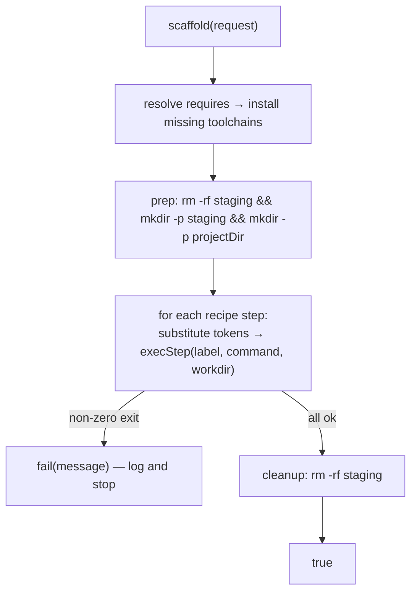

# Templates and scaffolding

| | |
|---|---|
| **Status** | Implemented |
| **Modules** | `:feature:marketplace`, `:app` |
| **Primary sources** | feature/marketplace/src/main/java/dev/jcode/feature/marketplace/TemplateCatalogModels.kt, feature/marketplace/src/main/java/dev/jcode/feature/marketplace/TemplateCatalog.kt, feature/marketplace/src/main/java/dev/jcode/feature/marketplace/TemplateScaffolder.kt (180 lines), feature/marketplace/src/main/java/dev/jcode/feature/marketplace/ExtensionInstaller.kt (`loadTemplate`) |
| **Verified against** | commit `cea581c`, 2026-08-09 |

---

## 1. Purpose and scope

Project templates: how an extension declares one, and how JCode scaffolds it on-device by running
real commands in the Linux runtime.

Templates carry **no** JCode-specific logic — a template is a list of shell commands plus the inputs
they need. That keeps the app generic and small, and lets a template track upstream tooling without
an app release.

---

## 2. Data model

```kotlin
data class ProjectTemplate(
    val id: String, val name: String, val description: String,
    val requires: List<String> = emptyList(),      // SDK catalog ids needed at scaffold time
    val inputs: List<TemplateInput> = emptyList(),
    val recipe: List<TemplateRecipeStep> = emptyList(),
) { val isEmpty: Boolean get() = recipe.isEmpty() }

data class TemplateRecipeStep(
    val label: String,
    val run: String,
    val workdir: String? = null,                   // placeholders resolved before exec
)

data class TemplateInput(
    val id: String,                                // fills {{id}} in the recipe
    val label: String,
    val type: String = "select",                   // "select" | "text"; unknown → text
    val options: List<String> = emptyList(),
    val optionsCommand: String = "",
    val default: String? = null,
) { val defaultValue: String get() = default ?: options.firstOrNull() ?: "" }

data class TemplateExtension(
    val id: String, val name: String, val publisher: String?,
    val version: String?, val description: String,
    val templates: List<ProjectTemplate>,
)
```

An **empty** template (`recipe` absent) creates only the folder — there is nothing to run.

---

## 3. On-disk layout

An extension's `extension.yaml` lists template **ids**; each resolves to:

```
<extensionDir>/templates/<id>/template.yaml
```

```yaml
id: vite-app
name: Vite app
description: A Vite + TypeScript starter.
requires: [nodejs]
inputs:
  - id: framework
    label: Framework
    type: select
    options: [vanilla-ts, react-ts, vue-ts]
    default: react-ts
  - id: targetFramework
    label: Target framework
    type: select
    optionsCommand: dotnet --list-sdks | awk '{print $1}'
recipe:
  - label: Scaffold
    run: npm create vite@latest "{{name}}" -- --template {{framework}}
    workdir: "{{hostStaging}}"
  - label: Move into place
    run: cp -R "{{hostStaging}}/{{name}}/." "{{projectDir}}/"
```

Parsing (`loadTemplate`):

- A missing `template.yaml`, or unparseable YAML, drops the template silently.
- `id` and `name` default to the directory id; `description` defaults to `""`.
- A recipe step without `run` is dropped; `label` defaults to `"Run"`.
- An input without a non-blank `id` is dropped; `label` defaults to `id`; `type` defaults to
  `"select"`.

---

## 4. Dynamic options

`optionsCommand` is a guest command whose **stdout lines** become the live select options at
New-Project time — for example listing installed .NET SDKs to offer `net8.0` / `net10.0`.

It falls back to the static `options` when the command is empty, the runtime is not ready, or the
command yields nothing.

> This is what lets a new .NET (or Node, or Android API) release appear in the picker **with no app
> change**.

---

## 5. Scaffolding

```kotlin
data class Request(
    val projectName: String,
    val projectDir: String,
    val inputs: Map<String, String>,   // keyed by input id
)

suspend fun scaffold(request: Request): Boolean
```

### 5.1 Substitution tokens

| Token | Value |
|---|---|
| `` | The user's pick, else `TemplateInput.defaultValue` |
| `{{name}}` | `request.projectName` |
| `{{projectDir}}` | `request.projectDir` |
| `{{hostStaging}}` | The staging directory (§5.2) |

Substitution applies to every step's `run` **and** its `workdir`.

### 5.2 Why staging exists

> Generators run in the runtime's **ext4 home** (`{{hostStaging}}`) because FUSE `/workspace` has no
> symlinks; only the build output or editable source lands in `{{projectDir}}`.

A generator such as `npm create` builds a `node_modules` tree containing symlinks (`.bin`), which a
FUSE-backed path cannot represent. Running in staging and copying the result across avoids the whole
class of failure.

### 5.3 Sequence



The prep command is literally:

```sh
rm -rf "<staging>" && mkdir -p "<staging>" && mkdir -p "<projectDir>"
```

Steps run **in order** and stop at the first failure. Progress is streamed as log lines, opening with
`== <templateName> → <projectDir> ==`. Cleanup removes the staging directory.

`reset()` clears the scaffolder's state between runs.

### 5.4 Where it runs

Steps execute in the shared **Setup terminal**, so the user watches real output rather than a silent
in-process exec. See
[Toolchain catalog and onboarding §5](../03-runtime/04-toolchain-catalog-and-onboarding.md#5-catalog-execution-and-state).

> `proot -w` does **not** expand `$HOME`, so a `workdir` must be an absolute path or a substituted
> token — not `~` or `$HOME`.

---

## 6. Catalog

`TemplateCatalog` aggregates templates from **all** installed extensions into the New Project dialog,
grouped by contributing extension (`TemplateExtension`).

`requires` entries are SDK catalog ids; missing toolchains are resolved and installed before the
recipe runs.

After scaffolding, the new folder is registered as a Project and gets its
`.jcode/<folderName>.yaml` marker with `template: <id>` recorded, which is how
`Project.templateId` is later derived.

---

## 7. Invariants and constraints

1. Templates contain no JCode-specific logic — only shell commands and inputs.
2. Generators run in `{{hostStaging}}` (ext4), never directly in a FUSE-backed `/workspace` path.
3. Recipe steps are ordered and stop at the first failure.
4. `optionsCommand` must degrade to static `options` when the runtime is not ready.
5. `workdir` must be absolute or token-substituted.
6. Staging is always cleaned up, including after a failure.
7. Template ids are stable — they are recorded in the project's config.

---

## 8. Failure modes

| Failure | Effect |
|---|---|
| `template.yaml` missing or unparseable | Template silently absent from the catalog |
| A required toolchain cannot be installed | Scaffolding aborts before running the recipe |
| A recipe step exits non-zero | Scaffolding stops; the log shows the failing step's label |
| `optionsCommand` fails or is empty | Falls back to the static `options` |
| Staging cleanup fails | Leaves a directory in the runtime home; harmless but untidy |
| Template with an empty recipe | Creates the folder only |

---

## 9. Known gaps

- There is no dry-run or preview of a recipe before it executes.
- `TemplateInput.type` recognizes only `select` and `text`; anything else falls back to free text.
- A partially-scaffolded project is left in place on failure — the user must delete it manually.

---

## 10. References

- [Extension model and lifecycle](01-extension-model-and-lifecycle.md)
- [Manifest reference](03-manifest-reference.md)
- [Workspaces and projects](../05-workspace/01-workspaces-and-projects.md)
- [Toolchain catalog and onboarding](../03-runtime/04-toolchain-catalog-and-onboarding.md)
