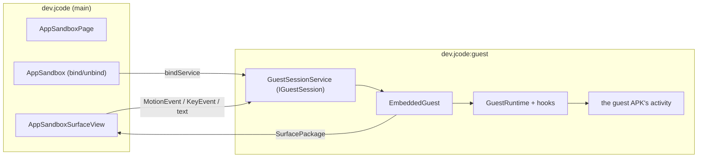

# App sandbox architecture

| | |
|---|---|
| **Status** | Implemented — device-verified on Android 13 |
| **Modules** | `:app` (`dev.jcode.vdevice`) |
| **Primary sources** | app/src/main/java/dev/jcode/vdevice/VirtualDevice.kt, VirtualDeviceApps.kt, VirtualDevicePolicy.kt, VirtualStorage.kt, VirtualStorageProvider.kt, GuestDocuments.kt, GuestResults.kt, DeviceIntents.kt, Camera2Probe.kt, GuestSurfaces.kt, SimulatedHardware.kt, VirtualDeviceLog.kt, VirtualLauncher.kt, VirtualWallpaper.kt, VirtualInput.kt, GuestHierarchy.kt, UiXml.kt, AppSandbox.kt, AppSandboxPage.kt, AppPermissionsSheet.kt, VirtualHardwarePage.kt, AppSandboxSurfaceView.kt, EmbeddedGuest.kt, GuestSessionService.kt, GuestActivity.kt, VirtualScreen.kt, app/src/main/aidl/dev/jcode/vdevice/IGuestSession.aidl, app/src/main/aidl/dev/jcode/vdevice/IGuestSessionCallback.aidl, app/src/main/AndroidManifest.xml |
| **Verified against** | device-verified on Android 13, 2026-08-15 |

---

## 1. Purpose and scope

Running a built APK **inside JCode** — no install, no ADB, no root — so a developer can build and
try an Android app on the same device, in an editor tab.

> **This is a sandboxed preview, not a security boundary.** The guest runs in a separate *process*
> of JCode, but shares JCode's uid, permissions and data directory. Never run untrusted APKs in it.

---

## 2. Two presentation modes

| Mode | Entry | Window | Used when |
|---|---|---|---|
| **Embedded** | `AppSandboxPage` → `GuestSessionService` → `EmbeddedGuest` | Window-less, composited into a `SurfaceView` in an editor tab | The window supports embedding |
| **Full-screen** | `VirtualDevice.launch` → `GuestBootstrapActivity` → `GuestActivity0..3` | A real activity in its own task | Otherwise, or by choice |

```kotlin
internal enum class AppSandboxTier { Embedded, FullScreen }
```

The tier is chosen by two things: embedding is impossible without hardware acceleration, and
**Settings → Virtual device → "Always run in full screen"** lets the user insist on a real window.

That switch exists because embedding is a trade, not a strict improvement. It buys the IDE around the
app and a screen an agent can read, and it costs the guest a real window: its activity token is one
no `ActivityRecord` answers to, so anything asking the activity manager about itself is answered by
the container rather than the system (see
[Guest runtime §4b](02-guest-runtime-and-hidden-api.md#4b-the-embedded-activitys-token--guestactivityclient)).
An app that wants a real task — its own recents entry, a `PendingIntent` the system will act on, an
SDK that interrogates its own activity — is better served by the full-screen path, and for those the
switch is the answer rather than a workaround for a bug.

`AppSandbox.alwaysFullScreen` holds it rather than the DataStore being read at each call site,
because the tab and the adb daemon's `am start` both have to give the same answer and the daemon is
not a composable. `am start --windowingMode 1` still asks for full screen explicitly.

### 2.1 Why not a virtual display

Putting a **system-launched** activity on a display the app owns is impossible for a normal app:
`ActivityOptions.setLaunchDisplayId` requires the `signature|privileged` `ACTIVITY_EMBEDDING`
permission.

`SurfaceControlViewHost` is what makes the embedded path permission-free — it exists precisely to
let one process's views be composited inside another's, the IDE and `:guest` share a uid, and unlike
a virtual display it asks nothing of the activity task manager.

---

## 3. Process topology



Declared in `AndroidManifest.xml` with `android:process=":guest"`:
`GuestBootstrapActivity` (translucent, `excludeFromRecents`), `GuestActivity0`–`GuestActivity3`
(`launchMode="standard"`, `Theme.DeviceDefault.NoActionBar`, a deliberately broad `configChanges`
set), and `GuestSessionService`.

The manifest comment explains why the stubs exist at all:

> …the stubs the app-virtualization container launches in place of a guest APK's own activities,
> since the system cannot be asked to start an activity of a package it has never heard of.
> …they are never used as themselves — `GuestRuntime` swaps in the guest's class before the system
> instantiates them. `launchMode` is standard so one stub can back several guest instances, and
> `configChanges` is deliberately broad so the guest handles rotation itself instead of being
> relaunched through the stub.

Four stubs means up to four concurrent guest activities.

**Unbinding `GuestSessionService` is what tears a session down** — nothing else keeps the `:guest`
process alive.

---

## 4. The AIDL surface

```java
interface IGuestSession {
    Bundle start(String apkPath, String activityClass, int width, int height,
                 IBinder hostToken, IGuestSessionCallback callback);
    Bundle surface();
    Bundle capture(String pngPath);
    Bundle dump(String xmlPath);

    oneway void resize(int width, int height);
    oneway void touch(in MotionEvent event);
    oneway void key(in KeyEvent event);
    oneway void text(String text);
    oneway void back();
}

interface IGuestSessionCallback {
    oneway void onGuestFinished(String reason);
}
```

Design decisions recorded in the AIDL itself:

| Decision | Reason |
|---|---|
| `start` returns a `Bundle` | So a failure comes back as a **message** rather than an exception across the binder |
| `hostToken` is **required** | It is the `SurfaceView`'s input token. Without it the window manager refuses to grant the embedded hierarchy an input channel at all, so a null token is refused with a message rather than embedded |
| `surface()` exists separately | A `SurfaceView` releases its surface package when it detaches, so switching editor tabs and back needs a **new** package rather than a session restart |
| `capture(pngPath)` writes a **file** | The processes share a uid and a data directory, so a file beats a `Bundle` that a large screen would burst |
| `dump(xmlPath)` likewise | `GuestHierarchy` walks the guest's live view tree into uiautomator-shaped XML; a deep tree outgrows a `Bundle` for the same reason a screen does |
| Everything else is `oneway` | It is called from the IDE's UI thread and must never block on the guest's |

---

## 5. Input injection

Having an input channel is **not** the same as being fed by it. Measured on Android 13, touches over
the embedded hierarchy are not dispatched to it by the system, so `AppSandboxSurfaceView` forwards
raw `MotionEvent`s, `KeyEvent`s and typed text over AIDL, and `EmbeddedGuest` routes each to
whichever guest window is topmost.

`back()` pops the embedded back stack, or sends Back to the only activity.

Child windows (dialogs, popups, spinners) need extra work — see
[Guest runtime and hidden API](02-guest-runtime-and-hidden-api.md).

### 5.1 An event must carry the **device's** coordinates, not the phone's

A `MotionEvent` holds two positions. `getX`/`getY` are shifted by every `ViewGroup` on the way down
the tree; `getRawX`/`getRawY` are not, because they are where the finger landed on the *display*.
Relaying an event into the tab shifts the first and leaves the second, so a guest reading the second
is told the tab's offset down JCode's window — and the device's screen appears to start a couple of
hundred pixels above the top of itself.

That is not a corner case. `getRawX`/`getRawY` are what GameActivity hands native code as
`GameActivityPointerAxes.rawX`, what SDL reads, and what anything hit-testing against a full-bleed
surface uses. All of them are correct on a phone, where a full-screen window starts at the origin and
the two positions are the same number.

> Measured on WaveRepo — a GameActivity app with a C++ UI: it rendered perfectly, and every tap
> arrived **258 px below** the control it was aimed at, so the app answered nothing. Nothing in any
> log said so, because from the app's side nothing had gone wrong. Tapping 258 px above the button
> triggered it.

`VirtualInput.inDeviceSpace` rebuilds the event from its local coordinates, which makes them its raw
ones too, and `EmbeddedGuest.touch` does that before dispatching. The batched samples come with it —
a velocity tracker given one sample per event fits no curve, and flings would die. Events
`VirtualInput` synthesises for `adb shell input` are already built this way, which is why `input tap`
worked on apps a finger could not drive.

---

## 6. `VirtualDevice`

```kotlin
data class VirtualDeviceApp(
    val packageName: String, val label: String,
    val versionName: String?, val activities: List<String>,   // fully-qualified, manifest order
)

fun inspect(context: Context, apkPath: String): Result<VirtualDeviceApp>
fun launch(...)
```

`inspect` uses `PackageManager.getPackageArchiveInfo` with `GET_ACTIVITIES or GET_META_DATA` —
**public API only**, so it is safe to call from the IDE process. It fails with
`VirtualDeviceException` for an unreadable APK or one with no `<application>`.

`launch` is the full-screen path: a real activity, in its own task, with everything a real window
brings. `GuestOverlay.install()` adds a floating pill and a back/close bar, because JCode draws
nothing over a full-screen guest.

---

## 7. Screen capture

`VirtualScreen` renders the guest's current screen to a PNG.

> `screencap -d <displayId>` returns **0 bytes** for this kind of surface, and `PixelCopy` over the
> tab's `SurfaceView` answers `ERROR_SOURCE_NO_DATA` — the guest's pixels live in a `SurfaceControl`
> the view only *parents*. So the screen is asked of whoever is drawing it: the guest re-draws its
> own hierarchy (`EmbeddedGuest.capture`), and an idle device draws its home screen — see §7a.

This is what backs `adb shell screencap` against the virtual device — see
[ADB bridge §10](../03-runtime/05-adb-bridge.md#10-adbdaemon--serving-the-virtual-device).

---

## 7a. The device with nothing on it

The tab's resting state is a **device**, not an empty panel: `VirtualWallpaper` (dark grey, outlined
square/triangle/circle), the device's name, and either the installed apps as icons or the words
"No app installed".

**The launcher is device content, not IDE chrome, and that is a correctness property rather than a
style.** It is drawn onto the `SurfaceView`'s **own surface** by `VirtualLauncher` — not composed
over it, since a `SurfaceView` punches a hole in the window and nothing behind it is ever visible —
and `VirtualScreen.blank` draws it through the same code. So:

| | Answered by |
|---|---|
| What the tab shows | `VirtualLauncher.draw` onto the surface |
| What `screencap` returns | `VirtualLauncher.draw` into a bitmap |
| Where a finger lands | `VirtualLauncher.hit`, from `AppSandboxSurfaceView` |
| Where `input tap` lands | `VirtualLauncher.hit`, from `VirtualDeviceAdbService` |
| What `uiautomator dump` lists | `VirtualLauncher.dump`, off the same `tiles` |

One `tiles(width, height, density, apps)` behind all five, so **what an agent screenshots is where
its taps land**. Drawing the launcher a second time for the capture would have put the icons it sees
in one place and the taps it sends in another.

What is *not* on the device's screen is JCode's "Install an app" button: it is the IDE reaching onto
the device, so it is composed over the surface and is deliberately absent from a capture, exactly
like the control bar. A guest's surface package reparents above the surface, so starting an app needs
no matching erase and stopping one repaints.

### 7b. The device's status bar and shade

A slim bar across the top of the device's screen, plus a notification shade that pulls down from it.

**The bar is persistent — a property of the device, not of whatever app is on it.** It is drawn
twice, because the device's screen is drawn two ways, and both must produce the same strip:

| While | Drawn by | Shows |
|---|---|---|
| An app is running | `VirtualStatusBar`, real views in the guest's container | The app's label, and what it has posted |
| The home screen | `VirtualLauncher.drawStatusBar`, canvas | The device's name |

One height and one palette (`VirtualStatusBar`'s companion) behind both, so the strip does not change
shape the moment an app starts.

**The guest's window stops where the bar starts.** Its decor view is added with a top margin of the
bar's height, and `GuestWindow.applySize` is told that reduced height, so the app both lays out for
the space it has and cannot draw into the strip. Measured before this: NewPipe's toolbar came out
with "Trending" half-hidden behind the device's own name.

A margin rather than dispatched insets, deliberately: insets only help an app that reads them, and
one that does not would still draw underneath. A phone does not ask an app to avoid the status bar —
it gives the app a window that does not include it — and a window that stops at the bar is true for
every guest however it lays itself out. Touch, capture and `uiautomator dump` all go through the
container, so the offset applies to all three at once and a dumped node's bounds are still exactly
where `input tap` lands. On the home screen it carries the device's name and nothing else:
there is no app to report the state of and no notifications to count, because the guest process is
what holds them and there is no guest process.

**No clock and no battery, deliberately.** Those belong to the phone, and the phone's own status bar
is directly above this one — a second copy would be either a duplicate or a lie. What the device has
that the phone's bar cannot show is the state of the app *inside* it, so that is all it carries: the
running app's label on the left, and what it has posted on the right.

| Gesture | Effect |
|---|---|
| Drag down from the top strip | Opens the shade: one row per notification, title and text, with **Clear all** |
| Drag up, or tap below an open shade | Closes it |
| `back` | Closes the shade first, the way a phone answers, before the guest ever sees the key |
| Tap the pill in the middle | JCode's own control bar — back, keyboard, restart, full screen, stop. IDE chrome, not the device's |

It is a child of `EmbeddedGuest`'s container, added **last** so it is the topmost view, rather than
composed over the tab by the IDE. That one decision is what makes it part of the device:

| | Falls out of being a child of the container |
|---|---|
| `screencap` shows it | `EmbeddedGuest.capture` draws the container |
| `uiautomator dump` lists it | `EmbeddedGuest.dump` walks the container, and these are real views with real text |
| A finger and `input tap` reach it | Both arrive through `EmbeddedGuest.touch`, which dispatches into the container |

Only vertical movement in the top strip is claimed. A horizontal swipe starting at the top of the
screen belongs to the guest, because pagers live there.

> Verified on the Odin2: `uiautomator dump` against a guest with the shade open lists
> `Notify Fixture`, `2 notifications`, both notification rows with their text, and `Clear all` — so
> an agent can read the device's notifications and tap them, not just a person.

#### What a notification carries

| | |
|---|---|
| **Icon** | The notification's own `smallIcon`, loaded against the **guest's** context — its resource id is from the guest's table and a package the real `PackageManager` has never heard of, so JCode's context would resolve nothing, or worse, whatever JCode has at that id. Falls back to the app icon. One per app in the bar, deduped; one per row in the shade |
| **Actions** | `Notification.actions`, drawn as buttons that fire the `PendingIntent` |
| **Ongoing** | `FLAG_ONGOING_EVENT` or `FLAG_NO_CLEAR`, **and** anything handed to `startForeground` — the platform treats a foreground service's notification as ongoing whether or not the app also said so, and most do not because on a phone they never had to. Measured on NewPipe, whose player notification arrives with no flags at all |

**Clear all leaves the ongoing ones**, as a phone does. Not decoration: a media player's notification
*is* its transport controls and a download's is its progress, so sweeping them would take a running
app's only handle away while the app kept running. Only the app takes those down.

> Verified: three notes posted, one ongoing; Clear all leaves `Ongoing note 3` and the count goes
> from `3 notifications` to `1 notification`.

**A guest's buttons do not reach the guest's own components, and cannot from here.** The token is
real — minted under JCode's package by `GuestActivityManagerHook` — but the *component* inside it
names a package the real system has never heard of, so it resolves to nothing and reports no error.
Neither end can be caught: `PendingIntent.send` marshals the token to the real activity manager
rather than calling anything this process can stand in front of (traced across a tap, a wrapped
`IIntentSender` sees `asBinder` and never `send`), and the intent inside cannot be recovered either
because `PendingIntent.mTarget` is **blocked** at `targetSdk` 33 —
`NoSuchFieldException: No field mTarget`. Buttons aimed anywhere the real system can reach work
normally; what is lost is an app's buttons on its own screens, where its own UI still has them.

#### The bar follows the app under it

A bar that is the same colour and the same presence over every app is not a device's status bar, it
is a strip JCode drew. `GuestWindow.statusBarStyleOf` reads the foreground activity's window, the
same places the platform reads it, and `EmbeddedGuest.followForegroundApp` reshapes the bar around
the answer — on every layout pass, because an app changes its mind at runtime (full screen for a
video, back afterwards) and nothing else tells the container.

| The app sets | The bar |
|---|---|
| `FLAG_FULLSCREEN`, or `SYSTEM_UI_FLAG_FULLSCREEN` | is gone, and the guest's window grows into the space |
| `FLAG_TRANSLUCENT_STATUS`, `FLAG_LAYOUT_NO_LIMITS`, or a transparent `statusBarColor` | floats over the app rather than pushing it down |
| an opaque `statusBarColor` | is painted that colour, with the app below it |
| `SYSTEM_UI_FLAG_LIGHT_STATUS_BAR` / `APPEARANCE_LIGHT_STATUS_BARS` | switches to dark markings, so a pale bar stays readable |

The guest's `Configuration` is re-sized whenever that changes, not just its margin: a window that
gains or loses the bar's height has to measure again for it.

> Verified: NewPipe's bar is painted `0xFF992722`, its own dark red, continuous with its toolbar.

### 7c. The device's built-in apps

`filesDir/vdevice/` is emptied on every start, so anything that should always be on the device has to
be put back — a built-in is not exempt from the clean room, it is reinstalled into it.
`installBuiltIns` does that from `assets/vdevice/*.apk` immediately after the wipe, through the same
`install` path any other APK takes.

Today that is four apps, and the first three are the device's **system apps** — the launcher offers
no Uninstall for them (§7h).

**The browser** (`tools/vdevice-browser`) is the one that makes the device usable: it opens a URL
without reaching for the phone's browser, which would take the user out of JCode and load the page
under their own profile — their cookies, their signed-in accounts. Inside the device, what it loads
is wiped with the device, including the WebView profile (§7d). Being resource-free is a packaging
constraint — one Java file, so plain `javac` and `aapt2` can produce it without a Gradle project —
not a licence to look unfinished, so its chrome is drawn in code in the device's own palette: a
rounded address pill, glyph buttons that dim when they would do nothing, a hairline instead of a
raised bar, and its own offline page rather than the platform's white one, which reads as a crash on
a surface this dark. The address shows the **host** while a page is loaded and the whole URL while it
is being edited.

**The camera** (`tools/vdevice-camera`) and **Files** (`tools/vdevice-files`) are what make the
device answer the intents an app sends when it wants a photo or a document — and what make
`resolveActivity` have something to find when an app asks before it reaches. Both are described in
§7j.

**The hardware fixture** (`tools/hardware-fixture`) is the one that makes the device *checkable*. It
prints what a guest can actually see of the camera, microphone, location and three motion sensors,
and has buttons that fire `ACTION_IMAGE_CAPTURE` and `ACTION_OPEN_DOCUMENT` and report what came
back, so the bench (§7f), Manage permissions (§7e) and the device's own apps (§7j) can be watched
having an effect on a real app rather than taken on trust. It is on every device by default because the moment you want it is the moment
something looks wrong, which is not the moment to go and build an APK.

All four are ordinary guests with no container privileges, which makes them a live test of the load,
embed, window, result and WebView paths as much as a feature — the Camera app found three real bugs
on its first run (§7i, §7j).

### 7d. What a guest leaves behind

Nothing, and WebView was the exception that proved it needed saying. WebView keeps its profile beside
JCode's own — under the suffix `GuestRuntime` gives it, which is what stops the two colliding — and
that directory is outside `filesDir/vdevice/`, so nothing in the reset ever touched it. Cookies,
local storage and any session an app signed into survived a restart and would have been handed to
whatever app was installed next. `resetOnStart` now clears it too.

### `VirtualDeviceApps` — the package store

`filesDir/vdevice/apps/<package>.apk`, with each app's private storage beside it at
`filesDir/vdevice/<package>/`. One store behind all three readers: the launcher grid, the adb
daemon's `pm`/`am`, and the start-up reset.

An app bundle's config splits go in `filesDir/vdevice/apps/<package>.splits/`, a directory *beside*
the base rather than one replacing it — so every reader that already knew where a package's APK is
keeps working unchanged, and `GuestLoader` finds the rest by the same convention without anything
crossing the binder. `adb install-multiple` stages a session under `apps/session-<n>/` and commits it
whole; the base is whichever staged file parses as a package on its own, since a config split's
manifest has no `<application>` in it.

> **Nothing survives a restart.** `resetOnStart` empties `filesDir/vdevice/` once per process — no
> apps, no data, no preferences a previous run left. Both the workbench (`MainViewModel` init) and
> `VirtualDeviceAdbService.daemon` call it, because those two race and the loser must not wipe what
> the winner just installed; `@Synchronized` plus a one-shot flag makes the second call a no-op.

A `revision` snapshot-state counter is bumped on every install/uninstall, so an `adb install` shows
up on the home screen without the tab being touched.

The device is reachable on its own through the `tools.virtualDevice` palette command
("Open Virtual Device") — otherwise the tab only ever appears when a virtual-device build finishes,
which is no way to reach the apps already installed on it.

### 7e. Two settings, not one — `VirtualDevicePolicy`

What an app may reach is two questions with two answers, kept apart because they are about different
things: what the **device** has, and what the **app** may do with it.

**What the device has**, once for the whole device, on the hardware bench — a phone has one camera
however many apps read it:

| Hardware | Modes | Default | What each mode is |
|---|---|---|---|
| Camera | Off, Simulated | Off | Simulated gives the device a camera its own Camera app takes pictures with — see §7j. The phone's is deliberately not on offer |
| Microphone | Off, Simulated, Real | Off | Real is the phone's, and is the one setting here that asks the user for something: `RECORD_AUDIO` is requested at the moment it is chosen |
| Location | Off, Simulated | Off | A fix the user sets, and a route it can walk. The phone's own location is never offered |
| Accelerometer | Off, Simulated, Real | **Simulated** | Simulated reports the attitude and motion set on the bench |
| Compass | Off, Simulated, Real | **Simulated** | Real is offered only if the phone has a magnetometer |
| Gyroscope | Off, Simulated, Real | **Simulated** | Real is offered only if the phone has one |

The three motion sensors default to Simulated rather than Off because Android has never gated them:
before this existed a guest was handed the host's own `SensorManager` and could feel the user's hand,
with nothing anywhere able to say no. Simulated is the setting that neither breaks an app that wants
a sensor nor leaks the phone's.

**What each app may do**, per app, long-press an icon → **Manage permissions**. The list is the
APK's own manifest — every `<uses-permission>` it declares and nothing else — each with the three
states a phone has:

| Rule | Means |
|---|---|
| **Allow** | Granted, provided the device has the hardware |
| **Deny** | Refused |
| **Ask** | Undecided. Reads as denied — Android has only two answers — until the app asks and the person answers the device's own prompt, which is then written down as Allow or Deny |

Defaults follow the platform's: a permission it asks about at runtime starts at Ask, everything else
at Allow, because "ask" for a permission nothing ever asks about is a state that could never be left.
A permission the app never declared is **denied**, which is what the platform itself answers and what
the container used to get wrong — it answered a blanket `PERMISSION_GRANTED` to everything.

**Both are required.** An app cannot be given a camera the device does not have, and a device with a
camera does not hand it to an app that was refused one. Device-verified: with the camera Simulated,
everything else Off, and the person tapping Allow to all three of a fixture's requests, the app is
answered `CAMERA=granted RECORD_AUDIO=denied ACCESS_FINE_LOCATION=denied`.

**Where it is enforced** — all in `:guest`, all resolving the *active* guest:

| Question | Answered by |
|---|---|
| `Context.checkSelfPermission` | **`GuestContext`**, which overrides the three public `check*Permission` members. It has to be in front rather than underneath: `PermissionManager` memoises the answer in a cache only the system can invalidate, and `disablePermissionCache` is blocked — measured, a camera granted while an app was running went on reading as denied through the binder hook |
| The same, from anywhere without a guest `Context` | `GuestActivityManagerHook`, on `IActivityManager.checkPermission` |
| `PackageManager.checkPermission`, `hasSystemFeature` | `GuestPackageHook` |
| `Activity.requestPermissions` | `GuestPermissions.consume`, off the start-activity hook. **This was broken outright before**: the intent went to the real permission controller, which was being asked to grant a permission to *JCode*, and the result came back addressed to an activity token no `ActivityRecord` answers to — so no dialog, no callback, and an app that waits for one stopped there. What is already decided is answered from the policy; what is still Ask goes to the person through the device's own dialog, over the session AIDL |
| `getSystemService(SENSOR_SERVICE)`, and every location call | `GuestSensorManager` and `GuestLocation` — see [Guest runtime §5c](02-guest-runtime-and-hidden-api.md#5c-the-devices-own-hardware) |

> **One runtime request per activity instance.** `Activity.requestPermissions` sets
> `mHasCurrentPermissionsRequest` and refuses a second request while it is set. Every route to
> clearing it is blocked at `targetSdk` 33 — the field, `dispatchRequestPermissionsResult` and
> `dispatchActivityResult` are all absent from `Activity`'s declared members, and the real path in
> goes through a record map an embedded activity was never in. The first request is answered
> properly; a second is cancelled by the platform with two empty arrays before the container sees it,
> which is a documented outcome apps handle, and reopening the app clears it.

The policy is a properties file inside `filesDir/vdevice/`, not `SharedPreferences`: the launcher
that writes it is in the IDE and the container that acts on it is in `:guest`, and a preferences file
is cached per process from first read — so a permission revoked while an app was on the screen would
have gone on being granted until the process died. It is written atomically and re-read whenever its
timestamp moves. Living inside `filesDir/vdevice/` also means `resetOnStart` takes it with everything
else, which is the honest behaviour: a grant that outlived the app it was granted to would be waiting
to apply itself to whatever was installed under that package name next.

`tools/hardware-fixture` is the regression test — one guest that prints what it can see of all six.

### 7f. The hardware bench — `VirtualHardwarePage`

The device's own settings screen: a tab opened from its control bar, and from the idle home screen
because a route is usually set up before the app meant to react to it is opened.

It opens on a **grid of what the device is made of** — one tile per piece of hardware, each showing
what it is wired to and what it is reporting — and each tile opens onto that piece's mode and its
tools. That shape is the point: the six Off/Simulated/Real choices are properties of the device, and
anywhere else they looked like properties of an app.

| Tool | What it does |
|---|---|
| Fixed location | Two coordinates the device is parked on |
| **Point to point** | Walks between two coordinates at a set speed, reporting the bearing and speed a real receiver would — `Location.speed` and `.bearing`, which is what a navigation app reads rather than differencing positions itself. Stops at the far end, starts over, or turns around |
| **Follow a trail** | Walks one of three built-in paths, drawn on a map with an arrow for the device that rotates to the heading it is reporting. Distance-based rather than fraction-based, so a steady speed means steady metres and not equal time on a 60 m corner and a 300 m straight |
| Attitude | Pitch, roll and heading, with five one-tap poses named after the accelerometer readings they produce |
| **Loops** | Shake and bounce (linear acceleration on one axis), tilt (the pitch rocking), spin (the heading turning, which is the one that accumulates) — each with an amplitude and a period |
| Shake once | One swing that dies away, so the device ends where it started |
| Reporting now | What the guest is being told, live |

Everything is a property of the **device**, not of one app, because a phone has one GPS and one set
of sensors however many apps read them.

**While the device is moving, the compass faces the way it is going.** The direction of travel is the
heading, which is what a phone on a dashboard reads, and it is what makes the simulated compass turn
through a corner without anybody touching the heading slider. The stored attitude is not changed —
it is what the device goes back to when it stops.

#### One output, one thing driving it

Several controls can reach the same reading, so each has a stated winner rather than a sum. A device
has one heading and one position; two settings quietly averaging into them is the failure mode this
table exists to prevent.

| When these overlap | What wins | Why |
|---|---|---|
| Travel heading vs the **heading slider** | Travel, while moving | The slider stays visible but inert, and says the trail is steering — it is still where the device points once it stops |
| Travel heading vs the **spin loop** | Travel; the spin waits | Otherwise the compass reports neither, but their sum — disagreeing with the bearing in the same reading and with the map arrow drawn from it |
| Travel heading vs the **tilt loop** | Both | Different axes: tilt rocks the pitch, travel turns the heading |
| A point-to-point route vs a **trail** | Whichever was started last | One `locationMode`, so starting either stops the other. The map and the readout only show the device when *its own* method is the one running |
| An app's rule vs the **device's mode** | Both must allow it | See §7e — an app cannot be given hardware the device does not have |

Two more overlaps are legal but worth saying out loud, so the bench says them rather than looking
broken: tools that run while their hardware is **Off** (the readouts stay honest, no app is being
told), and the three motion sensors wired **differently from each other** (an app deriving one
orientation from gravity and the magnetic field together is then being handed two devices).

#### The trails, and why they are wrong on purpose

Three, chosen for the three shapes of heading change a location app has to survive, and sitting in
three latitude bands and three time zones:

| Trail | Shape | What it is for |
|---|---|---|
| **Sunset Boulevard, Dipolog City** | 3.5 km of curving seafront | A heading that drifts a few degrees at a time and never settles — the hardest case for a compass that smooths |
| **Eixample, Barcelona** | Eight 230 m runs across a grid set 45° off north | A heading that *jumps* 90° and then holds still |
| **Trollstigen, Norway** | Eight switchbacks | ~180° reversals, at 62° north where a degree of longitude is half its equatorial width — which is where flat-earth distance maths shows itself |

Every one is **hand-drawn, simplified and displaced a few hundred metres**, and each carries a
`headingSkew` that puts the reported compass a few degrees off the true bearing of travel. That is
deliberate and it is the point of the design: a tool that replays a faithful trace of a real street,
at a realistic speed, with a matching compass, is a tool for making a fake journey look real. So the
repository contains no faithful trace to replay — the offsets are written down in `LocationTrails.kt`
rather than hidden, because the protection is that there is nothing accurate underneath them, not
that the numbers are secret.

The map is drawn from the trail's own points. No tiles, no network, nothing to attribute — which is
what makes it work offline, and which also keeps a real map from being laid under a deliberately
displaced path.

**Nothing is streamed.** The tab writes a *description* — "walk from here to there at 14 m/s,
starting at this clock reading" — and both the guest's `SensorManager` and the tab's own readout
evaluate it against `SystemClock.elapsedRealtime`, which counts from the same boot in every process.
So the two agree by construction rather than by synchronisation; there is no IPC per sample, no
policy file rewritten at 50 Hz, and a route that has been running for an hour costs what one that
just started costs. `SimulatedHardware.sample` is that function, and it is the only place the
accelerometer, the magnetometer and the rotation vector are derived — three views of one attitude,
so turning the heading turns all of them together.

Device-verified: with the spin loop at a 4 s period the guest reads a gyroscope of exactly
−1.57080 rad/s (−2π/4 s) and a rotating magnetic field, while gravity stays at (0, 0, 9.80665) —
a device turning about its vertical does not tip.

### 7g. The device's internal storage

A device with no filesystem is a device most apps cannot finish a sentence on. An app opens a
document, saves an export, unpacks its assets, writes a log — and before this the container had
nowhere for any of that to go, so those calls either failed or, worse, landed in the **phone's**
shared storage among the user's own files, under JCode's `MANAGE_EXTERNAL_STORAGE`.

`VirtualStorage` is `filesDir/vdevice/storage`, presented as `/sdcard`:

| | |
|---|---|
| `/sdcard/Download`, `Documents`, `Music`, `Pictures`, `Movies`, `DCIM` | Seeded empty on every start, so `adb push … /sdcard/Download/` works on a device nothing has run on |
| `/sdcard/Android/data/<pkg>/files` and `/cache` | What `getExternalFilesDir` and `getExternalCacheDir` answer |
| `/sdcard/Android/media/<pkg>`, `/sdcard/Android/obb/<pkg>` | `getExternalMediaDirs`, `getObbDir` |

It is under `filesDir/vdevice/`, so **`resetOnStart` empties it with everything else** — the same
clean-room rule the installed apps follow, and for the same reason. `pm uninstall` and `pm clear`
take an app's corner of it too, which a phone does not do for uninstall and is criticised for.

Reachable three ways: through the guest's `Context`; over adb (`pull`, `push`, `ls`, `cat` — see
[ADB bridge §10.2](../03-runtime/05-adb-bridge.md#102-the-devices-filesystem--sync-and-the-shell-commands));
and as `content://` URIs through `VirtualStorageProvider`, which is what a picker hands an app.

> **Known gap.** `Environment.getExternalStorageDirectory()` still answers the **phone's** path. It
> is computed fresh inside `Environment.UserEnvironment.getExternalDirs()` on every call, out of
> `StorageManager.getVolumeList`, so there is no cached field to redirect and no method to override
> without standing in front of the storage service for the whole process. Everything reached through
> a `Context` — which is what an app targeting API 30 or later has to use — is redirected.

`VirtualStorageProvider` is a `DocumentsProvider`, and it cannot be a private one:
`DocumentsProvider.attachInfo` refuses to start unless it is exported, grants URI permissions and is
guarded by `MANAGE_DOCUMENTS`. That permission is held by DocumentsUI alone, so the practical
audience is exactly two — the person, through the phone's Files app, which is the only way onto the
device that is not `adb push`; and the guest, which reaches it because a provider never
permission-checks its **own uid**. Its document ids are *device* paths, so an app falling back to
`DocumentsContract.getDocumentId` gets a sensible display name and JCode's data directory never
travels inside a URI a guest can read.

### 7h. Resolving an intent against the device's own apps

`ACTION_OPEN_DOCUMENT`, `ACTION_IMAGE_CAPTURE` and `ACTION_VIEW` are the intents an app cannot be
talked out of, and before this they went out to the real system, where two things went wrong at once:

1. **The phone answered them** — its picker over the user's own downloads and photos, its camera app
   pointing the user's real camera at the world on a sandboxed app's behalf, its browser loading a
   page under the user's profile. The exact leak the device exists to prevent, as the default path.
2. **The answer went nowhere.** An embedded activity's token is one no `ActivityRecord` answers to,
   so `startActivityForResult` has its `resultTo` blanked on the way out; there was no route back
   even in principle.

The first fix was for the container to take those launches off the wire and draw the screens itself.
That worked and was still the wrong shape, because it left a third failure untouched: **a drawn
screen is not something `PackageManager` can find.** An app that calls `resolveActivity` before
offering a camera button — which the careful ones do — was answered from the *phone's* installed
apps, so it either hid a button the device could have answered or offered one that opened the user's
own camera. There was nothing installed for the question to be about.

So the device has apps. `DeviceIntents` is the table of what its own apps answer, `GuestPackageHook`
answers `resolveIntent`/`queryIntentActivities` from it, and `GuestRuntime.rewriteOutgoing` starts
the named app rather than letting the intent out.

| Intent | The device's app |
|---|---|
| `ACTION_IMAGE_CAPTURE`, `…_SECURE`, `STILL_IMAGE_CAMERA` | Camera (§7j) |
| `ACTION_OPEN_DOCUMENT`, `GET_CONTENT`, `CREATE_DOCUMENT`, `OPEN_DOCUMENT_TREE` | Files (§7j) |
| `ACTION_VIEW` on `http(s)`, `ACTION_WEB_SEARCH`, `ACTION_MAIN` + `CATEGORY_APP_BROWSER` | Browser |

Anything else implicit still goes to the phone — and says so in the device's log, loudly, naming the
action and warning that no result can come back.

**Why a table and not intent-filter matching.** `PackageManager` does not report the filters in an
APK it has not installed: `getPackageArchiveInfo` gives activities, permissions and features, and
nothing else. Matching properly would mean parsing binary `AndroidManifest.xml` in the container.
What is actually needed is narrower — the apps that have to answer implicit intents are the device's
*own*, because they are the ones an app expects a device to have, and they ship in the container's
assets, so what they answer is known here rather than discovered. A guest answering *another
guest's* implicit intent is deliberately not supported; nothing has wanted it.

**They are system apps.** Camera, Files and Browser have no Uninstall in the launcher's long-press
menu, the way a phone's stock camera and files have none. A device you can leave in a state where an
app asking for a photo gets nothing is a device that fails in a way nothing explains.

### 7i. Results between the device's own activities

`startActivityForResult` is half of a contract, and the device only had the half that goes out. An
embedded activity could start another one — that has worked since the container grew a back stack —
but nothing ever came back, so every result the device produced was produced by the *container*, for
the two intents it answered itself. That is what stopped the device having a camera *app* rather
than a camera *screen*.

`GuestResults` is the other half:

1. The start-activity hook notes who is asking and under what code, just before the launch.
2. `EmbeddedGuest.push` attaches that to the activity it pushes.
3. `EmbeddedGuest.pop` harvests the finished activity's answer and delivers it.

Two reflective steps, and only the first is delicate. **Reading** the answer is `mResultCode` /
`mResultData`, private fields of `Activity` with no SDK equivalent since `setResult` has no getter;
they are reachable at `targetSdk` 33, and if they ever stop being, every answer reads as
`RESULT_CANCELED` — a real result an app handles — rather than the device hanging. **Delivering** it
is `Activity.onActivityResult`, which is `protected` SDK API that no hidden-API policy applies to,
invoked reflectively so it dispatches *virtually*: an app's own override runs, and AndroidX's
`ComponentActivity` override forwards into `ActivityResultRegistry`, so the old callback and a
`registerForActivityResult` launcher are both answered by the same call.

A screen that finishes without ever calling `setResult` answers `RESULT_CANCELED` with no data,
exactly as the platform does — so a Back out of the camera reaches the app as a cancelled capture
rather than as silence.

> **`active` must follow whatever is in front.** The container attributes permission checks and
> manifest lookups to `active`, which was set when an activity *started* and never restored when it
> finished. Harmless while the only cross-app launch was fire-and-forget; once an app could start the
> device's Camera and be returned to, the caller's own checks were answered from the **Camera's**
> grants. Measured: the hardware fixture read `CAMERA = GRANTED` immediately after the Camera app was
> allowed it. `resumeEmbedded` now sets it.

### 7j. The device's Camera and Files apps

Both are ordinary guests — no container privileges, started by ordinary intent resolution, answering
through the ordinary result path. Sources in `tools/vdevice-camera` and `tools/vdevice-files`,
bundled in `app/src/main/assets/vdevice/` and reinstalled into every device on every start.

**Camera** draws what it sees from the device's own motion sensors, which is something any app may
read: colour bars an app can check it decoded, a horizon that rolls and pitches with the attitude on
the hardware bench, a compass rose on its heading, a frame counter. Drawn, and drawn to look drawn —
nothing there could be mistaken for a photograph of a room, which is what a camera quietly handing
over *something* would invite. The capture contract is honoured as written: `EXTRA_OUTPUT` gets the
full-size JPEG and a bare `RESULT_OK`; without it the result carries a thumbnail under the `"data"`
extra. Either way the full-size file is kept in the device's `DCIM/Camera`, where `adb pull` reaches
it.

**Files** browses the device's storage and is also its picker — on a phone those are the same app,
and making them the same app here means the screen that answers `ACTION_OPEN_DOCUMENT` is one
somebody has actually used. It answers with a **device path** under `dev.jcode.vdevice.DEVICE_PATH`,
and `GuestDocuments.addressed` turns that into the `content://` URI the requester receives — a tree
URI for a folder request, a document URI otherwise. The URI belongs to JCode's documents provider,
whose authority and document-id encoding are the container's business; an app that guessed at them
would be coupled to a format it cannot see change.

> **`/sdcard` is a presentation path, and this is where that bites.** The bytes live in JCode's
> app-private tree and the container redirects the `Context` storage APIs onto it;
> `Environment.getExternalStorageDirectory()` is not among them (§7g) and still answers the phone's
> path. So `new File("/sdcard/…")` in a guest reads the **user's real storage** — and a file explorer
> doing that would show somebody their own photos and call them the device's. Both apps derive the
> root from `getExternalFilesDir(null)`, which is redirected, by walking up the four names of the
> documented `Android/data/<pkg>/files` layout.

Two findings the Camera app produced on its first run, both of which had been true for a while:

- **The simulated compass was mirrored.** With the bench at 45° the viewfinder read 315°.
  `SimulatedHardware.rotation` built its heading matrix with the sign that makes
  `getRotationMatrix` + `getOrientation` — how every app reads a heading — return −a. Gravity is
  unaffected by that sign, so the accelerometer values that were checked exactly stayed correct, and
  the bench reports the azimuth it was given rather than deriving it, so the two had quietly
  disagreed since the bench was written.
- **A runtime permission request from `onCreate` vanishes.** The device's dialog is raised on behalf
  of whichever activity is in front, and an embedded activity is not in front until it has been
  resumed, so the request could not be addressed to anybody. Ask from `onResume`.

Also fixed while it was visible: the permission dialog asked whether to allow an app "to use the take
pictures and videos". The platform's permission labels are verb phrases, so the wording is now
"Allow *app* to *label*?", and the fallback for a guest's own permission supplies the verb.

> Device-verified end to end on Android 13. `ACTION_OPEN_DOCUMENT` → the Files app listing `/sdcard`
> → `Download` → `notes.txt` → the fixture reports `read 30 bytes` from the `content://` URI.
> `ACTION_IMAGE_CAPTURE` → the Camera app → shutter → the fixture reports `got a 512x384 thumbnail`,
> with the JPEG in `DCIM/Camera`. With the bench at heading 45° and roll 15°, the viewfinder reads
> `hdg 045.0 roll +15.0` with the needle north-east.

### 7k. Camera2 — measured, and refused

An app that wants a *picture* is answered by the Camera app. An app that wants a *camera pipeline* —
`openCamera`, a capture session, frames in its own `Surface` — is not, and that used to be a
conclusion from reading rather than from trying. `Camera2Probe` now measures it, once per guest
process, into the device's log the first time anything asks for the camera service.

Measured on Android 13 at `targetSdk` 33:

```
ServiceManager.sCache                       reachable, 21 services cached
media.camera binder                         present
ICameraService                              methods=1 declared=0 Stub=true asInterface=false
ICameraDeviceUser                           methods=1 declared=0 Stub=true asInterface=false
ICameraDeviceCallbacks                      methods=1 declared=0 Stub=true asInterface=false
CameraMetadataNative                        class ok, no-arg ctor=false, set()=false
CameraCharacteristics(CameraMetadataNative) ctor is blocked
StreamConfigurationMap                      methods=27 declared=21
SubmitInfo                                  methods=11 declared=2
CaptureResultExtras                         methods=11 declared=2
```

The **seam exists** — `ServiceManager.sCache` is reachable, so `media.camera` could be replaced the
way `location` is (§ hardware). Everything that would have to go through it is blocked:

- **The three interfaces report `methods=1`.** That one method is `asBinder`. This is the same
  fingerprint `ILocationListener` had — a blocked interface still has a `Class`, and what marks it
  unusable is `getMethods()` coming back empty. A `Proxy` cannot implement an interface whose methods
  it cannot see.
- **`CameraMetadataNative` cannot be built or written**, and `CameraCharacteristics` cannot be built
  from one. So even the *first* call an app makes — `getCameraCharacteristics` — has no answer to
  construct.

The location stand-in got round blocked interface methods with hand-written `Parcel`s and
`IBinder.transact`. That does not transfer: location's arguments are `double`s and `String`s, while
camera metadata is a **natively marshalled blob** of tag/type/count entries whose layout is the
framework's private business. Hand-writing it would mean reimplementing that serialisation against a
format that has no compatibility promise, to produce a `CameraCharacteristics` the framework then
parses natively. That is not a hard piece of work so much as an unbounded one.

So `CameraManager` is left alone — it is `final` and could not be substituted anyway — and the device
says so. `getCameraIdList()` from a guest returns `[]`, which is both the honest answer and, checked
deliberately, **not a leak**: JCode holds no `CAMERA` permission, so the phone's own cameras are not
enumerable from inside the sandbox either.

> This is a refusal with evidence rather than an intention. If a future platform unblocks those
> interfaces the survey will say so, in the log, the next time an app opens a camera.

## 8. Session states

```kotlin
internal sealed interface SandboxStatus {
    data object Idle
    data object Starting
    …
}
```

`AppSandbox` holds the `ServiceConnection`, exposes status as a `StateFlow`, and provides
`requestOpen(...)` — which is also the target of `adb shell am start -n` against the virtual device.

---

## 9. Invariants and constraints

1. The container **only ever loads in `:guest`**; none of it runs in the IDE process.
2. `hostToken` must be the real `SurfaceView` input token.
3. Re-acquire the surface package after a detach; do not restart the session.
4. All `oneway` methods are called from the IDE UI thread and must not block.
5. Capture and hierarchy dumps go through a file path, not a `Bundle`.
6. Unbinding the service is the teardown; there is no separate stop call.
7. Treat every guest as trusted code — it shares JCode's uid.
8. The device is emptied on every JCode start. Nothing may assume an app installed in a previous
   session is still there, or a file written to its storage.
9. Everything installed goes through `VirtualDeviceApps`; nothing else writes `filesDir/vdevice/`.
10. An event handed to a guest carries the **device's** coordinates in both its local and its raw
    positions — see §5.1.
11. A path that arrives from outside — adb, a document id — is resolved by `VirtualStorage.resolve`,
    which compares canonical paths, and never by joining onto the root.
12. A guest asking for something the device answers itself must be answered *something*: a cancelled
    result is a real answer and silence is not.

---

## 10. Failure modes

| Failure | Effect |
|---|---|
| `hostToken` null | `start` returns an error message rather than embedding |
| `input`/`uiautomator dump` with nothing running | Answered with one line naming `am start`, not a hang |
| Embedding unsupported on the window | Falls back to `AppSandboxTier.FullScreen` |
| Guest activity finishes | `onGuestFinished(reason)`; the tab reports the session ended |
| `:guest` process killed | Same callback path; the IDE process is unaffected |
| More than four concurrent guests | No stub available |
| Unreadable APK | `VirtualDeviceException` from `inspect` |

---

## 11. Known gaps

- Four concurrent guest activities maximum (`GuestActivity0`–`GuestActivity3`).
- The guest shares JCode's uid and permissions — no isolation, by design.
- `Environment.getExternalStorageDirectory()` reports the phone's path, not the device's — §7g.
- Camera2 gets no frames; only `ACTION_IMAGE_CAPTURE` is answered — §7k.
- No `ACTION_VIDEO_CAPTURE`: the device can draw a frame and cannot encode a film, and an app handed
  a one-frame video would be worse off than one told there is no camera app for it.
- An implicit intent the device has no answer for still goes to the phone. It is logged loudly, but
  a result cannot come back from one.
- The picker's "save as" name field needs the tab's keyboard button, like every other guest text
  field: an embedded hierarchy has no window for an IME to bind to.
- Hidden-API coupling means this is validated against **Android 13 / targetSdk 33** specifically; see
  [Guest runtime and hidden API](02-guest-runtime-and-hidden-api.md).

---

## 12. References

- [Guest runtime and hidden API](02-guest-runtime-and-hidden-api.md)
- [Android app debugging](03-android-app-debugging.md)
- [ADB bridge](../03-runtime/05-adb-bridge.md)
- [System architecture](../01-architecture/01-system-architecture.md)
