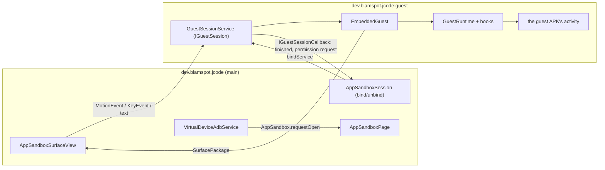

# App sandbox architecture

| | |
|---|---|
| **Status** | Implemented — device-verified on Android 13. **Moved out of the app at 1.7.0** (§1a); the move itself is not yet device-verified |
| **Modules** | The **Android Dev Pack** (`jcode.pack.android`), package `dev.jcode.ext.android.vdevice`, plus four manifest stubs in `:app` (`dev.blamspot.jcode.vdevice`) |
| **Primary sources** | *In the pack* (`jcode-ext-android`, `native/src/main/java/dev/jcode/ext/android/vdevice/`): VirtualDevice.kt, VirtualDeviceApps.kt, VirtualDevicePolicy.kt, VirtualStorage.kt, VirtualStorageProvider.kt, GuestDocuments.kt, GuestResults.kt, DeviceIntents.kt, GuestNetwork.kt, HiddenSeams.kt, VirtualSettingsProvider.kt, GuestSurfaces.kt, SimulatedHardware.kt, VirtualDeviceLog.kt, VirtualLauncher.kt, VirtualWallpaper.kt, VirtualInput.kt, GuestHierarchy.kt, UiXml.kt, AppSandbox.kt, AppSandboxPage.kt, AppPermissionsSheet.kt, VirtualHardwarePage.kt, AppSandboxSurfaceView.kt, EmbeddedGuest.kt, VirtualDeviceGuest.kt, VirtualScreen.kt, VirtualScreenOptions.kt, VirtualNavigationBar.kt, VirtualTaskView.kt, VirtualDeviceAdbService.kt, AdbSync.kt, `native/src/main/aidl/.../IGuestSession.aidl`, `IGuestSessionCallback.aidl`. *In the app*: `vdevice/GuestActivity.kt`, `GuestSessionService.kt`, `VirtualStorageProvider.kt`, `VirtualSettingsProvider.kt`, `VirtualDeviceBridge.kt`, `core/ext-api/.../VirtualDeviceExtension.kt`, `app/src/main/AndroidManifest.xml` |
| **Verified against** | device-verified on Android 13, 2026-08-15; re-homed into the pack 2026-08-28 (builds clean both sides, **not** re-verified on a device) |

---

## 1a. Where this lives, and why it is split

**The device is not part of JCode any more.** Everything that makes an APK run inside the IDE — the
container, the framework hooks, the launcher, the status bar, the navigation bar, the adb daemon's
device end — ships in the **Android Dev Pack**. A JCode with no Android pack installed has no virtual
device, the same way it has no Kotlin completions without the Kotlin pack.

Four things could not go with it, because an installed extension is a directory of files that a
`DexClassLoader` opens inside a process that is already running, and **it cannot contribute to
`AndroidManifest.xml`**:

| Stays in `:app` | Why only a manifest can declare it |
|---|---|
| `GuestSessionService` | `android:process=":guest"` — the separate ART heap the swapped `Instrumentation` and rewritten `Build` live in |
| `GuestActivity` | the `ActivityInfo` template `Instrumentation.newActivity` needs for a package the real `PackageManager` has never heard of |
| `VirtualStorageProvider`, `VirtualSettingsProvider` | `${applicationId}`-scoped authorities, resolved by the system from the manifest long before an extension could be consulted |
| the guest's `<uses-permission>` set | fixed at install time |

Each of those is a **stub**. It holds no device logic and forwards to whatever pack is installed;
with none installed they answer emptily rather than failing, because the phone's Files app queries
every `DocumentsProvider` it can see whether or not a dev pack was ever installed.

The contract between the two halves is `dev.blamspot.jcode.ext.api.JCodeVirtualDevice` (the IDE
process), `JCodeVirtualDeviceGuest` (the `:guest` process, named by `entry.native.guest` in the
pack's manifest) and `VirtualDeviceComponents` (the four names above, agreed once). `:app`'s entire
view of the device is `VirtualDeviceBridge`.

**Two objects, two processes — the trap this split introduces.** `AppSandbox` and
`VirtualScreenOptions` are Kotlin `object`s, and `:guest` has its own copies of both. Anything the
container decides that only the IDE can act on has to cross the binder: the navigation bar's Home
and its task-view switch go out over `IGuestSessionCallback`, and the screen profile's density
travels as an argument of `IGuestSession.start`/`resize`. Handling either locally compiles, runs and
does nothing.

---

## 1. Purpose and scope

Running a built APK **inside JCode** — no install, no ADB, no root — so a developer can build and
try an Android app on the same device, in an editor tab.

**The virtual device mirrors the host device's capabilities, isolated within JCode**, with some of
them simulated rather than passed through. That is the whole design in one sentence, and both halves
carry weight:

- *Mirrors* — it is a container, not an emulator. It shares the phone's runtime, its Android version
  and its CPU, so **an app that runs on the host runs here**. There is no second Android to be
  incompatible with.
- *Isolated* — what it does **not** share is anything the app could mistake for the user: its
  storage, its apps, its permissions, its sensors, its network answers, its browsing profile. Each
  of those is a thing that used to be the phone's and is now the device's, and each one is a section
  of this document.
- *Simulated for safety* — the camera, the location and the motion sensors are synthesised rather
  than forwarded. Not because forwarding is hard, but because a tool that runs somebody else's build
  must not be the way that build sees through the user's camera or learns where they are.

**Everything on the device is volatile.** Its apps, their data and its internal storage live in
JCode's *cache* and are emptied on every start — so they cost nothing to lose, the platform may
reclaim them under pressure, and **Clear cache** is a legitimate way to reset the device (§7g,
`VirtualDeviceFiles`). The one exception is the external volume, which is a folder in the workspace
precisely so that what should survive can.

> **This is a sandboxed preview, not a security boundary.** The guest runs in a separate *process*
> of JCode, but shares JCode's uid, permissions and data directory. Never run untrusted APKs in it.

---

## 2. One presentation: a tab, or the drawer beside it

**Where** is the pack's setting; **that there is only one** is the invariant. `deviceSurface` on the
Android Dev Pack chooses between an editor tab and the workbench's right drawer, and JCode reads it
and routes — `VirtualDeviceHost.openDeviceTab` is one request either way, answered by opening the tab
or by bringing the drawer up on the device's own panel. Switching to the drawer closes the editor
tab, and a selection left pointing at the drawer's panel falls back when the setting moves the device
out of it.

The device is one `SurfaceView` with one `hostToken` and one guest embedded under it, so it cannot be
drawn in two places: a second surface would ask the container to embed a guest that is already
embedded. That is why this is a choice rather than two views of one thing.

The drawer keeps the device on screen while a file is being edited, which is what watching an app
react to a change actually looks like; a tab gives it the full width, which is what a tablet profile
wants. Moving between them destroys and re-acquires the surface — the session, and the guest, live
across it.

## 2a. Why a tab at all

An app runs one way here — embedded, window-less, composited into whichever of the two surfaces
§2 named.

| | |
|---|---|
| **Entry** | `AppSandboxPage` → `AppSandbox.session` → `GuestSessionService` → `EmbeddedGuest` |
| **Window** | None of the guest's own. Its decor view is a child of the container's `FrameLayout`, and the surface shows that hierarchy through a `SurfaceControlViewHost` surface package |
| **Asked for by** | The tab, a finished virtual-device build, the `tools.virtualDevice` palette command, or the adb daemon's `am start` — all through `AppSandbox.requestOpen`, so they cannot disagree about what running an app means |

**There used to be a second one**, and it is worth recording what it was because the shape of the
container still carries its marks. A guest could be launched into a real activity of its own, outside
the tab: `VirtualDevice.launch` → a translucent `GuestBootstrapActivity` → one of four
`GuestActivity0`–`GuestActivity3` stubs, picked by an `AppSandboxTier` enum and forced by a
**Settings → Virtual device → "Always run in full screen"** switch. All of it is gone.

It went because it was a *second way to run an app*, with its own settings, its own fallbacks and its
own bugs — and everything that makes this a device rather than a viewport is built inside the
container's own view tree, which a guest in its own activity is not in:

| The device has | Which is |
|---|---|
| A status bar and a notification shade (§7b) | Views added last to `EmbeddedGuest`'s container |
| A home screen (§7a) | Drawn onto the tab's surface, with no guest process involved at all |
| `screencap` and `uiautomator dump` (§7, §7a) | `EmbeddedGuest.capture` / `.dump`, over that same container |
| Taps, from a finger and from `input tap` (§5) | `EmbeddedGuest.touch`, dispatched into that same container |
| A permission prompt somebody can answer (§7e) | The IDE's, raised over the tab across the session AIDL |

A full-screen guest was in none of that, so each line had to be given up for it or built a second
time — and a second implementation is a second set of answers, which is the divergence §7a exists to
prevent. The shade is the clearest case: because the device's bar is a view *inside* the container, a
full-screen guest had left the only surface the device had to show a notification on, and its
notifications had to be mirrored onto the **phone's** shade to appear anywhere. A device that borrows
the user's phone in order to say something has stopped being a device.

It was not free in the other direction either. A full-screen guest shared JCode's task, and measured
on the Odin2 the activity manager's crash cleanup for one finished `MainActivity` along with it — a
guest's bug took the IDE off the screen.

**Full screen now means what it means on a phone.** An app that asks for the whole screen gets the
*device's*: `GuestWindow.statusBarStyleOf` reads `FLAG_FULLSCREEN`, the bar goes away and the guest's
window grows into the space (§7b). There is no other screen for it to take, and `am start
--windowingMode 1` no longer means anything special — every launch lands on the device.

**What that costs, recorded rather than worked around.** Embedding is a trade. It buys the IDE around
the app and a screen an agent can read, and it costs the guest a real window: its activity token is
one no `ActivityRecord` answers to, so anything asking the activity manager about itself is answered
by the container rather than the system (see
[Guest runtime §4b](02-guest-runtime-and-hidden-api.md#4b-the-embedded-activitys-token--guestactivityclient)).
An app that wants a real task — its own recents entry, a `PendingIntent` the system will act on, an
SDK that interrogates its own activity — used to have the switch as an answer and now has none. What
the container can answer itself, it does (§7h, §7i); what it cannot, it says so in the device's log
rather than failing quietly.

**Hardware acceleration is a requirement, not a fork in the road.** The device is composited onto a
surface, so a window without the GPU cannot draw one. With nowhere else to put an app, the install
sheet says exactly that and names *Settings → Performance → Rendering*, instead of offering a tier
that no longer exists.

### 2.1 Why not a virtual display

Putting a **system-launched** activity on a display the app owns is impossible for a normal app:
`ActivityOptions.setLaunchDisplayId` requires the `signature|privileged` `ACTIVITY_EMBEDDING`
permission.

`SurfaceControlViewHost` is what makes the embedded path permission-free — it exists precisely to
let one process's views be composited inside another's, the IDE and `:guest` share a uid, and unlike
a virtual display it asks nothing of the activity task manager.

---

## 3. Process topology



`AndroidManifest.xml` declares **two** components in `android:process=":guest"`, one activity and one
service:

| | |
|---|---|
| `.vdevice.GuestActivity` | `exported="false"`, `launchMode="standard"`, `windowSoftInputMode="adjustResize"`, `Theme.DeviceDefault.NoActionBar`, and a deliberately broad `configChanges` set |
| `.vdevice.GuestSessionService` | `exported="false"` |

(The third `vdevice` component, `VirtualStorageProvider`, carries no `android:process` and so runs in
the IDE process — see §7g.)

The manifest comment says what the one activity is for:

> …a declared activity the container never launches. A guest activity belongs to a package the system
> has never heard of, so there is no `ActivityInfo` to build one from; this stub is that template, and
> nothing else. It is declared in the `:guest` process so the guest gets its own ART heap and
> framework hooks and cannot corrupt the IDE, and `configChanges` is deliberately broad so a guest
> handles configuration changes itself rather than being relaunched.

**One stub is enough, and that is a consequence of §2.** `GuestRuntime.stubIntent` names
`GuestActivity` every time, and it is never started — it is there so that `getActivityInfo` has
something to answer with, since `Instrumentation.newActivity` needs one and the activity actually
being built belongs to a package the system has never heard of. There used to be four so that several
guest activities could hold separate places in a real task; with the full-screen path gone there is
no task to hold a place in. Reaching `GuestActivity.onCreate` means something started it as itself,
which the container never asks for, so it logs that it is a template rather than a screen and
finishes.

**How many guest activities can be up at once is no longer a manifest question.**
`EmbeddedGuest.stack` is an ordinary list, bottom first, with only the top activity's decor visible;
`push` adds one and hides the one below, `pop` and `reapFinished` take them off again. Nothing counts
stubs, because the stub is a template rather than a place.

**Teardown is two different statements**, and treating them as one was a bug this container shipped
with:

| | |
|---|---|
| **Unbind** (`AppSandboxSession.close`) — a tab switch, Stop, or a guest that closed itself | `GuestSessionService.onUnbind` stops the guest and clears the permission prompt. The *device* stays: its home screen is drawn by the IDE and needs no `:guest` process at all |
| **`shutdown()`** — closing the tab | The service ends its own process (`Process.killProcess(myPid())`, posted after a short delay so this transaction and the unbind behind it finish first) |

Unbinding alone is **not** the teardown, which is what it was taken for. Android keeps an emptied
`:guest` around and rebinds into it, so everything the container accumulated outlives the tab that
asked for it: the loaded dex and class loaders, anything `GuestComponents` is still hosting, the
`Instrumentation` swapped into `ActivityThread`, the rewritten `Build`, and the WebView data
directory claimed for the guest. None of that has an undo — which is the whole reason the container
runs in a process of its own — so closing the tab has to mean the device is off rather than hidden.
`MainViewModel` calls `AppSandbox.shutdown()` when the last sandbox tab goes.

> Verified: `:guest` at pid 31222 with a guest running; tab closed, process gone.

---

## 4. The AIDL surface

```java
interface IGuestSession {
    Bundle start(String apkPath, String activityClass, int width, int height,
                 IBinder hostToken, IGuestSessionCallback callback);
    Bundle surface();
    Bundle capture(String pngPath);
    Bundle dump(String xmlPath);

    oneway void resize(int width, int height);
    oneway void touch(in MotionEvent event);
    oneway void key(in KeyEvent event);
    oneway void text(String text);
    oneway void back();
}

interface IGuestSessionCallback {
    oneway void onGuestFinished(String reason);
}
```

Design decisions recorded in the AIDL itself:

| Decision | Reason |
|---|---|
| `start` returns a `Bundle` | So a failure comes back as a **message** rather than an exception across the binder |
| `hostToken` is **required** | It is the `SurfaceView`'s input token. Without it the window manager refuses to grant the embedded hierarchy an input channel at all, so a null token is refused with a message rather than embedded |
| `surface()` exists separately | A `SurfaceView` releases its surface package when it detaches, so switching editor tabs and back needs a **new** package rather than a session restart |
| `capture(pngPath)` writes a **file** | The processes share a uid and a data directory, so a file beats a `Bundle` that a large screen would burst |
| `dump(xmlPath)` likewise | `GuestHierarchy` walks the guest's live view tree into uiautomator-shaped XML; a deep tree outgrows a `Bundle` for the same reason a screen does |
| Everything else is `oneway` | It is called from the IDE's UI thread and must never block on the guest's |

---

## 5. Input injection

Having an input channel is **not** the same as being fed by it. Measured on Android 13, touches over
the embedded hierarchy are not dispatched to it by the system, so `AppSandboxSurfaceView` forwards
raw `MotionEvent`s, `KeyEvent`s and typed text over AIDL, and `EmbeddedGuest` routes each to
whichever guest window is topmost.

`back()` pops the embedded back stack, or sends Back to the only activity.

Child windows (dialogs, popups, spinners) need extra work — see
[Guest runtime and hidden API](02-guest-runtime-and-hidden-api.md).

### 5.1 An event must carry the **device's** coordinates, not the phone's

A `MotionEvent` holds two positions. `getX`/`getY` are shifted by every `ViewGroup` on the way down
the tree; `getRawX`/`getRawY` are not, because they are where the finger landed on the *display*.
Relaying an event into the tab shifts the first and leaves the second, so a guest reading the second
is told the tab's offset down JCode's window — and the device's screen appears to start a couple of
hundred pixels above the top of itself.

That is not a corner case. `getRawX`/`getRawY` are what GameActivity hands native code as
`GameActivityPointerAxes.rawX`, what SDL reads, and what anything hit-testing against a full-bleed
surface uses. All of them are correct on a phone, where a full-screen window starts at the origin and
the two positions are the same number.

> Measured on WaveRepo — a GameActivity app with a C++ UI: it rendered perfectly, and every tap
> arrived **258 px below** the control it was aimed at, so the app answered nothing. Nothing in any
> log said so, because from the app's side nothing had gone wrong. Tapping 258 px above the button
> triggered it.

`VirtualInput.inDeviceSpace` rebuilds the event from its local coordinates, which makes them its raw
ones too, and `EmbeddedGuest.touch` does that before dispatching. The batched samples come with it —
a velocity tracker given one sample per event fits no curve, and flings would die. Events
`VirtualInput` synthesises for `adb shell input` are already built this way, which is why `input tap`
worked on apps a finger could not drive.

---

## 6. `VirtualDevice`

```kotlin
data class VirtualDeviceApp(
    val packageName: String, val label: String,
    val versionName: String?, val activities: List<String>,   // fully-qualified, manifest order
    val apkPath: String,                                      // where the launcher and `am start` run it from
)

fun inspect(context: Context, apkPath: String): Result<VirtualDeviceApp>
fun icon(context: Context, apkPath: String): Drawable?
```

`inspect` uses `PackageManager.getPackageArchiveInfo` with `GET_ACTIVITIES or GET_META_DATA` —
**public API only**, so it is safe to call from the IDE process. It fails with
`VirtualDeviceException` for an unreadable APK or one with no `<application>`.

`icon` resolves the APK's own launcher drawable by the same trick — an archive's resources resolve as
long as `sourceDir` points back at it — which is what keeps the device's launcher on public API in
the IDE process.

There is no `launch`. It was the full-screen path's entry point and went with it (§2); putting an app
on the device is `AppSandbox.requestOpen`, wherever the request came from.

---

## 7. Screen capture

`VirtualScreen` renders the guest's current screen to a PNG.

> `screencap -d <displayId>` returns **0 bytes** for this kind of surface, and `PixelCopy` over the
> tab's `SurfaceView` answers `ERROR_SOURCE_NO_DATA` — the guest's pixels live in a `SurfaceControl`
> the view only *parents*. So the screen is asked of whoever is drawing it: the guest re-draws its
> own hierarchy (`EmbeddedGuest.capture`), and an idle device draws its home screen — see §7a.

This is what backs `adb shell screencap` against the virtual device — see
[ADB bridge §10](../03-runtime/05-adb-bridge.md#10-adbdaemon--serving-the-virtual-device).

---

## 7a. The device with nothing on it

**The device's resting state is its home screen, and the home screen is an app** —
`tools/vdevice-launcher`, installed from the pack's assets like the browser and the camera. Opening
the tab starts it; it is the root of the device's activity stack and everything else is pushed on
top of it.

It took two earlier forms to get there. First Compose laid *over* the `SurfaceView`, which meant
`screencap` answered a bare wallpaper and an agent could not see what was installed. Then a `Canvas`
painted onto the surface itself with taps resolved against the very rectangles that had been drawn,
which fixed the capture and left one thing wrong: the home screen was the only part of the device
that was not an app. It had no activity, so `uiautomator dump` reported a bare `SurfaceView` where a
phone reports a view tree; it could not be started, stopped, paused or switched away from, so
"nothing is running" had to be special-cased everywhere instead of being answered by asking the app
that was; and the device had no activity stack, so Back from an app's last screen left a blank device
rather than the screen you came from.

As an app, every one of those is the platform's problem again — which is the test this design is
meant to pass. The launcher asks `queryIntentActivities(MAIN + LAUNCHER)` for what is installed,
`loadLabel`/`loadIcon` to draw it and `startActivity` to open it. Nothing in its source knows it is
running anywhere unusual; `GuestPackageHook` answers that query with the device's apps instead of the
phone's (§7h), and that is the whole of the difference. **If the home screen needs a private API,
the device is not a device.**

It declares `HOME` and `DEFAULT` but deliberately **not** `LAUNCHER`, which is what keeps it off its
own home screen — and out of that query's answer, since `GuestLoader.launchActivityOf` reads
MAIN/LAUNCHER to decide what an app's entry point is.

`VirtualLauncher` still exists and still draws: it is the fallback for a device whose tree was
emptied before the launcher could be installed, and it is what `VirtualScreen.blank` paints when
there is no `:guest` at all. It is no longer what anybody normally sees.

What is *not* on the device's screen is the tab's own chrome — the corner menu, the control gutter.
That is the IDE reaching onto the device, so it is composed over the surface and is deliberately
absent from a capture. A guest's surface package reparents above the surface, so starting an app
needs no matching erase and stopping one repaints.

### 7b. The device's status bar and shade

A slim bar across the top of the device's screen, plus a notification shade that pulls down from it.

**The shade is the screen while it is open.** It opens to the full height under the strip, square
and opaque, with the notifications in a scroller and the navigation bar's height reserved at the
bottom so *Clear all* is never under the Back button. It used to open to however tall its contents
measured, which made it a dropdown card: the panel's size announced how much was in it before any of
it could be read, and a device with nothing posted opened almost nothing at all. A phone's shade is
the same size every time, because it is the screen; what changes is how much of it has anything in
it. There is no "outside the panel" left to tap, so what closes it is the empty part of the panel
itself — a press that reaches the container is a press no card, tile or button wanted.

**The bar is persistent — a property of the device, not of whatever app is on it.** It is drawn
twice, because the device's screen is drawn two ways, and both must produce the same strip:

| While | Drawn by | Shows |
|---|---|---|
| An app is running | `VirtualStatusBar`, real views in the guest's container | The app's label, and what it has posted |
| The home screen | `VirtualLauncher.drawStatusBar`, canvas | The device's name |

One height and one palette (`VirtualStatusBar`'s companion) behind both, so the strip does not change
shape the moment an app starts.

**The guest's window stops where the bar starts.** Its decor view is added with a top margin of the
bar's height, and `GuestWindow.applySize` is told that reduced height, so the app both lays out for
the space it has and cannot draw into the strip. Measured before this: NewPipe's toolbar came out
with "Trending" half-hidden behind the device's own name.

A margin rather than dispatched insets, deliberately: insets only help an app that reads them, and
one that does not would still draw underneath. A phone does not ask an app to avoid the status bar —
it gives the app a window that does not include it — and a window that stops at the bar is true for
every guest however it lays itself out. Touch, capture and `uiautomator dump` all go through the
container, so the offset applies to all three at once and a dumped node's bounds are still exactly
where `input tap` lands. On the home screen it carries the device's name and nothing else:
there is no app to report the state of and no notifications to count, because the guest process is
what holds them and there is no guest process.

**No clock and no battery, deliberately.** Those belong to the phone, and the phone's own status bar
is directly above this one — a second copy would be either a duplicate or a lie. What the device has
that the phone's bar cannot show is the state of the app *inside* it, so that is all it carries: the
running app's label on the left, and what it has posted on the right.

| Gesture | Effect |
|---|---|
| Drag down from the top strip | Opens the shade **over the whole screen**, as a phone's does: quick-settings tiles, then one row per notification, then **Clear all** when there is something to clear |
| Drag up, or tap the empty part of an open shade | Closes it |
| `back` | Closes the shade first, the way a phone answers, before the guest ever sees the key |
| Tap the pill in the middle | JCode's own control bar — back, keyboard, the hardware bench, restart, stop, and a warning only when this guest actually lost something. IDE chrome, not the device's |

It is a child of `EmbeddedGuest`'s container, added **last** so it is the topmost view, rather than
composed over the tab by the IDE. That one decision is what makes it part of the device:

| | Falls out of being a child of the container |
|---|---|
| `screencap` shows it | `EmbeddedGuest.capture` draws the container |
| `uiautomator dump` lists it | `EmbeddedGuest.dump` walks the container, and these are real views with real text |
| A finger and `input tap` reach it | Both arrive through `EmbeddedGuest.touch`, which dispatches into the container |

Only vertical movement in the top strip is claimed. A horizontal swipe starting at the top of the
screen belongs to the guest, because pagers live there.

> Verified on the Odin2: `uiautomator dump` against a guest with the shade open lists
> `Notify Fixture`, `2 notifications`, both notification rows with their text, and `Clear all` — so
> an agent can read the device's notifications and tap them, not just a person.

#### What a notification carries

| | |
|---|---|
| **Icon** | The notification's own `smallIcon`, loaded against the **guest's** context — its resource id is from the guest's table and a package the real `PackageManager` has never heard of, so JCode's context would resolve nothing, or worse, whatever JCode has at that id. Falls back to the app icon. One per app in the bar, deduped; one per row in the shade |
| **Actions** | `Notification.actions`, drawn as buttons that fire the `PendingIntent` |
| **Ongoing** | `FLAG_ONGOING_EVENT` or `FLAG_NO_CLEAR`, **and** anything handed to `startForeground` — the platform treats a foreground service's notification as ongoing whether or not the app also said so, and most do not because on a phone they never had to. Measured on NewPipe, whose player notification arrives with no flags at all |

**Clear all leaves the ongoing ones**, as a phone does. Not decoration: a media player's notification
*is* its transport controls and a download's is its progress, so sweeping them would take a running
app's only handle away while the app kept running. Only the app takes those down.

> Verified: three notes posted, one ongoing; Clear all leaves `Ongoing note 3` and the count goes
> from `3 notifications` to `1 notification`.

**A guest's buttons do not reach the guest's own components, and cannot from here.** The token is
real — minted under JCode's package by `GuestActivityManagerHook` — but the *component* inside it
names a package the real system has never heard of, so it resolves to nothing and reports no error.
Neither end can be caught: `PendingIntent.send` marshals the token to the real activity manager
rather than calling anything this process can stand in front of (traced across a tap, a wrapped
`IIntentSender` sees `asBinder` and never `send`), and the intent inside cannot be recovered either
because `PendingIntent.mTarget` is **blocked** at `targetSdk` 33 —
`NoSuchFieldException: No field mTarget`. Buttons aimed anywhere the real system can reach work
normally; what is lost is an app's buttons on its own screens, where its own UI still has them.

#### The bar follows the app under it

A bar that is the same colour and the same presence over every app is not a device's status bar, it
is a strip JCode drew. `GuestWindow.statusBarStyleOf` reads the foreground activity's window, the
same places the platform reads it, and `EmbeddedGuest.followForegroundApp` reshapes the bar around
the answer — on every layout pass, because an app changes its mind at runtime (full screen for a
video, back afterwards) and nothing else tells the container.

| The app sets | The bar |
|---|---|
| `FLAG_FULLSCREEN`, or `SYSTEM_UI_FLAG_FULLSCREEN` | is gone, and the guest's window grows into the space |
| `FLAG_TRANSLUCENT_STATUS`, `FLAG_LAYOUT_NO_LIMITS`, or a transparent `statusBarColor` | floats over the app rather than pushing it down |
| an opaque `statusBarColor` | is painted that colour, with the app below it |
| `SYSTEM_UI_FLAG_LIGHT_STATUS_BAR` / `APPEARANCE_LIGHT_STATUS_BARS` | switches to dark markings, so a pale bar stays readable |

The guest's `Configuration` is re-sized whenever that changes, not just its margin: a window that
gains or loses the bar's height has to measure again for it.

> Verified: NewPipe's bar is painted `0xFF992722`, its own dark red, continuous with its toolbar.

### 7c. The device's built-in apps

`filesDir/vdevice/` is emptied on every start, so anything that should always be on the device has to
be put back — a built-in is not exempt from the clean room, it is reinstalled into it.
`installBuiltIns` does that from `assets/vdevice/*.apk` immediately after the wipe, through the same
`install` path any other APK takes.

Today that is seven, and six of them are the device's **system apps** — the home screen offers no
Uninstall for those (§7h). The launcher itself is one of the six: it is an app on this device like
any other (§7a), and the only one of the seven that is not is the hardware fixture.

**The browser** (`tools/vdevice-browser`) is the one that makes the device usable: it opens a URL
without reaching for the phone's browser, which would take the user out of JCode and load the page
under their own profile — their cookies, their signed-in accounts. Inside the device, what it loads
is wiped with the device, including the WebView profile (§7d). Being resource-free is a packaging
constraint — one Java file, so plain `javac` and `aapt2` can produce it without a Gradle project —
not a licence to look unfinished, so its chrome is drawn in code in the device's own palette: a
rounded address pill, glyph buttons that dim when they would do nothing, a hairline instead of a
raised bar, and its own offline page rather than the platform's white one, which reads as a crash on
a surface this dark. The address shows the **host** while a page is loaded and the whole URL while it
is being edited.

**The camera** (`tools/vdevice-camera`) and **Files** (`tools/vdevice-files`) are what make the
device answer the intents an app sends when it wants a photo or a document — and what make
`resolveActivity` have something to find when an app asks before it reaches. Both are described in
§7j.

**The hardware fixture** (`tools/hardware-fixture`) is the one that makes the device *checkable*. It
prints what a guest can actually see of the camera, microphone, location and three motion sensors,
and has buttons that fire `ACTION_IMAGE_CAPTURE` and `ACTION_OPEN_DOCUMENT` and report what came
back, so the bench (§7f), Manage permissions (§7e) and the device's own apps (§7j) can be watched
having an effect on a real app rather than taken on trust. It is on every device by default because the moment you want it is the moment
something looks wrong, which is not the moment to go and build an APK.

**The launcher** (`tools/vdevice-launcher`) is the device's home screen, and the reason there is one
of these on the list at all is that it used to be drawn by the container instead — see §7a for what
that cost and why it stopped.

The **keyboard** (`tools/vdevice-keyboard`) and **Settings** (`tools/vdevice-settings`) round out the
seven; both have sections of their own (§7m, and the keyboard in
[02-guest-runtime-and-hidden-api](02-guest-runtime-and-hidden-api.md)).

Every one of them is an ordinary guest with no container privileges, which makes them a live test of
the load, embed, window, result and WebView paths as much as a feature — the Camera app found three
real bugs on its first run (§7i, §7j), and making the home screen one of them found four more
(§7o1, §7o2).

### 7d. What a guest leaves behind

Nothing, and WebView was the exception that proved it needed saying. WebView keeps its profile beside
JCode's own — under the suffix `GuestRuntime` gives it, which is what stops the two colliding — and
that directory is outside `filesDir/vdevice/`, so nothing in the reset ever touched it. Cookies,
local storage and any session an app signed into survived a restart and would have been handed to
whatever app was installed next. `resetOnStart` now clears it too.

### `VirtualDeviceApps` — the package store

`filesDir/vdevice/apps/<package>.apk`, with each app's private storage beside it at
`filesDir/vdevice/<package>/`. One store behind all three readers: the launcher grid, the adb
daemon's `pm`/`am`, and the start-up reset.

An app bundle's config splits go in `filesDir/vdevice/apps/<package>.splits/`, a directory *beside*
the base rather than one replacing it — so every reader that already knew where a package's APK is
keeps working unchanged, and `GuestLoader` finds the rest by the same convention without anything
crossing the binder. `adb install-multiple` stages a session under `apps/session-<n>/` and commits it
whole; the base is whichever staged file parses as a package on its own, since a config split's
manifest has no `<application>` in it.

> **Nothing survives a restart.** `resetOnStart` empties `filesDir/vdevice/` once per process — no
> apps, no data, no preferences a previous run left. Both the workbench (`MainViewModel` init) and
> `VirtualDeviceAdbService.daemon` call it, because those two race and the loser must not wipe what
> the winner just installed; `@Synchronized` plus a one-shot flag makes the second call a no-op.

A `revision` snapshot-state counter is bumped on every install/uninstall, so an `adb install` shows
up on the home screen without the tab being touched.

The device is reachable on its own through the `tools.virtualDevice` palette command
("Open Virtual Device") — otherwise the tab only ever appears when a virtual-device build finishes,
which is no way to reach the apps already installed on it.

### 7e. Two settings, not one — `VirtualDevicePolicy`

What an app may reach is two questions with two answers, kept apart because they are about different
things: what the **device** has, and what the **app** may do with it.

**What the device has**, once for the whole device, on the hardware bench — a phone has one camera
however many apps read it:

| Hardware | Modes | Default | What each mode is |
|---|---|---|---|
| Camera | Off, Simulated | Off | Simulated gives the device a camera its own Camera app takes pictures with — see §7j. The phone's is deliberately not on offer |
| Microphone | Off, Simulated, Real | Off | Real is the phone's, and is the one setting here that asks the user for something: `RECORD_AUDIO` is requested at the moment it is chosen |
| Location | Off, Simulated | Off | A fix the user sets, and a route it can walk. The phone's own location is never offered |
| Accelerometer | Off, Simulated, Real | **Simulated** | Simulated reports the attitude and motion set on the bench |
| Compass | Off, Simulated, Real | **Simulated** | Real is offered only if the phone has a magnetometer |
| Gyroscope | Off, Simulated, Real | **Simulated** | Real is offered only if the phone has one |

The three motion sensors default to Simulated rather than Off because Android has never gated them:
before this existed a guest was handed the host's own `SensorManager` and could feel the user's hand,
with nothing anywhere able to say no. Simulated is the setting that neither breaks an app that wants
a sensor nor leaks the phone's.

**What each app may do**, per app, long-press an icon → **Manage permissions**. The list is the
APK's own manifest — every `<uses-permission>` it declares and nothing else — each with the three
states a phone has:

| Rule | Means |
|---|---|
| **Allow** | Granted, provided the device has the hardware |
| **Deny** | Refused |
| **Ask** | Undecided. Reads as denied — Android has only two answers — until the app asks and the person answers the device's own prompt, which is then written down as Allow or Deny |

Defaults follow the platform's: a permission it asks about at runtime starts at Ask, everything else
at Allow, because "ask" for a permission nothing ever asks about is a state that could never be left.
A permission the app never declared is **denied**, which is what the platform itself answers and what
the container used to get wrong — it answered a blanket `PERMISSION_GRANTED` to everything.

**Both are required.** An app cannot be given a camera the device does not have, and a device with a
camera does not hand it to an app that was refused one. Device-verified: with the camera Simulated,
everything else Off, and the person tapping Allow to all three of a fixture's requests, the app is
answered `CAMERA=granted RECORD_AUDIO=denied ACCESS_FINE_LOCATION=denied`.

**Where it is enforced** — all in `:guest`, all resolving the *active* guest:

| Question | Answered by |
|---|---|
| `Context.checkSelfPermission` | **`GuestContext`**, which overrides the three public `check*Permission` members. It has to be in front rather than underneath: `PermissionManager` memoises the answer in a cache only the system can invalidate, and `disablePermissionCache` is blocked — measured, a camera granted while an app was running went on reading as denied through the binder hook |
| The same, from anywhere without a guest `Context` | `GuestActivityManagerHook`, on `IActivityManager.checkPermission` |
| `PackageManager.checkPermission`, `hasSystemFeature` | `GuestPackageHook` |
| `Activity.requestPermissions` | `GuestPermissions.consume`, off the start-activity hook. **This was broken outright before**: the intent went to the real permission controller, which was being asked to grant a permission to *JCode*, and the result came back addressed to an activity token no `ActivityRecord` answers to — so no dialog, no callback, and an app that waits for one stopped there. What is already decided is answered from the policy; what is still Ask goes to the person through the device's own dialog, over the session AIDL |
| `getSystemService(SENSOR_SERVICE)`, and every location call | `GuestSensorManager` and `GuestLocation` — see [Guest runtime §5c](02-guest-runtime-and-hidden-api.md#5c-the-devices-own-hardware) |

> **One runtime request per activity instance.** `Activity.requestPermissions` sets
> `mHasCurrentPermissionsRequest` and refuses a second request while it is set. Every route to
> clearing it is blocked at `targetSdk` 33 — the field, `dispatchRequestPermissionsResult` and
> `dispatchActivityResult` are all absent from `Activity`'s declared members, and the real path in
> goes through a record map an embedded activity was never in. The first request is answered
> properly; a second is cancelled by the platform with two empty arrays before the container sees it,
> which is a documented outcome apps handle, and reopening the app clears it.

The policy is a properties file inside `filesDir/vdevice/`, not `SharedPreferences`: the launcher
that writes it is in the IDE and the container that acts on it is in `:guest`, and a preferences file
is cached per process from first read — so a permission revoked while an app was on the screen would
have gone on being granted until the process died. It is written atomically and re-read whenever its
timestamp moves. Living inside `filesDir/vdevice/` also means `resetOnStart` takes it with everything
else, which is the honest behaviour: a grant that outlived the app it was granted to would be waiting
to apply itself to whatever was installed under that package name next.

`tools/hardware-fixture` is the regression test — one guest that prints what it can see of all six.

### 7f. The hardware bench — `VirtualHardwarePage`

The device's own settings screen: a tab opened from its control bar, and from the idle home screen
because a route is usually set up before the app meant to react to it is opened.

It opens on a **grid of what the device is made of** — one tile per piece of hardware, each showing
what it is wired to and what it is reporting — and each tile opens onto that piece's mode and its
tools. That shape is the point: the six Off/Simulated/Real choices are properties of the device, and
anywhere else they looked like properties of an app.

| Tool | What it does |
|---|---|
| Fixed location | Two coordinates the device is parked on |
| **Point to point** | Walks between two coordinates at a set speed, reporting the bearing and speed a real receiver would — `Location.speed` and `.bearing`, which is what a navigation app reads rather than differencing positions itself. Stops at the far end, starts over, or turns around |
| **Follow a trail** | Walks one of three built-in paths, drawn on a map with an arrow for the device that rotates to the heading it is reporting. Distance-based rather than fraction-based, so a steady speed means steady metres and not equal time on a 60 m corner and a 300 m straight |
| Attitude | Pitch, roll and heading, with five one-tap poses named after the accelerometer readings they produce |
| **Loops** | Shake and bounce (linear acceleration on one axis), tilt (the pitch rocking), spin (the heading turning, which is the one that accumulates) — each with an amplitude and a period |
| Shake once | One swing that dies away, so the device ends where it started |
| Reporting now | What the guest is being told, live |

Everything is a property of the **device**, not of one app, because a phone has one GPS and one set
of sensors however many apps read them.

**While the device is moving, the compass faces the way it is going.** The direction of travel is the
heading, which is what a phone on a dashboard reads, and it is what makes the simulated compass turn
through a corner without anybody touching the heading slider. The stored attitude is not changed —
it is what the device goes back to when it stops.

#### One output, one thing driving it

Several controls can reach the same reading, so each has a stated winner rather than a sum. A device
has one heading and one position; two settings quietly averaging into them is the failure mode this
table exists to prevent.

| When these overlap | What wins | Why |
|---|---|---|
| Travel heading vs the **heading slider** | Travel, while moving | The slider stays visible but inert, and says the trail is steering — it is still where the device points once it stops |
| Travel heading vs the **spin loop** | Travel; the spin waits | Otherwise the compass reports neither, but their sum — disagreeing with the bearing in the same reading and with the map arrow drawn from it |
| Travel heading vs the **tilt loop** | Both | Different axes: tilt rocks the pitch, travel turns the heading |
| A point-to-point route vs a **trail** | Whichever was started last | One `locationMode`, so starting either stops the other. The map and the readout only show the device when *its own* method is the one running |
| An app's rule vs the **device's mode** | Both must allow it | See §7e — an app cannot be given hardware the device does not have |

Two more overlaps are legal but worth saying out loud, so the bench says them rather than looking
broken: tools that run while their hardware is **Off** (the readouts stay honest, no app is being
told), and the three motion sensors wired **differently from each other** (an app deriving one
orientation from gravity and the magnetic field together is then being handed two devices).

#### The trails, and why they are wrong on purpose

Three, chosen for the three shapes of heading change a location app has to survive, and sitting in
three latitude bands and three time zones:

| Trail | Shape | What it is for |
|---|---|---|
| **Sunset Boulevard, Dipolog City** | 3.5 km of curving seafront | A heading that drifts a few degrees at a time and never settles — the hardest case for a compass that smooths |
| **Eixample, Barcelona** | Eight 230 m runs across a grid set 45° off north | A heading that *jumps* 90° and then holds still |
| **Trollstigen, Norway** | Eight switchbacks | ~180° reversals, at 62° north where a degree of longitude is half its equatorial width — which is where flat-earth distance maths shows itself |

Every one is **hand-drawn, simplified and displaced a few hundred metres**, and each carries a
`headingSkew` that puts the reported compass a few degrees off the true bearing of travel. That is
deliberate and it is the point of the design: a tool that replays a faithful trace of a real street,
at a realistic speed, with a matching compass, is a tool for making a fake journey look real. So the
repository contains no faithful trace to replay — the offsets are written down in `LocationTrails.kt`
rather than hidden, because the protection is that there is nothing accurate underneath them, not
that the numbers are secret.

The map is drawn from the trail's own points. No tiles, no network, nothing to attribute — which is
what makes it work offline, and which also keeps a real map from being laid under a deliberately
displaced path.

**Nothing is streamed.** The tab writes a *description* — "walk from here to there at 14 m/s,
starting at this clock reading" — and both the guest's `SensorManager` and the tab's own readout
evaluate it against `SystemClock.elapsedRealtime`, which counts from the same boot in every process.
So the two agree by construction rather than by synchronisation; there is no IPC per sample, no
policy file rewritten at 50 Hz, and a route that has been running for an hour costs what one that
just started costs. `SimulatedHardware.sample` is that function, and it is the only place the
accelerometer, the magnetometer and the rotation vector are derived — three views of one attitude,
so turning the heading turns all of them together.

Device-verified: with the spin loop at a 4 s period the guest reads a gyroscope of exactly
−1.57080 rad/s (−2π/4 s) and a rotating magnetic field, while gravity stays at (0, 0, 9.80665) —
a device turning about its vertical does not tip.

### 7g. The device's two storage volumes

A device with no filesystem is a device most apps cannot finish a sentence on — an app opens a
document, saves an export, unpacks its assets, writes a log. Before this the container had nowhere
for any of that to go, so those calls either failed or landed in the **phone's** shared storage,
among the user's own files, under JCode's `MANAGE_EXTERNAL_STORAGE`.

There are two volumes, because the device needs storage for two different lifetimes and one volume
cannot have both.

| | Internal | External |
|---|---|---|
| Device path | `/sdcard` | `/storage/external` |
| Lives in | `cacheDir/vdevice/storage` | the workspace, as `vDevice_ExtStorage` |
| Survives a JCode restart | **no** | yes |
| Survives **Clear cache** | **no** | yes |
| Visible in the IDE | no | yes, beside your projects |

**Internal is in the cache, and that is a claim about what it is.** `filesDir` is for what an app
would be sorry to lose; `cacheDir` is for what it can rebuild, and the platform may reclaim it under
storage pressure or when somebody taps Clear cache. All of that was already true of the device's
tree — it is deleted on the next start regardless — so keeping it in `filesDir` was claiming a
durability the device neither has nor wants. `VirtualDeviceFiles` is the one place that says where
it lives; six files used to work it out for themselves.

The trade is that the tree can go away *while JCode is running*, and that is handled rather than
hoped about: `VirtualDeviceApps.healIfEmptied` puts the built-ins back when it finds **nothing**
installed, which is a state no start-up path produces and so can only mean the tree went away. The
test is deliberately "nothing at all" rather than "a built-in is missing" — somebody who uninstalls
the hardware fixture wants it gone, and having it reappear would be the app arguing with them.

> Device-verified: `rm -rf` of the whole tree while JCode ran, then reopening the device — all five
> built-ins were back, and the external volume was untouched.

**Internal is the clean room**, emptied on every start with the installed apps and for the same
reason: a file that outlived the app that wrote it would be waiting to be found by whatever was
installed under that package name next. `seed` puts the empty media directories back, so the device
starts as a formatted phone does rather than as a bare directory.

**External is the way out.** A photo the device took, a file an app exported — on a clean-room device
those are gone the next time JCode starts, which is right for a sandbox and useless for the thing a
sandbox is for. It is an ordinary folder in the workspace, so what an app writes there is still there
tomorrow, is visible in the project explorer, is editable in the IDE, and is reachable from the Linux
environment at `/workspace/vDevice_ExtStorage`.

Both are presented the way a phone presents two volumes: `getExternalFilesDirs` and its siblings
answer with **two** entries, internal first. An app written for a phone with an SD card already
handles that, and one that only reads `[0]` gets internal, which is what it would get on a phone.
`adb df` lists both, `VirtualStorageProvider` publishes both as SAF roots with summaries that say
which is which, and the Files app opens on the choice between them.

> **The bug this shipped with, found by looking.** `WorkspaceHostPaths` is a process-wide latch the
> IDE sets at startup, and `:guest` is a different process that never ran that code — so it fell back
> to the *legacy* shared path and created the device's external volume at
> `/storage/emulated/0/JCode/projects/vDevice_ExtStorage`: **in the user's own storage**, the exact
> leak this container exists to prevent. `GuestRuntime.install` now initialises it before anything
> can touch storage.

`VirtualStorage.resolve` compares canonical paths against the volume's root, which is what makes
`../` — and a symlink planted by a guest, which `..` alone would not catch — land outside and be
refused. That matters more for the external volume, because outside *it* is the user's whole
workspace. And `forget(package)` clears an app's private trees on both volumes but deliberately
leaves the shared part of external alone: uninstalling an app is not a licence to delete files a
person has been working with.

#### Known gap

`Environment.getExternalStorageDirectory()` still answers the **phone's** path. It is computed fresh
inside `Environment.UserEnvironment.getExternalDirs()` on every call, out of
`StorageManager.getVolumeList`, so there is no cached field to redirect and no method to override
without standing in front of the storage service for the whole process. Everything reached through a
`Context` — which is what an app targeting API 30 or later has to use — is redirected; an app that
reaches for the static instead sees the phone.

> Device-verified: a file written to external survived `am force-stop` and a relaunch, while
> `/sdcard/Download` came back empty.

### 7h. Resolving an intent against the device's own apps

`ACTION_OPEN_DOCUMENT`, `ACTION_IMAGE_CAPTURE` and `ACTION_VIEW` are the intents an app cannot be
talked out of, and before this they went out to the real system, where two things went wrong at once:

1. **The phone answered them** — its picker over the user's own downloads and photos, its camera app
   pointing the user's real camera at the world on a sandboxed app's behalf, its browser loading a
   page under the user's profile. The exact leak the device exists to prevent, as the default path.
2. **The answer went nowhere.** An embedded activity's token is one no `ActivityRecord` answers to,
   so `startActivityForResult` has its `resultTo` blanked on the way out; there was no route back
   even in principle.

The first fix was for the container to take those launches off the wire and draw the screens itself.
That worked and was still the wrong shape, because it left a third failure untouched: **a drawn
screen is not something `PackageManager` can find.** An app that calls `resolveActivity` before
offering a camera button — which the careful ones do — was answered from the *phone's* installed
apps, so it either hid a button the device could have answered or offered one that opened the user's
own camera. There was nothing installed for the question to be about.

So the device has apps. `DeviceIntents` is the table of what its own apps answer, `GuestPackageHook`
answers `resolveIntent`/`queryIntentActivities` from it, and `GuestRuntime.rewriteOutgoing` starts
the named app rather than letting the intent out.

| Intent | The device's app |
|---|---|
| `ACTION_IMAGE_CAPTURE`, `…_SECURE`, `STILL_IMAGE_CAMERA`, `ACTION_VIDEO_CAPTURE` | Camera (§7j) |
| `ACTION_OPEN_DOCUMENT`, `GET_CONTENT`, `CREATE_DOCUMENT`, `OPEN_DOCUMENT_TREE` | Files (§7j) |
| `ACTION_VIEW` on `http(s)`, `ACTION_WEB_SEARCH`, `ACTION_MAIN` + `CATEGORY_APP_BROWSER` | Browser |
| The `android.settings.*` intents | Settings (§7m) |

Anything else implicit still goes to the phone — and says so in the device's log, loudly, naming the
action and warning that no result can come back.

**Why a table and not intent-filter matching.** `PackageManager` does not report the filters in an
APK it has not installed: `getPackageArchiveInfo` gives activities, permissions and features, and
nothing else. Matching properly would mean parsing binary `AndroidManifest.xml` in the container.
What is actually needed is narrower — the apps that have to answer implicit intents are the device's
*own*, because they are the ones an app expects a device to have, and they ship in the container's
assets, so what they answer is known here rather than discovered. A guest answering *another
guest's* implicit intent is deliberately not supported; nothing has wanted it.

**They are system apps.** Camera, Files and Browser have no Uninstall in the home screen's long-press
menu, the way a phone's stock camera and files have none. A device you can leave in a state where an
app asking for a photo gets nothing is a device that fails in a way nothing explains. The keyboard,
Settings and the launcher itself are in that set for the same reason — `DeviceIntents.SYSTEM_PACKAGES`
is the list, and uninstalling the home screen is the clearest case of all.

### 7i. Results between the device's own activities

`startActivityForResult` is half of a contract, and the device only had the half that goes out. An
embedded activity could start another one — that has worked since the container grew a back stack —
but nothing ever came back, so every result the device produced was produced by the *container*, for
the two intents it answered itself. That is what stopped the device having a camera *app* rather
than a camera *screen*.

`GuestResults` is the other half:

1. The start-activity hook notes who is asking and under what code, just before the launch.
2. `EmbeddedGuest.push` attaches that to the activity it pushes.
3. `EmbeddedGuest.pop` harvests the finished activity's answer and delivers it.

Two reflective steps, and only the first is delicate. **Reading** the answer is `mResultCode` /
`mResultData`, private fields of `Activity` with no SDK equivalent since `setResult` has no getter;
they are reachable at `targetSdk` 33, and if they ever stop being, every answer reads as
`RESULT_CANCELED` — a real result an app handles — rather than the device hanging. **Delivering** it
is `Activity.onActivityResult`, which is `protected` SDK API that no hidden-API policy applies to,
invoked reflectively so it dispatches *virtually*: an app's own override runs, and AndroidX's
`ComponentActivity` override forwards into `ActivityResultRegistry`, so the old callback and a
`registerForActivityResult` launcher are both answered by the same call.

A screen that finishes without ever calling `setResult` answers `RESULT_CANCELED` with no data,
exactly as the platform does — so a Back out of the camera reaches the app as a cancelled capture
rather than as silence.

> **`active` must follow whatever is in front.** The container attributes permission checks and
> manifest lookups to `active`, which was set when an activity *started* and never restored when it
> finished. Harmless while the only cross-app launch was fire-and-forget; once an app could start the
> device's Camera and be returned to, the caller's own checks were answered from the **Camera's**
> grants. Measured: the hardware fixture read `CAMERA = GRANTED` immediately after the Camera app was
> allowed it. `resumeEmbedded` now sets it.

### 7j. The device's Camera and Files apps

Both are ordinary guests — no container privileges, started by ordinary intent resolution, answering
through the ordinary result path. Sources in `tools/vdevice-camera` and `tools/vdevice-files`,
bundled in the Android Dev Pack's `native/vdevice/assets/vdevice/` and reinstalled into every device
on every start. Their *sources* stay in JCode's own repo under `tools/vdevice-*`, so rebuilding one
means copying the artifact across — see §1a for why the two halves live in different repositories.

**Camera** answers `ACTION_VIDEO_CAPTURE` as well as the stills, because the specification's claim
that the device "can draw a frame and cannot encode a film" was true of nothing except the code not
being written: a frame is a `Bitmap`, `MediaCodec` and `MediaMuxer` are ordinary SDK API, and the
device already knows how to draw as many frames as it is asked for. `Recorder` encodes three seconds
at 15 fps into an MP4 — byte buffers rather than a codec input surface, because a codec's surface is
a hardware buffer that `lockCanvas` refuses and OpenGL is a great deal of machinery to avoid a colour
conversion that costs milliseconds; `COLOR_FormatYUV420Flexible` and `getInputImage` let the planes
say where they are rather than guessing NV12 from I420.

**What the camera sees is a choice, and it is a choice about cost.** The first version drew its
scene procedurally on every frame — colour bars, a horizon computed from the device's attitude, a
compass rose, and a line of text carrying the frame number and three angles — which made the camera
the most expensive thing on an otherwise idle device, in order to show numbers nobody reads off a
viewfinder. A scene is now a handful of small frames, each rendered once into a bitmap and cached,
and the viewfinder blits whichever is current.

| `CameraScene` | What it is | Cost while open |
|---|---|---|
| **Pixel art** (default) | Five frames on a one-second loop | **3.6%** |
| Three photos | Three colour-bar stills, one a second | about the same |
| One photo | A single still, never redrawn | **0.2%** |

The frames are 48×36 and scaled up with filtering off, which is what makes it pixel art rather than
a blurred small picture — and is why five of them cost nothing to hold. A still scene draws once and
then asks for nothing, so the viewfinder genuinely stops; an animated one redraws five times a
second rather than sixty, and each redraw is a scaled blit instead of a page of drawing commands.

The scene is set on the hardware bench and read by the Camera app through
`VirtualSettingsProvider` — it is a property of the *device*, next to whether the device has a camera
at all, and an app that chose for itself would be disagreeing with the switch somebody just moved.

> Measured on Android 13 with the viewfinder open, over a 20-second window: **3.6%** of a core for
> the pixel art, **0.2%** for a still, against **11.5–18.5%** for the procedural scene it replaced.
> The captured JPEG also fell from 59 KB to 16 KB, because flat colours compress.

**Files** browses the device's storage and is also its picker — on a phone those are the same app,
and making them the same app here means the screen that answers `ACTION_OPEN_DOCUMENT` is one
somebody has actually used. It answers with a **device path** under `dev.blamspot.jcode.vdevice.DEVICE_PATH`,
and `GuestDocuments.addressed` turns that into the `content://` URI the requester receives — a tree
URI for a folder request, a document URI otherwise. The URI belongs to JCode's documents provider,
whose authority and document-id encoding are the container's business; an app that guessed at them
would be coupled to a format it cannot see change.

> **`/sdcard` is a presentation path, and this is where that bites.** The bytes live in JCode's
> app-private tree and the container redirects the `Context` storage APIs onto it;
> `Environment.getExternalStorageDirectory()` is not among them (§7g) and still answers the phone's
> path. So `new File("/sdcard/…")` in a guest reads the **user's real storage** — and a file explorer
> doing that would show somebody their own photos and call them the device's. Both apps derive the
> root from `getExternalFilesDir(null)`, which is redirected, by walking up the four names of the
> documented `Android/data/<pkg>/files` layout.

Two findings the Camera app produced on its first run, both of which had been true for a while:

- **The simulated compass was mirrored.** With the bench at 45° the viewfinder read 315°.
  `SimulatedHardware.rotation` built its heading matrix with the sign that makes
  `getRotationMatrix` + `getOrientation` — how every app reads a heading — return −a. Gravity is
  unaffected by that sign, so the accelerometer values that were checked exactly stayed correct, and
  the bench reports the azimuth it was given rather than deriving it, so the two had quietly
  disagreed since the bench was written.
- **A runtime permission request from `onCreate` vanishes.** The device's dialog is raised on behalf
  of whichever activity is in front, and an embedded activity is not in front until it has been
  resumed, so the request could not be addressed to anybody. Ask from `onResume`.

Also fixed while it was visible: the permission dialog asked whether to allow an app "to use the take
pictures and videos". The platform's permission labels are verb phrases, so the wording is now
"Allow *app* to *label*?", and the fallback for a guest's own permission supplies the verb.

> Device-verified end to end on Android 13. `ACTION_OPEN_DOCUMENT` → the Files app listing `/sdcard`
> → `Download` → `notes.txt` → the fixture reports `read 30 bytes` from the `content://` URI.
> `ACTION_IMAGE_CAPTURE` → the Camera app → shutter → the fixture reports `got a 512x384 thumbnail`,
> with the JPEG in `DCIM/Camera`. With the bench at heading 45° and roll 15°, the viewfinder reads
> `hdg 045.0 roll +15.0` with the needle north-east.

### 7k. Camera2 — measured, and refused

An app that wants a *picture* is answered by the Camera app. An app that wants a *camera pipeline* —
`openCamera`, a capture session, frames in its own `Surface` — is not, and that used to be a
conclusion from reading rather than from trying. `HiddenSeams` now measures it, once per guest
process, into the device's log the first time anything asks for the camera service.

Measured on Android 13 at `targetSdk` 33:

```
ServiceManager.sCache                       reachable, 21 services cached
media.camera binder                         present
ICameraService                              methods=1 declared=0 Stub=true asInterface=false
ICameraDeviceUser                           methods=1 declared=0 Stub=true asInterface=false
ICameraDeviceCallbacks                      methods=1 declared=0 Stub=true asInterface=false
CameraMetadataNative                        class ok, no-arg ctor=false, set()=false
CameraCharacteristics(CameraMetadataNative) ctor is blocked
StreamConfigurationMap                      methods=27 declared=21
SubmitInfo                                  methods=11 declared=2
CaptureResultExtras                         methods=11 declared=2
```

The **seam exists** — `ServiceManager.sCache` is reachable, so `media.camera` could be replaced the
way `location` is (§ hardware). Everything that would have to go through it is blocked:

- **The three interfaces report `methods=1`.** That one method is `asBinder`. This is the same
  fingerprint `ILocationListener` had — a blocked interface still has a `Class`, and what marks it
  unusable is `getMethods()` coming back empty. A `Proxy` cannot implement an interface whose methods
  it cannot see.
- **`CameraMetadataNative` cannot be built or written**, and `CameraCharacteristics` cannot be built
  from one. So even the *first* call an app makes — `getCameraCharacteristics` — has no answer to
  construct.

The location stand-in got round blocked interface methods with hand-written `Parcel`s and
`IBinder.transact`. That does not transfer: location's arguments are `double`s and `String`s, while
camera metadata is a **natively marshalled blob** of tag/type/count entries whose layout is the
framework's private business. Hand-writing it would mean reimplementing that serialisation against a
format that has no compatibility promise, to produce a `CameraCharacteristics` the framework then
parses natively. That is not a hard piece of work so much as an unbounded one.

So `CameraManager` is left alone — it is `final` and could not be substituted anyway — and the device
says so. `getCameraIdList()` from a guest returns `[]`, which is both the honest answer and, checked
deliberately, **not a leak**: JCode holds no `CAMERA` permission, so the phone's own cameras are not
enumerable from inside the sandbox either.

> This is a refusal with evidence rather than an intention. If a future platform unblocks those
> interfaces the survey will say so, in the log, the next time an app opens a camera.

### 7l. The network

An app's first question is almost always *am I online*, and until now the answer was the **phone's**.
That is wrong in the ordinary way, and it costs something concrete: an app that has never been run
without a network is an app whose offline path has never been run, and there was no way to get the
device into that state from here — turning the phone's Wi-Fi off also disconnects the IDE you are
working in.

`VirtualHardware.WiFi` is the switch, `GuestNetwork` is what makes it mean something.

| Mode | What a guest sees |
|---|---|
| Simulated (default) | The phone's connection, reported as it is. An app really does fetch the URL |
| Off | No active network, no default network, no capabilities — the device is offline |

The seam is `ServiceManager.sCache["connectivity"]`, replaced before the first guest context exists,
exactly as `location` is: a manager is built once per context and caches its binder, so a
replacement made later is one nothing is looking at. The proxy is **delegating** — the "is there a
network" family is answered, and every other one of `IConnectivityManager`'s hundred-odd methods
goes to the real binder untouched. Answering only in the negative is deliberate: with the device
online the connection genuinely is the phone's, and reporting anything else would be a lie an app
could catch by fetching something.

> **`VirtualHardware.WiFi` deliberately declares no features and no permissions**, which is unique
> among the hardware entries. Withdrawing `FEATURE_WIFI` makes `getSystemService(WIFI_SERVICE)`
> return **null** — real platform behaviour, and a crash in nearly every app that asks; measured, the
> fixture went from `wifi enabled = false` to `no manager`. And withdrawing `ACCESS_NETWORK_STATE`
> or `INTERNET` would deny install-time permissions to every app on the device because a connection
> is down. A phone with Wi-Fi switched off still has Wi-Fi hardware. This switch is about the
> connection.

**Two things that could not be stood in for**, both built and measured before being removed:

- **`WifiManager`.** Replacing `IWifiManager` worked and then did not: `WifiManager`'s construction
  calls more of that interface than a proxy built from the three methods reflection exposes can
  answer, so the manager sometimes failed to build and `getSystemService` returned null. A wrong
  answer to "is Wi-Fi on" is a far smaller failure than no manager, so the question is left to the
  phone.
- **Bluetooth.** `BluetoothAdapter` is `final`, but its `mService` field is reachable and
  `IBluetooth.Stub.asInterface` is not blocked — the shape that works for connectivity. Neither
  direction worked. Clearing `mService` left `isEnabled()` answering **true** with the phone's radio
  on; wrapping it in a proxy answering `getState` never saw the call, because `getState` is not in
  `IBluetooth`'s visible method set (`asBinder, fetchRemoteUuids, getAddress, getConnectionState,
  getDeviceType, getRemoteAlias, getSocketOpt, …`) so `Proxy` does not implement it. What the device
  *can* govern is what goes through the package manager, so `VirtualHardware.Bluetooth` is
  **Off / Simulated**: Off withdraws `FEATURE_BLUETOOTH` and refuses `BLUETOOTH_CONNECT`/
  `BLUETOOTH_SCAN` to every app. Whether the adapter reports itself switched on is the phone's
  business, and the Settings screen says so in as many words.

> Device-verified on Android 13, with the phone online and its Bluetooth on throughout:
> Wi-Fi Off → `active = none, wifi = false, validated = false`; Wi-Fi Simulated →
> `active = 101, wifi = true, validated = true`. `wifi enabled` and `bluetooth` report the phone's,
> which is the documented behaviour rather than a gap.

### 7m. The device's Settings app, and the two layers of control

A device you can only configure from outside itself is a device with a piece missing. The hardware
bench and Manage permissions are **JCode's** screens, in JCode's window, reached by the person
driving the IDE — right for JCode, and no use to somebody looking at the device, to an agent driving
it through `input tap`, or to an app that sends `ACTION_MANAGE_APPLICATIONS` and expects something to
answer.

`tools/vdevice-settings` is an ordinary guest like Camera and Files, and it changes **real** settings:
the same ones the bench writes, in the same file, with the same effect on a running guest.

#### The two layers

This is the distinction the whole design turns on, and collapsing it was the first version's mistake.

| | The bench (JCode) | Settings (on the device) |
|---|---|---|
| Asks | *Does this device have the hardware?* | *Is it switched on?* |
| Answers | Off / Simulated / Real | On / Off |
| Belongs to | whoever is building the device | the device, and anything running on it |

A phone with Wi-Fi switched off still **has** Wi-Fi. Making one control do both would mean a device
that loses its hardware whenever somebody toggles a setting, and an app that could never see the
state it actually cares about — a radio that is present and off.

`VirtualDevicePolicy.switchedOn` is the inner switch, and it is false whenever the outer one says the
device has no such hardware, so a caller only ever asks one thing.

#### Changing the outer layer restarts the device

The two layers differ in one more way, and it is forced by the platform rather than chosen: **the
inner switch is live and the outer one is not.**

An app is told what hardware a device has *once*. `ApplicationPackageManager.hasSystemFeature` goes
through an `android.app.PropertyInvalidatedCache` that sits in front of this container, is shared by
the whole `:guest` process, and is invalidated by a system property only the system server may write.
At `targetSdk` 33 that class exposes **no declared method and no declared field at all** to
reflection — measured, the same fingerprint as `SurfaceControlViewHost` (§2 of
`02-guest-runtime-and-hidden-api.md`) — so there is nothing here to disable or clear, and
`ApplicationPackageManager.mHasSystemFeatureCache` is itself `blocked, reflection, denied`.

What that cost, before it was understood: switching the camera on at the bench reached
`GuestPackageHook`, which answered the feature query **true**, and the app was still handed the
frozen **false** in front of it. The device's Camera app read "This device has no camera" for as long
as the process lived, and because every guest shares one process, one app asking early settled it for
all of them. Restarting JCode was the only way through — and it looked exactly like a broken camera.

So `VirtualDevicePolicy.setMode` ends the `:guest` process when a change crosses the `Off` boundary
for hardware that declares features, and the tab returns to its launcher. The next app to start is
told what the device is now. That is the truthful version of the event rather than a way around it:
no phone grows a camera while it is running, and the bench says so above the control —

> An app is told what hardware a device has when it starts and never again, so switching this on or
> off restarts the device.

`Simulated` ↔ `Real` does **not** restart anything: it changes what the readings are, and every seam
that reports one answers live. Neither does the inner switch — a radio going on and off is exactly
the kind of change apps are written to watch, and `GuestNetwork` answers it from the policy file on
each call.

> `AppSandboxSession.shutdown` also had to learn to finish the job. It told the guest to kill itself
> over the binder, which does nothing when nothing is bound — after a Stop, or a tab switch, both of
> which unbind — and the emptied process stayed with everything the container had accumulated in it.
> Measured: `:guest` still listed after a shutdown. It now also ends the process by pid, which is this
> app's own process under this app's own uid.

#### Three radios, none of them Real

Wi-Fi, Cellular and Bluetooth are `Off`/`Simulated` on the bench, with **no `Real`**. The bytes an app
moves are genuinely the phone's — this container has never pretended otherwise — but the *answers*
about the network belong to the device, and handing over the phone's radio state would put a guest
back where this exists to get it out of.

| Switched on | What a guest sees |
|---|---|
| Wi-Fi | An active network, carried by the phone's connection |
| Cellular | The same, reported as **metered** when Wi-Fi is off |
| Neither | No active network, no capabilities — the device is offline while the phone is not |

Cellular earns its place by being different from Wi-Fi *in a way apps behave differently about*: an
app that defers a large download, drops a bitrate, or asks before syncing is reading the metered bit,
and getting a real phone into that state on purpose means a SIM and turning its Wi-Fi off.

#### What the radios have around them

A simulated radio with nothing in range is a switch and a label. Turning Wi-Fi on gave a device that
was *on the network* and could not say what it was on — no list, no name, and nothing that changed
when the switch did, which reads as a screen somebody stopped halfway through.

`VirtualRadios` gives the device surroundings: five or six networks with names, signal levels and
locks (one of them open, because a captive-portal path needs one), and three or four Bluetooth things
in range. They are **generated once and kept**, in the policy file — which is in the volatile tree, so
a device gets new neighbours whenever it gets everything else new, and holds still while somebody is
reading them. `Scan again` draws a fresh set on purpose.

| | Wi-Fi | Bluetooth |
|---|---|---|
| What a tap does | Joins that network | Pairs or unpairs that device |
| What a rescan keeps | Nothing — being carried somewhere else is how a device leaves a network | Whatever is paired, because a pairing outlives being out of range |

Both layers read the same store, so the bench and the device's own Settings app agree: joining
`Upstairs` from inside the device puts `Upstairs` on the bench's Wi-Fi tile, and pairing a speaker
there makes the Bluetooth tile say `1 paired`.

> **No app on the device sees any of this, and none of it is a leak either way.** A guest's scan goes
> to the phone's `WifiManager`, which could not be stood in for (below). That manager answers a
> caller holding no location permission with an empty list and `<unknown ssid>`, and JCode's manifest
> declares no location permission at all — checked, not assumed. So a guest learns neither these
> names nor the phone's real ones. They exist for the device's own screens, the way the camera's
> scene does.

> Two things the transport cannot do, both measured. `NetworkCapabilities.Builder` is `@SystemApi`
> and its mutators are `@hide`, so `hasTransport(TRANSPORT_WIFI)` still reports the phone's radio —
> only the metered bit is corrected. And **Bluetooth's on/off state is not visible to a guest at
> all**: the adapter is `final`, and its state does not travel through the `mService` field this
> container can reach (§7l). Bluetooth's switch governs what goes through the package manager —
> `FEATURE_BLUETOOTH` and the two permissions — and the Settings screen says so in as many words
> rather than showing a toggle that appears to turn a radio on.

#### Who is asking

`Activity.getCallingPackage()` used to answer null for every guest, so the device's own screens could
only say "An app wants a photo" — the one thing those screens exist to tell somebody. On a phone the
server knows who launched an activity because it recorded the launch; here the server has never heard
of either party, so the container records it at the one moment it knows: `GuestRuntime.embed` reads
`active` **before** `resolve` moves it to the activity being built, and `GuestActivityClient` keeps
it against the token and answers `getCallingPackage` from it. The apps turn the package into a label,
so the screen says *Hardware Fixture wants a video*.

#### The provider

`VirtualSettingsProvider` is how the app reaches any of it: `call()` rather than rows, because "tell
me everything on this screen" and "change this one thing" are not tables. It does **not** claim to
tell one guest from another — every guest runs under JCode's uid, so `getCallingPackage()` is JCode
for all of them and a check would be reading a claim the caller makes about itself. Any app on the
device can read and change these settings, which is the same trade the container makes everywhere;
what the provider does instead is **write down who asked**, so a setting that changed on its own has
a name against it in the device's log.

The Settings app finds the provider by asking the package manager who owns its own uid — not
`getPackageName()`, which inside a guest answers with the *guest's* package. That is also what makes
one build of the app work against `dev.blamspot.jcode`, `dev.blamspot.jcode.debug` and `dev.blamspot.jcode.beta` without knowing
there is more than one.

#### What each screen can honestly claim

**Network** is the three radios with their switches, and under them what each one can see: the
networks in range with the joined one marked, and the Bluetooth devices nearby with the paired ones
marked, each tappable and each with a `Scan again`. The row that leads to the screen carries the
network's **name** rather than the word "Wi-Fi", which is what a phone's own settings answer with and
what the row was leaving out.

**Privacy** and **Motion sensors** are the bench's entries with the bench's modes. **Apps** lists what
is installed and cycles each declared permission Allow → Ask → Deny. **Storage** shows both volumes
with what each is holding and which one keeps things. **Sound** governs the microphone and says
plainly that output volume is the phone's — there is no audio stand-in, and a slider that moved
nothing would be worse than saying so.

> Device-verified on Android 13: Settings *on the device* switched Wi-Fi and Cellular off, and the
> hardware fixture — a different app on the same device — then read `active = none, wifi = false,
> validated = false`, with the phone still online throughout.

### 7n. Sleeping

A guest used to be RESUMED from the moment it started until it was destroyed. Nothing paused one:
not another activity opening over it, not the tab being switched away, not JCode going to the
background. `destroyEmbedded` was the only code in the container that ever called `onPause`, and it
called it on the way to `onDestroy`.

That is not a lifecycle nicety. **Every mechanism that stops a device doing work hangs off that
callback**: an app releases its sensors in `onPause`, an engine stops its render thread on losing
focus, Compose stops its frame clock below `STARTED`, and the device's own Camera switches its
viewfinder off. All of it was waiting for a call that never came, so a guest kept the accelerometer
ticking and kept drawing frames into a surface nobody was looking at, for as long as the session
lived.

`GuestRuntime.pauseEmbedded` is the mirror of `resumeEmbedded`, and three things call it:

| When | What happens |
|---|---|
| An activity opens over another | The one going behind is paused, not merely hidden |
| The device's tab leaves the composition | `IGuestSession.setVisible(false)` |
| JCode goes to the background | The same, from a `Lifecycle` observer on the tab |

Both halves of the last two matter and neither implies the other: switching editor tabs takes the
composition away without stopping the activity, and pressing Home stops the activity without taking
the composition away.

Focus is dropped before the lifecycle, for the reason `destroyEmbedded` gives — an engine that
started its render thread on gaining focus stops it on losing focus. And when the lifecycle dispatch
does not land, the registry is advanced by hand, for the same reason the resume path does it:
`ReportFragment` registers on the activity's own callback list, which is blocked at `targetSdk` 33,
so an AndroidX guest would otherwise keep its frame clock running through a pause it never heard
about.

**Two polls also stopped running flat out.** A sensor registration whose hardware is Off — or Real,
and being fed by the phone — still has to tick, because that is what lets a mode change reach an app
that is already registered rather than leaving it holding a registration that quietly stopped. But it
was polling four times a second, delivering nothing, for as long as the app lived; it is a second
now. The location feed backs off from one second to five on the same reasoning.

> Device-verified on Android 13, with the Camera app open and its viewfinder running:
> **11.5–18.5%** CPU in the `:guest` process with JCode in front, **0.0%** with JCode in the
> background — and the *cumulative* CPU time identical across samples four seconds apart, so the
> process did no work at all rather than a little. Bringing JCode back resumed it at 11.5% with the
> viewfinder live and no lifecycle damage.

### 7o. The device's navigation bar — `VirtualNavigationBar`

Back, Home and Recents, along the bottom of the device's screen, in AOSP's order.

**Back used to be a button on JCode's toolbar, and it was in the wrong window.** The tab's control
bar is the IDE's chrome, so `adb shell screencap` of the device did not show it, `uiautomator dump`
did not list it, and `input tap` could not reach it — an agent driving the device could see an app
waiting for a Back press and had no way to press it. That is the same argument the phone's IME lost
to `VirtualKeyboard` (§7c), and it loses here for the same reason: **anything a person can press on
the device, a driver must be able to press too.** The three buttons carry
`vdevice_nav_back` / `vdevice_nav_home` / `vdevice_nav_recents`, addressable exactly as a phone's
`com.android.systemui:id/back` is.

The glyphs are drawn in code rather than shipped as drawables, so they stay sharp at whatever density
the screen profile is pretending to be (§7p).

| Button | What it does | Where it is handled |
|---|---|---|
| Back | pops the embedded back stack, or sends Back to the only activity | `:guest`, locally |
| Home | takes the app off the screen and leaves a live, blank device | the **IDE**, over `IGuestSessionCallback.onHome` |
| Recents | opens the task view | `:guest`, locally |

Home and the task view's switch cross the binder because `AppSandbox` is an `object` in the IDE's
process and the copy `:guest` holds has no session in it — see §1a.

A full-screen app takes the navigation bar with it exactly as it takes the status bar, and
`GuestInsets` now reports `navigationBars()` the same three ways it reports `statusBars()`: the
guest's window already stops above the bar, so nothing is covered *now*, and what an edge-to-edge app
is told is how much a bar would want back.

**The task view — `VirtualTaskView`.** A device that runs one app at a time still wants one: the
single `:guest` process means switching apps *is* stopping one and starting another, and that is
what a phone's recents is for. It lists the apps that have actually started this session
(`VirtualTasks`, most-recent-first, filtered against what is still installed), drawn inside the
device's own container so a capture shows it and a tap can reach it. Dismissing a card force-stops
that app; tapping one runs it.

### 7o1. A guest's lifecycle is the platform's, driven by hand

`ActivityThread` drives an activity on a phone. Nothing drives one here — the container built it
with `Instrumentation.newActivity` and the system has never heard of it — so `GuestRuntime` makes
every call the platform would, in the order the platform makes it. What the container did *not* call
was, for a long time, simply a callback apps never got.

| Step | Called by | Notes |
|---|---|---|
| `onCreate(savedState)` | `embed` | `savedState` is non-null only for a relaunch |
| `onRestart` | `restartEmbedded` | The only signal that says "you were stopped and are coming back" |
| `onStart` / `onResume` | `resumeEmbedded` | Wrapped in the `Pre`/`Post` dispatches `performStart` would have made — see §02 |
| `onRestoreInstanceState` | `resumeEmbedded` | Between start and post-create, and **only** for a rebuilt instance |
| `onPause` | `pauseEmbedded` | |
| `onStop` | `stopEmbedded` | |
| `onSaveInstanceState` | `stopEmbedded` | *After* the stop, which is the order since Android P |
| `onNewIntent` | `newIntentEmbedded` | What `singleTask` means: the running instance is handed the intent |
| `onDestroy` | `destroyEmbedded` | Walks down whatever steps the activity has not taken yet |

`GuestRuntime` keeps each activity's position, the way `ActivityThread` keeps it in an
`ActivityClientRecord`, because the calls arrive from several directions — the tab being hidden,
another activity opening over it, the device being torn down — and two in a row used to pause a
paused activity and send a second `onStop` to one that had already released everything the first
asked for.

**Stopping is not pausing, and both are owed.** A guest used to be paused when something covered it
and never stopped, which is half a promise: `onPause` means "you are not in front" and `onStop` means
"you are not on the screen", and apps split their teardown across the two deliberately — the device's
own Camera switches its viewfinder off in the first and releases the camera in the second. The
covered activity is stopped *after* the new one resumes, which is the order a phone guarantees so
that an outgoing screen's teardown is never something the incoming screen waits on.

**The device's tab going away is the app going to the background.** `setVisible(false)` pauses and
stops; `setVisible(true)` restarts. Anything less left a guest holding its sensors behind whatever
the person was actually doing.

**A configuration change is either told or obeyed, per activity, per its own manifest.**
`GuestWindow.applySize` answers with `Configuration.diff` — the same question `ActivityThread` asks —
and anything outside the activity's `android:configChanges` *relaunches* it: pause, stop, save,
destroy, rebuild from the intent that started it, and hand the new instance the saved state. Destroy
comes before create, as on a phone, so an app with a static holder that asserts one live instance
never sees two. Everything else is told through `onConfigurationChanged`.

That distinction is the difference between a device and a scaler. An app that does not declare
rotation handling is *relaunched* by a phone — that is what rotating one does — and an app resized in
place instead is an app whose own rotation handling has never once been exercised, on the one screen
built for exercising it. The container says which it chose:

```
BrowserActivity told for config 0x1d00 (declares 0x1da3)
LifecycleActivity relaunched for config 0x1d00 (declares 0x0)
```

Every app on the stack is resized, not only the one in front. Sizing the active guest alone left
whatever was underneath holding the screen it had when it was last on top, and then being "told"
about the change by being handed its own unchanged `Configuration` — a notification about nothing.

An app started **from the home screen** is sized before it is built, the way the first guest is.
Until it was, only the app the IDE started got the device's screen: measured, the launcher ran at
411×844dp while the app it opened ran at the tablet JCode itself was on.

`tools/lifecycle-fixture` is the app that proves all of this. It reports every callback it is given
and declares no `configChanges`, which makes it the one app on the device that a screen change must
rebuild — every other one declares the full set and is resized in place.

### 7o2. Home, and the apps behind it

Home means what it means on a phone: the app stops, the home screen comes forward, and the app is
still there. `EmbeddedGuest.home()` moves everything above the stack's root into a per-app background
list, restarts the launcher, and reports the change; the IDE is not involved.

It used to be. The device's Home button called out to `AppSandbox.requestOpen(launcher)`, which —
because the launcher is a different app from the one on the screen — unbound the session and rebuilt
the device from nothing. **Every Home press destroyed the running app, the container's process and
the launcher's own instance, and put back a device that had never run anything.**

A card in Recents resumes that background task rather than starting the app again: it returns whole,
in the order it left in, with only its top resumed. Tapping an app on the home screen that is already
waiting brings it forward too — but only for a plain `MAIN`/`LAUNCHER` intent, since an intent
carrying data or extras is a request to *do* something and a task that has never seen it would drop
what was asked for.

`VirtualTasks` refuses to record the launcher. It is running more of the time than anything else, so
it would sit permanently at the top of Recents, and a card that takes you home duplicates the button
next to it — which is why a phone's recents does not list its launcher either.

The device's tab is named from what the container reports, not from what the IDE started. Those
stopped being the same thing when the home screen became an app: the IDE's last instruction is "start
the launcher" for the whole time an app opened from that launcher is running, so the tab read
`Device: dev.blamspot.jcode.vdevice.launcher` while the browser was on the screen. `onForeground`
carries the app's own label across, and the launcher is never named — a tab called "Device: launcher"
says less than "Device sandbox", which is what a device showing its home screen is.

### 7p. Screen options — `VirtualScreenOptions`

Which screen the device is pretending to be, and which way up. The presets are the layout designer's
— Phone, Phone (small), Foldable, Tablet — deliberately, so a layout checked in the designer and an
app run on the device are checked against the same screens. The default, "Fit the tab", is what the
device always did.

**The resize is real, not letterboxed.** Picking a profile rewrites the guest's `DisplayMetrics` and
its `Configuration` through `GuestWindow.applySize`: `widthPixels`/`heightPixels`, `density`,
`densityDpi` and `scaledDensity`, then `screenWidthDp`, `screenHeightDp`, `smallestScreenWidthDp`,
`orientation` and the `screenLayout` size bucket. Resource qualifiers reselect,
`onConfigurationChanged` fires, and an app laid out for a small phone genuinely reflows. The tab
then scales the whole device down to fit, the way an emulator window does — the `SurfaceView` is
*laid out* at the device's own pixel size and given a `graphicsLayer` scale, so what reaches
`onSizeChanged` (and from there the guest, `wm size` and `screencap`) is the device's resolution
rather than the tab's. Touches need no mapping: the framework maps them back through the view's
transform before they arrive.

A profile is a size **and** a density, because 360×640dp at 320dpi and the same at 480dpi select
different drawables and wrap text differently — resizing without re-densifying would be testing
neither. The density has to travel over `IGuestSession.start`/`resize` for the reason §1a gives.

## 8. Session states

```kotlin
internal sealed interface SandboxStatus {
    data object Idle
    data object Starting
    …
}
```

`AppSandbox` holds the `ServiceConnection`, exposes status as a `StateFlow`, and provides
`requestOpen(...)` — which is also the target of `adb shell am start -n` against the virtual device.

### 8.1 The device is on demand, and can be switched off from outside the tab

Nothing starts `:guest` except putting an app on the device: opening the tab draws the launcher from
the IDE, and only a launch — a tap on an icon, a run configuration, or an `adb install` / `am start`
arriving at `requestOpen` — brings the process up. An idle device costs one drawn wallpaper.

It is also **stoppable from the Tasks panel**, which lists `:guest` alongside every other process the
app owns, and that is the path the two fixes below came out of:

- **A bare `SIGTERM` is not how a device is switched off.** Signalling a *bound* session arrives as a
  death: the tab reported "Could not run the app on this device" for something the user had just done
  on purpose, and the container wrote an exit reason for a process nobody lost. The row now routes
  `:guest` through `AppSandbox.shutdown()` — unbind first, so nothing discovers a corpse.
- **A `SurfaceView` cannot give a child `SurfacePackage` back.** There is no clearing call; the only
  thing that releases one is the view detaching. While the guest is alive to take its own layer down
  that never shows, and when it is not, the dead process's last frame stays on a layer above
  everything the container draws — the device went on showing the app it had just been stopped from.
  So the view is rebuilt (`key(generation)`) as the screen goes.

> The rebuild found a second bug the moment it existed: `AndroidView`'s replacement is composed
> **before** its predecessor is disposed, so an `onDispose { onSurface(null) }` landed *after* the new
> view had registered and left the tab holding no screen. The launcher then had nothing to paint on
> and the device came back empty. The view that is going now announces itself, and the tab clears
> only if it is still the one being held.

The same gap ran through the notification's **Stop & close**, which is the one control that says the
whole app is finished. `BackendService.shutdownRuntimeAndExit` flushed buffers, closed terminals,
reaped the proot trees and killed *its own* process — and the device is not in that process.
Measured: `:guest` and the `logcat` a guest had open outlived a Stop & close, holding 198 MB with no
JCode left to show them in. It now turns the device off through its own door first and then ends
every remaining process under the app's uid, which `/proc`'s hidepid mount makes exactly this app's
tree and nothing else: the guest, whatever a guest forked, any proot still standing, and the detached
adb daemon whose parent is `init` and which nothing else would ever reap. Swipe-away-to-exit takes
the same path, so it means the same thing.

---

## 9. Invariants and constraints

1. The container **only ever loads in `:guest`**; none of it runs in the IDE process.
2. `hostToken` must be the real `SurfaceView` input token.
3. Re-acquire the surface package after a detach; do not restart the session.
4. All `oneway` methods are called from the IDE UI thread and must not block.
5. Capture and hierarchy dumps go through a file path, not a `Bundle`.
6. Unbinding takes the *guest* down and leaves the device on; only `shutdown()` ends the `:guest`
   process, and only closing the tab means it — see §3.
7. Treat every guest as trusted code — it shares JCode's uid.
8. The device is emptied on every JCode start. Nothing may assume an app installed in a previous
   session is still there, or a file written to its storage.
9. Everything installed goes through `VirtualDeviceApps`; nothing else writes `filesDir/vdevice/`.
10. An event handed to a guest carries the **device's** coordinates in both its local and its raw
    positions — see §5.1.
11. A path that arrives from outside — adb, a document id — is resolved by `VirtualStorage.resolve`,
    which compares canonical paths, and never by joining onto the root.
12. A guest asking for something the device answers itself must be answered *something*: a cancelled
    result is a real answer and silence is not.
13. Every lifecycle step a phone would make, the container makes — and makes once. An activity is
    paused before it is stopped, stopped before it is destroyed, and restarted rather than resumed
    when it is coming back from stopped — see §7o1.
14. An activity is sized for the device's screen **before** it is built, whoever started it.
15. A configuration change outside an activity's own `android:configChanges` relaunches it. Resizing
    in place something that expects to be rebuilt is the one thing this device must not do, because
    it is the thing it exists to test.

---

## 10. Failure modes

| Failure | Effect |
|---|---|
| `hostToken` null | `start` returns an error message rather than embedding |
| `input`/`uiautomator dump` with nothing running | Answered with one line naming `am start`, not a hang |
| The tab's window is not hardware accelerated | Said plainly on the install sheet, naming *Settings → Performance → Rendering*. There is nothing to fall back to — see §2 |
| Guest activity finishes | `onGuestFinished(reason)`; the tab reports the session ended |
| `:guest` process killed | Same callback path; the IDE process is unaffected |
| Something starts `GuestActivity` as itself | It logs that it is a template rather than a screen, and finishes immediately |
| Unreadable APK | `VirtualDeviceException` from `inspect` |

---

## 11. Known gaps

- There is no full-screen path. An app that needs a real task — its own recents entry, a
  `PendingIntent` the system will act on, an SDK that interrogates its own activity — cannot have one
  here, and the container answers what it can itself instead — §2.
- The device cannot draw at all without a hardware-accelerated window — §2.
- The guest shares JCode's uid and permissions — no isolation, by design.
- `Environment.getExternalStorageDirectory()` reports the phone's path, not the device's — §7g.
- Camera2 gets no frames; only `ACTION_IMAGE_CAPTURE` is answered — §7k.
- `Environment.getExternalStorageDirectory()` reports the phone's path, not the device's — §7g.
- An implicit intent the device has no answer for still goes to the phone. It is logged loudly, but
  a result cannot come back from one.
- The picker's "save as" name field needs the tab's keyboard button, like every other guest text
  field: an embedded hierarchy has no window for an IME to bind to.
- Hidden-API coupling means this is validated against **Android 13 / targetSdk 33** specifically; see
  [Guest runtime and hidden API](02-guest-runtime-and-hidden-api.md).

---

## 12. References

- [Guest runtime and hidden API](02-guest-runtime-and-hidden-api.md)
- [Android app debugging](03-android-app-debugging.md)
- [ADB bridge](../03-runtime/05-adb-bridge.md)
- [System architecture](../01-architecture/01-system-architecture.md)
