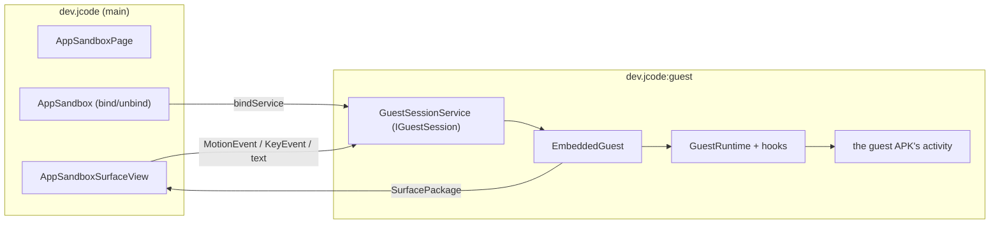

# App sandbox architecture

| | |
|---|---|
| **Status** | Implemented — device-verified on Android 13 |
| **Modules** | `:app` (`dev.jcode.vdevice`) |
| **Primary sources** | app/src/main/java/dev/jcode/vdevice/VirtualDevice.kt, VirtualDeviceApps.kt, VirtualDeviceLog.kt, VirtualLauncher.kt, VirtualWallpaper.kt, VirtualInput.kt, GuestHierarchy.kt, UiXml.kt, AppSandbox.kt, AppSandboxPage.kt, AppSandboxSurfaceView.kt, EmbeddedGuest.kt, GuestSessionService.kt, GuestBootstrapActivity.kt, GuestActivity.kt, VirtualScreen.kt, app/src/main/aidl/dev/jcode/vdevice/IGuestSession.aidl, app/src/main/aidl/dev/jcode/vdevice/IGuestSessionCallback.aidl, app/src/main/AndroidManifest.xml |
| **Verified against** | device-verified on Android 13, 2026-08-11 |

---

## 1. Purpose and scope

Running a built APK **inside JCode** — no install, no ADB, no root — so a developer can build and
try an Android app on the same device, in an editor tab.

> **This is a sandboxed preview, not a security boundary.** The guest runs in a separate *process*
> of JCode, but shares JCode's uid, permissions and data directory. Never run untrusted APKs in it.

---

## 2. Two presentation modes

| Mode | Entry | Window | Used when |
|---|---|---|---|
| **Embedded** | `AppSandboxPage` → `GuestSessionService` → `EmbeddedGuest` | Window-less, composited into a `SurfaceView` in an editor tab | The window supports embedding |
| **Full-screen** | `VirtualDevice.launch` → `GuestBootstrapActivity` → `GuestActivity0..3` | A real activity in its own task | Otherwise, or by choice |

```kotlin
internal enum class AppSandboxTier { Embedded, FullScreen }
```

The tier is chosen by two things: embedding is impossible without hardware acceleration, and
**Settings → Virtual device → "Always run in full screen"** lets the user insist on a real window.

That switch exists because embedding is a trade, not a strict improvement. It buys the IDE around the
app and a screen an agent can read, and it costs the guest a real window: its activity token is one
no `ActivityRecord` answers to, so anything asking the activity manager about itself is answered by
the container rather than the system (see
[Guest runtime §4b](02-guest-runtime-and-hidden-api.md#4b-the-embedded-activitys-token--guestactivityclient)).
An app that wants a real task — its own recents entry, a `PendingIntent` the system will act on, an
SDK that interrogates its own activity — is better served by the full-screen path, and for those the
switch is the answer rather than a workaround for a bug.

`AppSandbox.alwaysFullScreen` holds it rather than the DataStore being read at each call site,
because the tab and the adb daemon's `am start` both have to give the same answer and the daemon is
not a composable. `am start --windowingMode 1` still asks for full screen explicitly.

### 2.1 Why not a virtual display

Putting a **system-launched** activity on a display the app owns is impossible for a normal app:
`ActivityOptions.setLaunchDisplayId` requires the `signature|privileged` `ACTIVITY_EMBEDDING`
permission.

`SurfaceControlViewHost` is what makes the embedded path permission-free — it exists precisely to
let one process's views be composited inside another's, the IDE and `:guest` share a uid, and unlike
a virtual display it asks nothing of the activity task manager.

---

## 3. Process topology



Declared in `AndroidManifest.xml` with `android:process=":guest"`:
`GuestBootstrapActivity` (translucent, `excludeFromRecents`), `GuestActivity0`–`GuestActivity3`
(`launchMode="standard"`, `Theme.DeviceDefault.NoActionBar`, a deliberately broad `configChanges`
set), and `GuestSessionService`.

The manifest comment explains why the stubs exist at all:

> …the stubs the app-virtualization container launches in place of a guest APK's own activities,
> since the system cannot be asked to start an activity of a package it has never heard of.
> …they are never used as themselves — `GuestRuntime` swaps in the guest's class before the system
> instantiates them. `launchMode` is standard so one stub can back several guest instances, and
> `configChanges` is deliberately broad so the guest handles rotation itself instead of being
> relaunched through the stub.

Four stubs means up to four concurrent guest activities.

**Unbinding `GuestSessionService` is what tears a session down** — nothing else keeps the `:guest`
process alive.

---

## 4. The AIDL surface

```java
interface IGuestSession {
    Bundle start(String apkPath, String activityClass, int width, int height,
                 IBinder hostToken, IGuestSessionCallback callback);
    Bundle surface();
    Bundle capture(String pngPath);
    Bundle dump(String xmlPath);

    oneway void resize(int width, int height);
    oneway void touch(in MotionEvent event);
    oneway void key(in KeyEvent event);
    oneway void text(String text);
    oneway void back();
}

interface IGuestSessionCallback {
    oneway void onGuestFinished(String reason);
}
```

Design decisions recorded in the AIDL itself:

| Decision | Reason |
|---|---|
| `start` returns a `Bundle` | So a failure comes back as a **message** rather than an exception across the binder |
| `hostToken` is **required** | It is the `SurfaceView`'s input token. Without it the window manager refuses to grant the embedded hierarchy an input channel at all, so a null token is refused with a message rather than embedded |
| `surface()` exists separately | A `SurfaceView` releases its surface package when it detaches, so switching editor tabs and back needs a **new** package rather than a session restart |
| `capture(pngPath)` writes a **file** | The processes share a uid and a data directory, so a file beats a `Bundle` that a large screen would burst |
| `dump(xmlPath)` likewise | `GuestHierarchy` walks the guest's live view tree into uiautomator-shaped XML; a deep tree outgrows a `Bundle` for the same reason a screen does |
| Everything else is `oneway` | It is called from the IDE's UI thread and must never block on the guest's |

---

## 5. Input injection

Having an input channel is **not** the same as being fed by it. Measured on Android 13, touches over
the embedded hierarchy are not dispatched to it by the system, so `AppSandboxSurfaceView` forwards
raw `MotionEvent`s, `KeyEvent`s and typed text over AIDL, and `EmbeddedGuest` routes each to
whichever guest window is topmost.

`back()` pops the embedded back stack, or sends Back to the only activity.

Child windows (dialogs, popups, spinners) need extra work — see
[Guest runtime and hidden API](02-guest-runtime-and-hidden-api.md).

---

## 6. `VirtualDevice`

```kotlin
data class VirtualDeviceApp(
    val packageName: String, val label: String,
    val versionName: String?, val activities: List<String>,   // fully-qualified, manifest order
)

fun inspect(context: Context, apkPath: String): Result<VirtualDeviceApp>
fun launch(...)
```

`inspect` uses `PackageManager.getPackageArchiveInfo` with `GET_ACTIVITIES or GET_META_DATA` —
**public API only**, so it is safe to call from the IDE process. It fails with
`VirtualDeviceException` for an unreadable APK or one with no `<application>`.

`launch` is the full-screen path: a real activity, in its own task, with everything a real window
brings. `GuestOverlay.install()` adds a floating pill and a back/close bar, because JCode draws
nothing over a full-screen guest.

---

## 7. Screen capture

`VirtualScreen` renders the guest's current screen to a PNG.

> `screencap -d <displayId>` returns **0 bytes** for this kind of surface, and `PixelCopy` over the
> tab's `SurfaceView` answers `ERROR_SOURCE_NO_DATA` — the guest's pixels live in a `SurfaceControl`
> the view only *parents*. So the screen is asked of whoever is drawing it: the guest re-draws its
> own hierarchy (`EmbeddedGuest.capture`), and an idle device draws its home screen — see §7a.

This is what backs `adb shell screencap` against the virtual device — see
[ADB bridge §10](../03-runtime/05-adb-bridge.md#10-adbdaemon--serving-the-virtual-device).

---

## 7a. The device with nothing on it

The tab's resting state is a **device**, not an empty panel: `VirtualWallpaper` (dark grey, outlined
square/triangle/circle), the device's name, and either the installed apps as icons or the words
"No app installed".

**The launcher is device content, not IDE chrome, and that is a correctness property rather than a
style.** It is drawn onto the `SurfaceView`'s **own surface** by `VirtualLauncher` — not composed
over it, since a `SurfaceView` punches a hole in the window and nothing behind it is ever visible —
and `VirtualScreen.blank` draws it through the same code. So:

| | Answered by |
|---|---|
| What the tab shows | `VirtualLauncher.draw` onto the surface |
| What `screencap` returns | `VirtualLauncher.draw` into a bitmap |
| Where a finger lands | `VirtualLauncher.hit`, from `AppSandboxSurfaceView` |
| Where `input tap` lands | `VirtualLauncher.hit`, from `VirtualDeviceAdbService` |
| What `uiautomator dump` lists | `VirtualLauncher.dump`, off the same `tiles` |

One `tiles(width, height, density, apps)` behind all five, so **what an agent screenshots is where
its taps land**. Drawing the launcher a second time for the capture would have put the icons it sees
in one place and the taps it sends in another.

What is *not* on the device's screen is J Code's "Install an app" button: it is the IDE reaching onto
the device, so it is composed over the surface and is deliberately absent from a capture, exactly
like the control bar. A guest's surface package reparents above the surface, so starting an app needs
no matching erase and stopping one repaints.

### 7b. The device's status bar and shade

A slim bar across the top of the device's screen, plus a notification shade that pulls down from it.

**The bar is persistent — a property of the device, not of whatever app is on it.** It is drawn
twice, because the device's screen is drawn two ways, and both must produce the same strip:

| While | Drawn by | Shows |
|---|---|---|
| An app is running | `VirtualStatusBar`, real views in the guest's container | The app's label, and what it has posted |
| The home screen | `VirtualLauncher.drawStatusBar`, canvas | The device's name |

One height and one palette (`VirtualStatusBar`'s companion) behind both, so the strip does not change
shape the moment an app starts.

**The guest's window stops where the bar starts.** Its decor view is added with a top margin of the
bar's height, and `GuestWindow.applySize` is told that reduced height, so the app both lays out for
the space it has and cannot draw into the strip. Measured before this: NewPipe's toolbar came out
with "Trending" half-hidden behind the device's own name.

A margin rather than dispatched insets, deliberately: insets only help an app that reads them, and
one that does not would still draw underneath. A phone does not ask an app to avoid the status bar —
it gives the app a window that does not include it — and a window that stops at the bar is true for
every guest however it lays itself out. Touch, capture and `uiautomator dump` all go through the
container, so the offset applies to all three at once and a dumped node's bounds are still exactly
where `input tap` lands. On the home screen it carries the device's name and nothing else:
there is no app to report the state of and no notifications to count, because the guest process is
what holds them and there is no guest process.

**No clock and no battery, deliberately.** Those belong to the phone, and the phone's own status bar
is directly above this one — a second copy would be either a duplicate or a lie. What the device has
that the phone's bar cannot show is the state of the app *inside* it, so that is all it carries: the
running app's label on the left, and what it has posted on the right.

| Gesture | Effect |
|---|---|
| Drag down from the top strip | Opens the shade: one row per notification, title and text, with **Clear all** |
| Drag up, or tap below an open shade | Closes it |
| `back` | Closes the shade first, the way a phone answers, before the guest ever sees the key |
| Tap the pill in the middle | J Code's own control bar — back, keyboard, restart, full screen, stop. IDE chrome, not the device's |

It is a child of `EmbeddedGuest`'s container, added **last** so it is the topmost view, rather than
composed over the tab by the IDE. That one decision is what makes it part of the device:

| | Falls out of being a child of the container |
|---|---|
| `screencap` shows it | `EmbeddedGuest.capture` draws the container |
| `uiautomator dump` lists it | `EmbeddedGuest.dump` walks the container, and these are real views with real text |
| A finger and `input tap` reach it | Both arrive through `EmbeddedGuest.touch`, which dispatches into the container |

Only vertical movement in the top strip is claimed. A horizontal swipe starting at the top of the
screen belongs to the guest, because pagers live there.

> Verified on the Odin2: `uiautomator dump` against a guest with the shade open lists
> `Notify Fixture`, `2 notifications`, both notification rows with their text, and `Clear all` — so
> an agent can read the device's notifications and tap them, not just a person.

### `VirtualDeviceApps` — the package store

`filesDir/vdevice/apps/<package>.apk`, with each app's private storage beside it at
`filesDir/vdevice/<package>/`. One store behind all three readers: the launcher grid, the adb
daemon's `pm`/`am`, and the start-up reset.

An app bundle's config splits go in `filesDir/vdevice/apps/<package>.splits/`, a directory *beside*
the base rather than one replacing it — so every reader that already knew where a package's APK is
keeps working unchanged, and `GuestLoader` finds the rest by the same convention without anything
crossing the binder. `adb install-multiple` stages a session under `apps/session-<n>/` and commits it
whole; the base is whichever staged file parses as a package on its own, since a config split's
manifest has no `<application>` in it.

> **Nothing survives a restart.** `resetOnStart` empties `filesDir/vdevice/` once per process — no
> apps, no data, no preferences a previous run left. Both the workbench (`MainViewModel` init) and
> `VirtualDeviceAdbService.daemon` call it, because those two race and the loser must not wipe what
> the winner just installed; `@Synchronized` plus a one-shot flag makes the second call a no-op.

A `revision` snapshot-state counter is bumped on every install/uninstall, so an `adb install` shows
up on the home screen without the tab being touched.

The device is reachable on its own through the `tools.virtualDevice` palette command
("Open Virtual Device") — otherwise the tab only ever appears when a virtual-device build finishes,
which is no way to reach the apps already installed on it.

---

## 8. Session states

```kotlin
internal sealed interface SandboxStatus {
    data object Idle
    data object Starting
    …
}
```

`AppSandbox` holds the `ServiceConnection`, exposes status as a `StateFlow`, and provides
`requestOpen(...)` — which is also the target of `adb shell am start -n` against the virtual device.

---

## 9. Invariants and constraints

1. The container **only ever loads in `:guest`**; none of it runs in the IDE process.
2. `hostToken` must be the real `SurfaceView` input token.
3. Re-acquire the surface package after a detach; do not restart the session.
4. All `oneway` methods are called from the IDE UI thread and must not block.
5. Capture and hierarchy dumps go through a file path, not a `Bundle`.
6. Unbinding the service is the teardown; there is no separate stop call.
7. Treat every guest as trusted code — it shares JCode's uid.
8. The device is emptied on every JCode start. Nothing may assume an app installed in a previous
   session is still there.
9. Everything installed goes through `VirtualDeviceApps`; nothing else writes `filesDir/vdevice/`.

---

## 10. Failure modes

| Failure | Effect |
|---|---|
| `hostToken` null | `start` returns an error message rather than embedding |
| `input`/`uiautomator dump` with nothing running | Answered with one line naming `am start`, not a hang |
| Embedding unsupported on the window | Falls back to `AppSandboxTier.FullScreen` |
| Guest activity finishes | `onGuestFinished(reason)`; the tab reports the session ended |
| `:guest` process killed | Same callback path; the IDE process is unaffected |
| More than four concurrent guests | No stub available |
| Unreadable APK | `VirtualDeviceException` from `inspect` |

---

## 11. Known gaps

- Four concurrent guest activities maximum (`GuestActivity0`–`GuestActivity3`).
- The guest shares JCode's uid and permissions — no isolation, by design.
- Hidden-API coupling means this is validated against **Android 13 / targetSdk 33** specifically; see
  [Guest runtime and hidden API](02-guest-runtime-and-hidden-api.md).

---

## 12. References

- [Guest runtime and hidden API](02-guest-runtime-and-hidden-api.md)
- [Android app debugging](03-android-app-debugging.md)
- [ADB bridge](../03-runtime/05-adb-bridge.md)
- [System architecture](../01-architecture/01-system-architecture.md)
