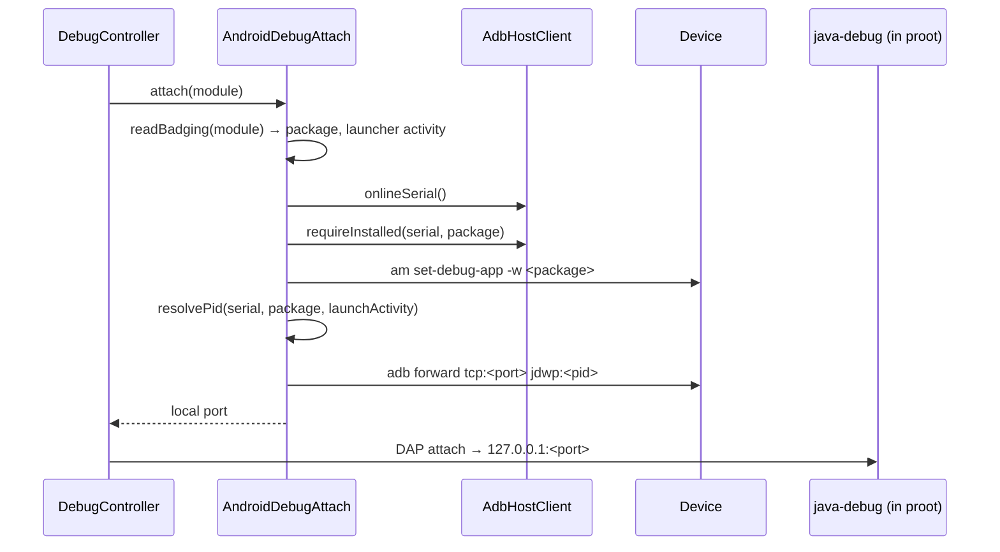

# Android app debugging

| | |
|---|---|
| **Status** | Implemented |
| **Modules** | `:app`, `:core:debug`, `:core:distro`, and the Java Dev Pack's `adapter/` |
| **Primary sources** | app/src/main/java/dev/blamspot/jcode/debug/AndroidAppProject.kt, app/src/main/java/dev/blamspot/jcode/debug/AndroidDebugAttach.kt (157 lines), app/src/main/java/dev/blamspot/jcode/debug/DebugController.kt (702 lines), core/distro/src/main/java/dev/blamspot/jcode/core/distro/adb/AdbHostClient.kt, the Java Dev Pack's adapter/ |
| **Verified against** | commit `cea581c`, 2026-08-09 |

---

## 1. Purpose and scope

Debugging an Android application built inside JCode, on the same device JCode is running on: how the
application module is identified, and how the app's ART JDWP channel is exposed to the Java debug
adapter.

> **It is always an attach, never a launch.** ART speaks JDWP only for a *debuggable* process and
> only over adb's `jdwp:<pid>` service — there is no `-agentlib:jdwp` leg to start. That single fact
> shapes the entire flow.

---

## 2. Project detection — `AndroidAppProject`

`appModuleFor(hostPath, projectDir)` returns the Android **application** module for a debug target:
the project directory when it is the Gradle root, otherwise the nearest Gradle root above the active
file's path. It mirrors `ProjectRunner.androidAppModule`, so Run and Debug agree on what an Android
app project is and which module the APK comes from.

### 2.1 `appModule(root)`

1. Require `root/gradlew`.
2. Walk the tree with `maxDepth = SCAN_DEPTH (8)`, capped at `SCAN_FILE_CAP (8,000)` files, skipping
   `node_modules`, `bin`, `obj`, `build`, `dist`, `out`, `target` and any dot-directory.
3. Note whether `gradle/libs.versions.toml` names `com.android.application`.
4. For each `build.gradle` / `build.gradle.kts`, look **line by line** for `com.android.application`
   or a version-catalog alias matching
   `alias\s*\([^)]*[Aa]ndroid[^)]*[Aa]pplication[^)]*\)`, **excluding any line containing
   `apply false`**.
5. Fallback: an `AndroidManifest.xml` containing `android.intent.category.LAUNCHER`; the module is
   its great-grandparent directory (`src/main/AndroidManifest.xml` → module).

> The `apply false` exclusion is load-bearing. A root build script names the plugin as
> `id("com.android.application") … apply false` to declare the version for subprojects without
> applying it; matching the file as a whole would pick the **root** as the app module.

### 2.2 Helpers

| Member | Purpose |
|---|---|
| `gradleRoot(hostPath)` | Nearest directory at or above the path holding `gradlew`, up to `ROOT_WALK_UP_LIMIT (8)` levels |
| `debugApk(module)` | Newest `.apk` under `build/outputs/apk/debug` (`APK_DIR`) — what the Run flow installs |
| `sourceRoots(module)` | `src/main/java`, `src/main/kotlin` (those that exist) — for the adapter's stack-frame → file resolution |

---

## 3. Attach sequence



Steps in detail:

1. **`readBadging(module)`** runs `aapt dump badging` over the built debug APK to read the package
   name and launcher activity.
2. **`onlineSerial()`** resolves an online device from the ADB bridge, preferring the loopback relay
   serial.
3. **`requireInstalled(serial, package)`** confirms the app is installed.
4. **`am set-debug-app -w <package>`** — the `-w` holds the **next** launch at "Waiting For Debugger"
   until a debugger attaches, so breakpoints in `Application`/`Activity` start-up still bind in time.
   It has no effect on an already-running process, which is exactly why it is set **before** the pid
   is resolved.
5. **`resolvePid(...)`** finds or launches the process.
6. **`freeLocalPort()`** then `adb forward tcp:<port> jdwp:<pid>`.
7. The java-debug adapter — running inside proot, which shares the app's network namespace — issues a
   DAP `attach` to `127.0.0.1:<port>`.

### 3.1 Why the forward can fail

```
adb refused to forward tcp:<port> to jdwp:<pid> for <package> — only a debuggable
(debug-variant) build exposes a JDWP channel.
```

A release-variant APK has no JDWP channel at all; this is the most common attach failure and the
error text says so directly.

---

## 4. Detach

```kotlin
suspend fun detach()
```

Undoes everything `attach` changed:

- `am clear-debug-app` — **essential**, because `set-debug-app -w` outlives the session. Left set, it
  would strand the app at "Waiting For Debugger" the next time the user launched it by hand.
- `adb killforward` for the forwarded port.

`debugAppSerial` and `forwardedPort` are tracked so a **partial** attach can still be undone.

---

## 5. Routing from `DebugController`

`DebugController.prepareJvm` checks `AndroidAppProject.appModuleFor(...)`. When it returns a module,
the flow routes to `prepareAndroidAttach` instead of a plain JVM launch. Everything downstream is a
normal DAP session — see
[Debug Adapter Protocol](../04-language-services/02-debug-adapter-protocol.md).

The adapter is `java-debug`, wrapped by the Java Dev Pack's `adapter/` with JCode-specific providers
(`JCodeSourceLookUpProvider`, `JCodeEvaluationProvider`, `JCodeCompletionsProvider`,
`JCodeHotCodeReplaceProvider`, `JCodeVirtualMachineManagerProvider`).

---

## 6. Interaction with the app sandbox

The virtual device is *also* an adb target: `VirtualDeviceAdbService` answers
`shell:am start -n`, `shell:pm list packages` and `exec:cmd package 'install' -S <n>` — so an app can
be built, installed and launched inside JCode's own sandbox, then debugged over the same ADB bridge.
See [ADB bridge](../03-runtime/05-adb-bridge.md) and
[App sandbox architecture](01-app-sandbox-architecture.md).

`RUN_IN_VIRTUAL_DEVICE` (default `false`) selects whether Run targets the sandbox or the real device.

---

## 7. Invariants and constraints

1. Android debugging is always an **attach**.
2. Only a debuggable (debug-variant) build exposes a JDWP channel.
3. `set-debug-app -w` must always be cleared on detach.
4. Detection excludes `apply false` lines.
5. Run and Debug must agree on the app module — both go through the same detection.
6. Tree scans are bounded by depth and file count so a monorepo cannot hang detection.

---

## 8. Failure modes

| Failure | Effect |
|---|---|
| Release-variant APK | `adb forward` refused; the error names the cause |
| No online device | Attach aborts at `onlineSerial()` |
| App not installed | Attach aborts at `requireInstalled` |
| Process never starts | `resolvePid` fails |
| Session killed without detach | The app is stranded at "Waiting For Debugger" until `am clear-debug-app` runs |
| Wireless debugging off | The ADB bridge is `Degraded`; no serial to attach to |
| `aapt` not installed | `readBadging` fails — the Android SDK catalog entry provides it |

---

## 9. Known gaps

- Hot code replace is wired through `JCodeHotCodeReplaceProvider` but not exercised in the documented
  device verification.
- Source lookup depends on `sourceRoots(module)` finding `src/main/java` or `src/main/kotlin`; a
  non-standard layout will not resolve stack frames to files.
- Only the **application** module is detected; a library module cannot be debugged directly.

---

## 10. References

- [Debug Adapter Protocol](../04-language-services/02-debug-adapter-protocol.md)
- [ADB bridge](../03-runtime/05-adb-bridge.md)
- [App sandbox architecture](01-app-sandbox-architecture.md)
- [Run and build configurations](../05-workspace/03-run-and-build-configurations.md)
- [docs/java-debug-adapter-plan.md](../../java-debug-adapter-plan.md)
